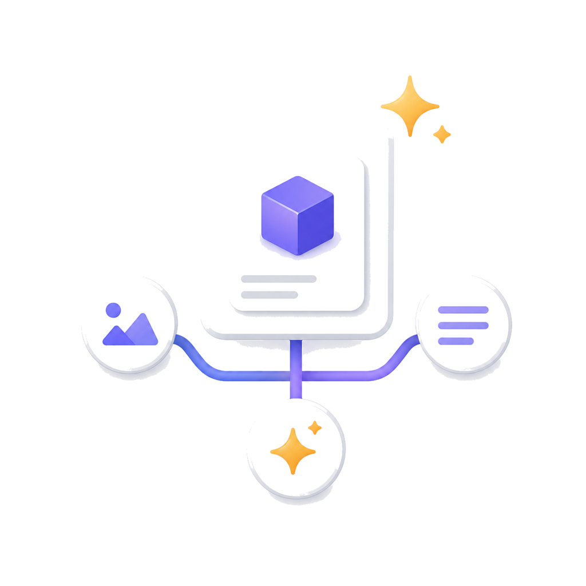

<p align="center">
  
</p>

# ProductFlow

ProductFlow 是一个面向单人或小团队商家的开源自托管商品素材工作台。它把商品资料、AI 文案、参考图、AI/模板海报、连续生图会话和可视化商品工作流放在同一个私有部署里，目标是让运营者更快地把单个商品整理成可复用的电商素材。

本仓库当前不是多租户 SaaS，也不包含托管服务账号。你需要自己部署 PostgreSQL、Redis、后端、worker 和前端，并自行配置可用的文本/图片模型供应商。

## 当前功能状态

已实现并在代码中可见的能力：

- 单管理员访问密钥登录，基于 Cookie session 访问后台 API。
- 商品列表、分页浏览、创建商品、商品详情工作台，以及商品删除。
- 产品内 guided onboarding：顶部导航可随时开始/继续/重置引导，首页展示进度卡片，操作页不占用工作空间。
- ProductFlow workbench：商品详情页以节点画布组织商品资料、参考图、文案和生图流程。
- 画布交互：鼠标滚轮缩放、左键拖动画布空白处平移、节点拖拽定位、节点连线拖拽创建、边删除、右侧面板宽度记忆。
- 商品原图、参考图和连续生图参考图支持点击选择或拖拽上传，带 MIME、大小、像素和数量限制。
- 参考图节点是单图槽位：手动上传或上游生图填充都会替换当前图，旧素材留在商品历史/素材列表中。
- 文案生成、文案编辑、文案确认、历史文案查看；文案节点可编辑标题、卖点、海报主标题和 CTA。
- 生图节点是触发/配置节点，不直接承载图片；生成结果填充到连接的下游参考图节点，并在参考图/图片侧栏里预览和下载。
- 两种海报产出模式：本地 Pillow 模板渲染、远程图片 provider 生成。
- 海报下载、海报重新生成、商品历史时间线，以及右侧 Images 面板聚合可下载素材。
- 独立图片会话：上传参考图、连续生成图片、把生成图挂回商品。
- 提示词配置：设置页可覆盖商品理解、文案生成、工作台生图和连续生图的默认提示词模板。
- 运行时设置页：可在数据库中覆盖 provider、模型、图片尺寸、上传限制、任务重试等业务配置，secret 不回显。
- 异步任务：Dramatiq + Redis 投递，PostgreSQL 记录状态，启动时恢复未完成任务/工作流。

仍然不在当前范围内：多用户/多租户、团队权限、支付、托管账号体系、自动投放/自动上架、视频生成、生产级容器编排模板。

## 产品入口与文档

- 新手操作：`docs/USER_GUIDE.md`
- 架构说明：`docs/ARCHITECTURE.md`
- 路线图：`docs/ROADMAP.md`
- 品牌资产：`docs/assets/productflow-brand-concept.png`、`docs/assets/productflow-mark.svg`
- Web metadata / favicon 资产：`web/public/productflow-brand-concept.png`、`web/public/productflow-mark.svg`

## 技术栈

- 后端：Python 3.12、FastAPI、SQLAlchemy、Alembic、Dramatiq、Redis、PostgreSQL、Pillow、OpenAI Python SDK。
- 前端：React 19、Vite、TypeScript、React Router、TanStack Query、Tailwind CSS 4。
- 本地开发入口：根目录 `justfile`。
- 文档：`docs/PRD.md`、`docs/USER_GUIDE.md`、`docs/ARCHITECTURE.md`、`docs/ROADMAP.md`。

## 开源依赖与致谢

ProductFlow 的应用代码之外，也保留了一套面向 AI 协作的项目工作流资产。这里优先感谢对本仓库结构、开发方式和协作体验影响最大的开源项目。

<p>
  <a href="https://github.com/mindfold-ai/Trellis">
    
  </a>
  &nbsp;
  <a href="https://openai.com/codex/">
    
  </a>
</p>

- [Trellis](https://github.com/mindfold-ai/Trellis) 为本项目提供任务工作流、规范沉淀和上下文注入约定；仓库保留 `.trellis/workflow.md`、`.trellis/scripts/` 和 `.trellis/spec/`，方便贡献者理解需求、实现、检查和收尾方式。
- [OpenAI Codex](https://openai.com/codex/) / Codex CLI 参与本项目的开发协作流程；仓库中的 `.codex/`、`.agents/skills/` 和 `AGENTS.md` 用于保存面向 AI coding agent 的项目级指令、hooks、技能和子代理配置。

## 仓库结构

```text
ProductFlow/
  README.md
  LICENSE
  CONTRIBUTING.md
  SECURITY.md
  .env.example
  .env.dev.example
  docker-compose.yml
  justfile
  scripts/
    release.sh
    with_dev_env.sh
  docs/
    PRD.md
    USER_GUIDE.md
    ARCHITECTURE.md
    ROADMAP.md
    assets/
      productflow-brand-concept.png
      productflow-mark.svg
  backend/
    pyproject.toml
    alembic.ini
    alembic/versions/
    src/productflow_backend/
    tests/
  web/
    package.json
    public/
      productflow-brand-concept.png
      productflow-mark.svg
    src/
  .trellis/
    workflow.md
    scripts/
    spec/
```

`.trellis/spec/`、`.trellis/workflow.md` 和 `.trellis/scripts/` 是项目开发规范和任务工具，保留在仓库中便于贡献者理解约定；`.trellis/tasks/` 和 `.trellis/workspace/` 是本地任务/开发者运行上下文，不应公开跟踪。

## 快速开始：本地自托管开发

### 1. 准备工具

需要本机已有：

- Python 3.12+
- `uv`
- Node.js 20+ 或兼容版本
- `pnpm`
- Docker / Docker Compose
- `just`

### 2. 复制环境变量

```bash
cp .env.example .env
cp .env.dev.example .env.dev
cp web/.env.example web/.env
```

至少需要把 `.env` / `.env.dev` 中的这些值改成自己的随机值：

- `ADMIN_ACCESS_KEY`：登录后台使用的管理员密钥。
- `SESSION_SECRET`：签名 session cookie 的长随机字符串。
- `POSTGRES_PASSWORD`：本地 PostgreSQL 密码，同时保持 `DATABASE_URL` 中的密码一致。

默认 provider 为 `mock`，不需要真实模型密钥即可跑通主流程。`.env.dev.example` 使用开发端口、Redis DB 1 和 `backend/storage-dev`，数据库名与默认 `docker-compose.yml` 保持一致；如果你要使用单独的开发数据库，需要先在 PostgreSQL 中创建对应数据库，再调整 `.env.dev` 的 `DATABASE_URL`。切换真实模型前，请先阅读“模型与供应商配置”。

### 3. 启动依赖服务

```bash
docker compose up -d
```

`docker-compose.yml` 默认启动：

- PostgreSQL：宿主机 `localhost:${POSTGRES_HOST_PORT:-15432}`
- Redis：宿主机 `localhost:${REDIS_HOST_PORT:-16379}`

### 4. 安装依赖并迁移数据库

```bash
just backend-install
just web-install
just backend-migrate
```

### 5. 启动后端、worker 和前端

开三个终端分别运行：

```bash
just backend-run
just backend-worker
just web-dev
```

默认开发端口来自 `.env.dev.example`：

- API：`http://localhost:29282`
- Web：`http://localhost:29283`

打开 Web 页面后，用 `ADMIN_ACCESS_KEY` 登录。登录后可先点顶部导航右侧的 **开始引导**，按产品内提示创建商品、补资料、生成文案和图片。

### 6. 健康检查

```bash
curl http://127.0.0.1:29282/healthz
```

预期返回：

```json
{"status":"ok"}
```

## 模型与供应商配置

ProductFlow 把文本和图片能力分开配置。基础设施配置（数据库、Redis、session、管理员密钥）仍然只从环境变量读取；业务配置可在前端 `/settings` 页面写入数据库并覆盖环境变量默认值。

文本 provider：

- `TEXT_PROVIDER_KIND=mock`：本地假实现，适合开发和测试。
- `TEXT_PROVIDER_KIND=openai`：OpenAI Responses 兼容接口。
- 相关变量：`TEXT_API_KEY`、`TEXT_BASE_URL`、`TEXT_BRIEF_MODEL`、`TEXT_COPY_MODEL`。

图片 provider：

- `IMAGE_PROVIDER_KIND=mock`：本地假图实现。
- `IMAGE_PROVIDER_KIND=openai_responses`：OpenAI Responses `image_generation` 工具，支持参考图输入和 `previous_response_id` 连续上下文。
- 相关变量：`IMAGE_API_KEY`、`IMAGE_BASE_URL`、`IMAGE_GENERATE_MODEL`、`IMAGE_MAIN_IMAGE_SIZE`、`IMAGE_PROMO_POSTER_SIZE`、`IMAGE_ALLOWED_SIZES`。

海报模式：

- `POSTER_GENERATION_MODE=template`：用本地模板/Pillow 渲染，不调用图片模型。
- `POSTER_GENERATION_MODE=generated`：把确认版文案和商品/参考图交给图片 provider 生成海报。

提示词模板：

- `/settings` 的提示词分组可覆盖商品理解、文案生成、工作台生图和连续生图模板。
- 单次需求建议写在文案/生图节点里；长期统一口吻或格式再改配置页模板。

## 常用命令

```bash
just backend-install     # uv sync --directory backend --extra dev
just backend-migrate     # 应用 Alembic 迁移
just backend-run         # 启动开发 API
just backend-worker      # 启动 Dramatiq worker
just backend-test        # 运行 backend pytest
just web-install         # pnpm install
just web-dev             # 启动 Vite 开发服务器
just web-build           # TypeScript 检查 + Vite build
just release-dry-run     # 生成本机发布快照但不切换服务
```

`scripts/release.sh` 是一个可选的单机发布快照脚本，默认把快照写入仓库外/内可配置的 `RELEASE_ROOT`（未设置时为 `./.release`），并假设目标机器使用 `productflow-backend.service`、`productflow-worker.service` 和 `productflow-web.service` 这组 user-level systemd 服务。自托管部署时可通过 `RELEASE_ROOT`、`BACKEND_PYTHON`、`APP_PORT` 和 `WEB_PORT` 覆盖这些默认值；文档中的快速开始不依赖该脚本。

## 主要 API 资源

后端只暴露 REST API。主要入口包括：

- `POST /api/auth/session`、`GET /api/auth/session`、`DELETE /api/auth/session`
- `/api/products`、`/api/products/{product_id}`、`/api/products/{product_id}/history`
- `/api/products/{product_id}/reference-images`、`/api/source-assets/{asset_id}`、`/api/source-assets/{asset_id}/download`
- `/api/products/{product_id}/copy-jobs`、`/api/copy-sets/{copy_set_id}`、`/api/copy-sets/{copy_set_id}/confirm`
- `/api/products/{product_id}/poster-jobs`、`/api/posters/{poster_id}/regenerate`、`/api/posters/{poster_id}/download`
- `/api/image-sessions`、`/api/image-sessions/{image_session_id}`、`/api/image-session-assets/{asset_id}/download`
- `/api/products/{product_id}/workflow`、`/api/products/{product_id}/workflow/run`、`/api/workflow-nodes/{node_id}`、`/api/workflow-edges/{edge_id}`
- `/api/settings`
- `/api/jobs/{job_id}`

## 开源与安全边界

- License：MIT，见 `LICENSE`。
- 贡献指南：见 `CONTRIBUTING.md`。
- 安全报告：见 `SECURITY.md`。
- 不要提交 `.env`、`web/.env`、本地 storage、构建产物、缓存、日志或 `.trellis/tasks/` / `.trellis/workspace/`。
- 真实 provider API key 只应放在本地环境变量或私有部署配置中，不应写入 issue、PR 或文档示例。
