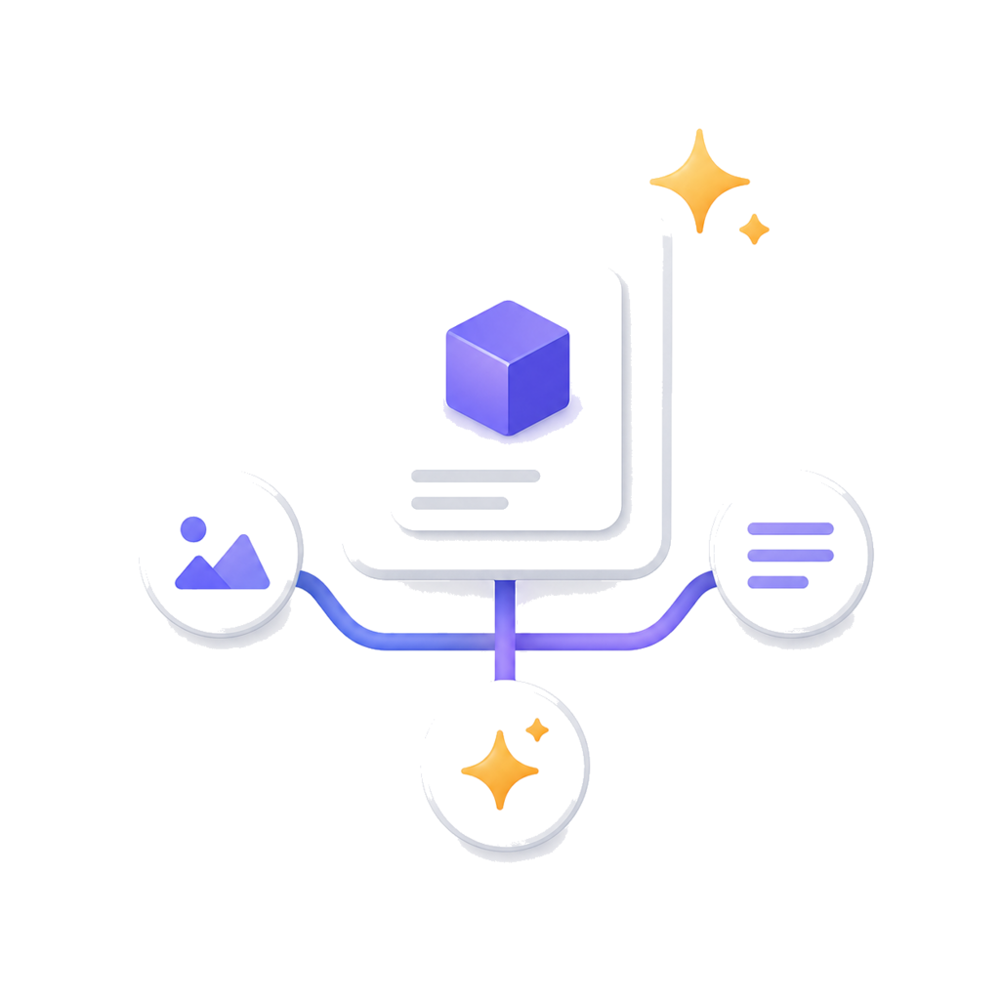

<p align="center">
  
</p>

# ProductFlow

[中文](README.md) | [English](README.en.md)

<p align="center">
  <a href="https://draw.devbin.de"><strong>体验站 / Live Demo</strong></a>
</p>

ProductFlow 是面向单商家创作者的开源商品视觉工作台。用户上传真实商品参考图、选择所需图片类型和数量，工作流 Agent 通过对话补齐价格、风格、文字语种、文案要求等信息，再生成可编辑、可运行的图片生产工作流。

当前公网实例是个人项目的 live demo，项目尚未正式商用发布，也没有真实商户用户。当前实现采用单管理员、单商家数据模型，研发主线仍可能需要重建数据库和 storage。

目标产品是可自托管的多商家 SaaS，项目方也会部署同一产品经营站点。多商家隔离、额度、交付体验和稳定安装/恢复/升级已纳入 [正式版路线图](docs/ROADMAP.md)，尚未实现的目标不代表当前可用能力。

## 当前产品能力

### Agent 创建商品

- `/products/new` 是唯一正式创建入口。填商品名称即可进入 Agent 对话；参考图和图片需求在对话框提交。
- 用户也可在创建页选择图片类型并上传 1 至 6 张参考图，用于直接创建画布。支持 PNG、JPEG 和 WebP。
- Agent 可追问商品价格、生图风格、图片文字语种、文案要求和视觉体系等缺失信息。
- 开始对话即写入 live schema-v3 图并进入商品工作台；Agent 用 ChangeSet 改现图，多节点改图在画布上确认。

### 工作流画布

- 当前节点类型是 `product_source`、`image_asset`、`creative_brief`、`visual_system`、`image_prompt`、`image_generation`。
- 画布保留节点拖动、自由添加、连线、删除、多选、缩放、平移、自动布局和快捷键。
- 文件夹用于收纳局部流程，降低大型 DAG 的排线和浏览压力。
- 节点详情可编辑提示词、参考图绑定、视觉体系覆盖、生图比例、分辨率、质量、文字策略和交付规格。
- 生图结果写入对应节点，同时进入该商品的统一图片库。
- 工作流复用只来自用户主动保存的 `WorkflowRecipe` 或局部 `recipe_fragment`。

### 图片库与连续生图

- `/media-library` 是跨商品长期保存的全局素材库，支持搜索、文件夹、标签、归档/恢复和批量组织；工作流子图库通过关联使用全局素材，不复制媒体文件。
- 商品图片库使用类似资源管理器的目录树、文件夹、筛选、排序、重命名、移动、预览、批量选择和下载。
- 每个图片节点只绑定自己的当前承载图；图片库保存商品的全部上传图、工作流生成图和会话转入图。
- 商品封面从图片资产自动选择，仍可通过当前封面 API 显式调整。
- `/image-chat` 支持参考图、分支基图、多候选生成、取消、重试、下载和保存到商品图片库。

### Provider 与运行

- `/settings` 管理供应商档案和 `prompt`、`agent`、`image` 三类用途绑定。
- 供应商档案保存 Base URL、API Key、能力和默认模型；secret 不回显。
- 图片用途支持 OpenAI Responses、OpenAI Images 兼容接口和 Google Gemini 图片能力。
- 高级图片参数包括质量、格式、压缩、背景、审核、action、input fidelity 和 partial images；生成数量由业务选择决定。
- Agent Turn 使用独立 Node.js 22 服务和 Pi SDK ProductFlow adapter，SSE 支持断线续传；Pi 不启用操作系统工具。
- 图片生成和交付图任务由 Go worker + Redis 执行，PostgreSQL 保存业务状态，storage 保存媒体字节。

## 当前边界

- 单管理员、单商家实例。
- 不提供多租户、团队权限、支付、托管账号、自动上架、广告投放或视频生成。
- 公网体验站数据和本地开发库都可以在破坏性更新时重建。
- 空库和已有库都跑 `just go-migrate` / `productflow-migrate`。主仓库不为旧数据写回填或兼容层。

## 页面入口

| 路由 | 用途 |
|---|---|
| `/home` | 功能导航与真实商品素材展示 |
| `/products` | 商品列表 |
| `/products/new` | Agent 创建商品 |
| `/products/:productId` | Agent 对话 + schema-v3 工作流 + 图片库 |
| `/image-chat` | 连续文/图生图 |
| `/media-library` | 全局素材库 |
| `/settings` | Provider 与运行时配置 |
| `/help` | 产品内帮助 |

仓库文档：

- [文档地图](docs/README.md)
- [产品需求](docs/PRD.md)
- [用户指南](docs/USER_GUIDE.md)
- [架构说明](docs/ARCHITECTURE.md)
- [路线图](docs/ROADMAP.md)
- [版本记录](CHANGELOG.md)

## 技术栈

- 后端：Go 1.23（Gin、GORM、asynq）、`productflow-migrate`、Redis、PostgreSQL。
- Agent service：Node.js 22、Pi SDK、ProductFlow Tool adapter、JSONL session 文件和 JSON event 文件。
- 前端：React 19、Vite、TypeScript、React Router、TanStack Query、XYFlow、Tailwind CSS 4。
- 模型 SDK：Go 与 TypeScript 的 OpenAI-compatible adapter，以及 Google GenAI。

## 仓库结构

```text
ProductFlow/
  go/
    cmd/
    internal/
  agent-service/
    src/
    .pi/skills/
    package.json
  web/
    src/
    public/
  docs/
  scripts/
  release/
  CONTEXT.md
  docker-compose.yml
  justfile
```

## Docker Compose 运行

有两种入口：

1. **源码工作树**（开发或本机 `docker compose up --build`）：见下方「源码 Compose」。
2. **版本化发行物**（空主机、无 git）：见 [release/README.md](release/README.md)。固定镜像 tag、锁定 compose、`.env` 样例与 `VERSION`/`images.env` 由 `scripts/release-pack.sh` 打出；自营与自托管同一包。

### 源码 Compose

#### 1. 准备配置

```bash
cp .env.example .env
```

至少修改：

- `ADMIN_ACCESS_KEY`
- `SETTINGS_ACCESS_TOKEN`
- `SESSION_SECRET`
- `POSTGRES_PASSWORD`
- `AGENT_SERVICE_INTERNAL_TOKEN`

#### 2. 启动完整栈

开发或本机调试（默认会把 PostgreSQL、Redis、dispatcher/worker metrics 映射到宿主端口，便于本机工具接入）：

```bash
docker compose up -d --build
```

自托管 / 生产式端口（不把 PostgreSQL、Redis、metrics 发布到宿主；仅保留 Web 与 API 的宿主端口供反向代理）：

```bash
docker compose -f docker-compose.yml -f docker-compose.prod-ports.yml up -d --build
```

Compose 包含 PostgreSQL、Redis、Go API / worker / dispatcher、Agent service 和 Web。独立 `productflow-migrate` 容器在 Go API 之前执行 GORM `CreateTable`/`AddColumn` 与 ExtraDDL（CHECK / enum / 部分唯一索引 / FK），不使用 AutoMigrate。Web 容器内 nginx 将 `/api/` 反代到 Compose 服务名 `productflow-go-api:29280`。

默认地址：

- Web：`http://127.0.0.1:29281`
- Backend health：`http://127.0.0.1:29280/healthz`
- Web proxy health：`http://127.0.0.1:29281/api/healthz`

启动后使用 `ADMIN_ACCESS_KEY` 登录，再用 `SETTINGS_ACCESS_TOKEN` 解锁设置页并配置 `prompt`、`agent`、`image` 用途。

#### 3. 数据与日志

```bash
docker compose logs -f productflow-go-api productflow-go-worker productflow-agent-service productflow-web
docker compose down
```

`docker compose down` 保留 volumes。确认需要清空演示数据库、Redis、媒体 storage 和 Agent journal 时执行：

```bash
docker compose down -v
```

设置 `STORAGE_HOST_PATH=/absolute/host/path` 可使用宿主机目录；未设置时使用 `productflow-storage` named volume。

### 版本化发行物（空主机）

构建机（有源码）：

```bash
just release-build-images
just release-pack
# 可选推送：PRODUCTFLOW_REGISTRY=localhost:5000/ just release-push-images
# 可选离线镜像：RELEASE_PACK_SAVE_IMAGES=1 just release-pack
```

空主机解包 `dist/release/productflow-<IMAGE_TAG>.tar.gz` 后，按 [release/README.md](release/README.md) 填写 `.env`、加载或拉取镜像，再：

```bash
docker compose --env-file images.env --env-file .env \
  -f docker-compose.yml -f docker-compose.prod-ports.yml up -d
```

发行物路径不依赖作者本地 `storage` 或隐藏配置。备份/恢复与 R6 全项仍见平台可靠性章程；本 README 不宣称它们已通过。

## 本地开发

### 1. 准备工具

- Go 1.23+
- Node.js 22.19+ 与 `pnpm`
- Python 3（仓库脚本，如 `just docs-check`、`just wipe-dev-data`）
- Docker / Docker Compose
- `just`（推荐）

### 2. 准备开发配置

```bash
cp .env.example .env
cp .env.dev.example .env.dev
cp web/.env.example web/.env
```

保持 `.env` 和 `.env.dev` 的 PostgreSQL 密码一致，并为管理员、设置页和内部 Agent 服务分别设置不同的随机密钥。

### 3. 安装与迁移

```bash
docker compose up -d productflow-postgres productflow-redis
just agent-service-install
just web-install
just go-migrate
```

### 4. 启动本地开发环境

准备完成后可以用一个命令启动 PostgreSQL、Redis、数据库迁移、Go API / worker / dispatcher、Pi Agent 和 Web：

```bash
just dev
```

也可以分别在四个终端运行进程，便于单独查看日志：

```bash
just go-api
just go-worker
just go-dispatcher
just agent-service-run
just web-dev
```

`go-api`、`go-worker`、`go-dispatcher`、`agent-service-run` 和 `web-dev` 都会读取 `.env.dev`。Go dispatcher 持续扫描 PostgreSQL 中的 durable dispatch 状态并向 Redis 投递。`just dev` 会先停掉上次残留的 API / worker / dispatcher / Agent / Web 进程，再迁移并启动；`just dev-stop` 只做这一步清理。Ctrl+C 会结束这些应用进程。`just dev` 启动的 PostgreSQL 和 Redis 会继续保留在 Docker 中，停止它们执行：

```bash
docker compose down
```

默认开发地址：

- API：`http://127.0.0.1:29282`
- Agent service：`http://127.0.0.1:29284`
- Web：`http://127.0.0.1:29283`

## 常用验证

```bash
just go-test
pnpm --dir web test:run
pnpm --dir web lint
just web-build
just agent-service-test
```

依赖真实 PostgreSQL/Redis 的恢复测试和真实 provider 测试为显式 opt-in：

```bash
just go-test-live-providers
```

浏览器级真实出图 gate 不进入 `just go-test` 或 `pnpm --dir web test:run`。它要求 `just dev` 已在跑、设置页的 prompt/image 用途已绑真实供应商（不能是 mock），然后：

```bash
just web-e2e-live-graph
```

该命令会登录、在 `/products/new` 直接创建一张细节图、点运行整张图，等到真实图片写入商品图库。首次需要本机 Playwright Chromium。

Pi 的真实 provider/依赖验收需要显式配置真实 ProductFlow、provider 和浏览器环境；当前没有把它伪装成普通单元测试命令。

## 发布脚本

```bash
just release-dry-run
just release
just release-build-images
just release-pack
```

`release-dry-run` 校验**源码树** Compose 配置并打印当前发布动作。`release` 执行 `docker compose up -d --build --remove-orphans`，随后检查 backend、Agent service、Web 和 Web API proxy；它不会删除 volumes。生产式端口请在 Compose 命令中叠用 `docker-compose.prod-ports.yml`（见上文），再按同样四项探活验收；`just release` 默认仍使用开发 Compose 端口映射。

`release-build-images` / `release-pack`（及可选 `PRODUCTFLOW_REGISTRY=… just release-push-images`）产出不可变镜像 tag 与锁定安装包，供无 git 空主机安装；步骤与限制见 [release/README.md](release/README.md)。

## 主要 API 资源

- `/api/auth/session`
- `/api/v2/agent-product-workspaces`
- `/api/v2/products`
- `/api/v2/products/{product_id}/agent-conversations`
- `/api/v2/products/{product_id}/agent-workbench`
- `/api/v2/products/{product_id}/workflow`
- `/api/v3/workflow-recipes`
- `/api/v2/product-image-assets`
- `/api/image-sessions`
- `/api/media-library`
- `/api/settings`

完整合同以 Go HTTP 实现（`go/internal/*/http.go`）为准。`contracts/` 是 2026-08-29 历史封印快照。

## 开源与安全

- License：MIT，见 [LICENSE](LICENSE)。
- 贡献指南：[CONTRIBUTING.md](CONTRIBUTING.md)。
- 安全报告：[SECURITY.md](SECURITY.md)。
- 不要提交 `.env`、`web/.env`、storage、构建产物、缓存、日志或迁移证据目录。
- Provider API key 只放在私有配置中。

ProductFlow 在开发过程中使用 OpenAI Codex。感谢 [LinuxDo](https://linux.do) 社区。
