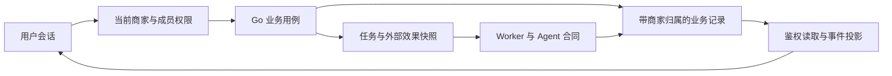

# ProductFlow 产品方向与正式版路线图

校准日期：2026-09-07。决策依据：用户确认的产品目标、`8b006abc` 源码、当前开发站只读观察及本页列出的竞品公开资料。本文是未实现方向、产品取舍和发布顺序的唯一总纲；当前能力仍以 [PRD](PRD.md)、[CONTEXT](../CONTEXT.md) 和 [ARCHITECTURE](ARCHITECTURE.md) 为准。业务组章程维护责任和验收证据，[公共看板](audits/tasks/README.md) 维护具体任务状态。

## 1. 产品目标与当前阶段

**目标产品：可自托管的多商家商品视觉生产 SaaS。同一套产品既交付给部署者，也支持项目方自行部署并经营一个站点。**

自托管描述部署与控制权，多商家描述应用的数据和权限边界，SaaS 描述站点持续提供服务的使用方式。三者可以同时成立。项目方自营站点是这套产品的一次部署，不另建特权业务分支。

当前尚未正式商用发布，没有真实商户用户、付费留存或获客数据。开发库中的商品、内部试用和评测样本均不得计作商户经营数据。当前单管理员、单商家实现是研发基线，不能继续用它排除多商家正式版建设。

核心交付对象是可使用的一套商品图片，包括初次制作、改稿、规格适配和下一商品复用。Agent、画布、模型接入和自进化用于提高这项工作的质量、可控性和效率。

### 1.1 本次确定的决策

| 决策 | 要求 | 依据 |
|---|---|---|
| D1 同一产品双重交付 | 自托管版本和自营站点共用身份、商家、商品、资产、任务和额度合同 | 用户明确产品目标；避免自营特例破坏可部署性 |
| D2 商家是租户 | 用户通过成员关系进入商家；品牌、商品和销售渠道都在商家内 | 一个操作者可能管理多个商家，一个商家可能经营多个品牌和店铺 |
| D3 正式版有完整经营边界 | 商家隔离、额度、故障处理、备份恢复和升级属于首个正式版 | 当前共享管理员门禁无法承载互不信任的商家 |
| D4 围绕完整交付竞争 | 基本操作达到可用水准，差异投入事实约束、可控改稿和视觉复用 | 竞品已有套图、Agent、编辑、配方；功能存在本身无法形成优势 |
| D5 复用既有执行系统 | 使用现有 Graph、Graph Command、资产身份、运行和 Agent 协议 | 已有跨层实现与测试，第二套简化执行器会造成状态和确认分裂 |
| D6 正式版逐级开放 | 内部双商家验收、邀请试用、稳定版本、公开付费运营分别验收 | 当前没有客户证据，不能用虚构转化率安排研发，也不能跳过隔离直接邀请 |
| D7 自进化继续交付 | 固定开发输入后自动发现、验证、修改、有界多轮改进，最终一次用户审批 | 保留既定用户授权；它与商品体验、图片质量分别验收 |

### 1.2 首版聚焦与明确延后

首版覆盖商品摄影图与基础营销信息图：主图、卖点、场景、细节、规格和用户提供的真实证明素材。输入以商家已有图片、规格和品牌资料为主；不承诺从任意链接自动得到可信商品档案。

尚无证据决定只做某个类目。内部按现有参考条件覆盖硬质商品、纺织服饰、包装文字等不同失真风险，结果决定首发明确支持的范围。服装试穿、复杂透明反光、精确新视角等高风险能力不能随普通摄影一并宣称可用。

直接使用者优先考虑负责日常上新与改稿的商家操作者，以及为多个商家制作素材的小团队；部署者关心数据、模型接入和运营成本。两类需求共用商品生产链，但账号、支持与交付文档不同。这是目标人群假设，尚无客户访谈证明；不据此承诺服务商协同、企业审批或特定品类占有率。

视频、虚拟试穿专用链、全功能 PSD 编辑器、公共模板交易市场、营销投放优化、全平台一键发布、复杂企业审批和多地域部署留到后续。延后这些业务不影响多商家隔离和部署正式化的优先级。

## 2. 当前实现与真实缺口

以下是源码检查结论，不是研发完成百分比。代码路径相对仓库根目录；详细当前合同仍由对应活文档维护。

| 范围 | 已有实现与依据 | 对正式版意味着什么 |
|---|---|---|
| 创建 | `web/src/pages/product-create/`、`go/internal/product/`；Agent 与直接创建，参考图、说明、规格、平台预设、图种与数量 | 已有结构化入口；需要减少重复表达并让两条入口的结果一致，不重复新建创建系统 |
| 工作台 | `ProductWorkbenchSurface.tsx`、`GraphCanvasPanel.tsx`、`GraphShotFilmstrip.tsx` | 主区仍为节点图；已有胶片条，缺完整成果工作视图和交付采用关系 |
| 图投影 | `web/src/pages/workbench/canvas/shotProjection.ts` 只遍历 group | 不能把胶片条直接当完整图片清单；必须覆盖未分组节点、一组多图、旧图与当前结果 |
| 手动控制 | `go/internal/graph/` 与画布测试；单节点、选区、整图、取消、重试、候选、撤销 | 已有能力要继承；简化界面不能吞掉保存冲突、运行范围或未确认候选 |
| 配方 | `go/internal/product/recipe_create.go` 及测试；预览、事务确认、幂等与新商品输入已实现 | 这些不是新任务；下一缺口是可复用的品牌和视觉决策 |
| 配方内容 | `go/internal/recipe/payload.go` 清除商品身份、事实版本、视觉版本引用和 `visual_overrides`；`extract.go` 清除来源绑定 | 结构复用不等于品牌风格复用；不能通过原样复制来源商品文案解决 |
| 图片与交付 | `go/internal/product/`、`go/internal/localedit/`、`go/internal/delivery/`；局部编辑、历史结果、规格转换和 ZIP 已实现 | 需要候选对比、明确采用和交付快照；不重复立项基础下载、消除或换字 |
| 身份 | `go/internal/auth/http.go`、`go/internal/platform/httpx/admin.go`；共享管理员密钥与布尔会话 | 没有用户及成员关系，当前登录不能作为多商家鉴权基础 |
| 数据范围 | `go/internal/platform/db/schema/models.go`、`go/internal/product/store.go`、`go/internal/library/http.go` | 商品、图库、设置和业务读取没有商家范围；全局图库当前是实例范围 |
| Agent 范围 | `go/internal/agent/contract.go`、`agent-service/src/runtime-scope.ts` | 有 product/task/conversation 边界，但没有商家身份；内部令牌不能替代租户授权 |
| 费用 | `go/internal/providers/contract.go` 的图片结果没有 usage/charge；AgentModelInvocations 有 token 与 usage_source | 无全链路商家费用账本；不能从模型响应成功直接计算商业毛利 |
| 部署 | `docker-compose.yml`、`docker-compose.staging.yml`、`scripts/release.sh` | 已有运行单元和健康检查；缺固定产品发行物、正式升级合同及完整恢复证据 |
| 自进化 | [唯一章程](audits/agent-self-harness.md) 中 P1/P2/P2b 已交付 | 自动控制器未实现；完整有效开发包仍是一次性启动缺口 |

### 2.1 本次实际页面观察

在现有开发站 Web `29283`、API `29282` 上，用独立 Playwright context 打开商品列表、创建页、已有商品工作台和图库，分别检查 `1440×960`、`390×844`。禁止浏览器提交非只读请求；八次页面观察没有 pageerror、已加载图片损坏或页面横向溢出，未触发被拦截的写请求。

观察到创建页已有完整表单与配方入口；已有商品工作台主区展示大量连线和节点，手机画布缩放到 24%，主要成图集中在底部胶片条。这个样本支持“成果浏览应有直接入口”的设计判断，不证明所有商品布局都有缺陷，也不能据此证明新视图更快。

运行中的服务未核实其编译 revision，因此页面观察只属于当前开发站；源码结论绑定 `8b006abc`。没有执行生成、局部改图、导出或商户任务计时，不能把只读截图当端到端通过。现场截图、检查脚本和 JSON 位于 `/tmp/productflow-recalibration-nJw957DB/`，这是本机调查材料，不是发布证据的持久存储。

同一源码基线已运行并复用的局部检查：胶片条、投影、变更计划共 3 文件 14 个测试；配方提取、规范化和隔离相关 7 个 Go 纯逻辑测试通过。它们不覆盖 PostgreSQL 完整链、多商家或真实模型质量。

### 2.2 必须保留的未成熟结论

- 图片旧候选 `36ade164` 的 32 图位只有 24 个有效评分，相对同模型直调为 11 胜、6 平、7 负；卖点图 2 胜、4 负。参考/金标分类、非盲单评委和未完成图位限制结论，不能宣传总体领先。原始合同见 [对照任务](audits/tasks/image-quality-comparison.md)。
- 单图卖点修复 `61426ed6` 已提交；[内容试跑](audits/tasks/archive/image-quality-content-pilot.md) 两商品完整对照已采证（闸门仍各 2/8，工作台均分有升有降），已归档，不写成全面改善；跟进卖点保真对齐任务。
- 195 个文件有效样本已被接受为当前池规模；参考身份与金标语义尚不等于合格。保留 [原 42 图位合同](audits/tasks/image-eval-pool.md)，不以新设计偷换旧验收。
- Agent 当前缺可信完整开发基线，不能用旧 pass^k 或工具参数格式正确证明业务可靠性。
- 没有真实生产商家，因此 [生产回流](audits/tasks/eval-production-mine.md) 是上线后的证据任务，不能要求现在补出不存在的生产用户记录。

## 3. 竞品理解与吸收方式

资料复核日期为 2026-09-06 至 2026-09-07。证据分为公开产品介绍、帮助/API 文档、公开页面可见操作，以及开源实现资料。本次没有登录付费产品完成同题生成；无法证明竞品的实际成功率、耗时、费用或其私有模型结构。下表“吸收”是我们的设计决策，不代表发现了竞品内部代码。

### 3.1 竞品能力与产品机制

| 产品与证据 | 可核实的长处 | 机制为什么有价值 | ProductFlow 应吸收什么 |
|---|---|---|---|
| [Designkit 商品套图](https://www.designkit.com/product-listing-generator)，产品介绍 | 参考图、平台选择、追问与概念整理、在线编辑、配方和批量复用 | 把开放式设计需求收敛为有目标的整套交付，复用成功做法 | 精简 intake、可修改的套图提案、固定配方和批量参数；不把“Agent 套图”当独家卖点 |
| [爱创详情图](https://www.51aic.com/detail-image)，公开页面 | 六图输入、AI 帮写、平台/语种/比例、AI 规划与自选模块 | 有主意的人可直接配置，没主意的人可获得结构化规划 | 同一商品合同支持直接创建和辅助规划；不要把熟练操作者强制赶进对话 |
| [稿定创作入口](https://www.gaoding.art/en-us/creation)、[工作流入口](https://www.gaoding.art/product/portrait-model)，公开页面 | Agent、成套内容、AI 编辑/文字编辑、可选业务工作流 | 高频工具入口明确，复杂组合有可预览的用途 | 按当前选中图片提供编辑命令；用业务目的组织可复用方案，不堆模型菜单 |
| [Lovart 编辑文档](https://www.lovart.ai/docs/edit-your-design/advanced-ai-editing)，帮助文档 | 快捷改图、对象标记、文字修改、AI 分层及 PSD 导出 | 用户在具体结果上表达修改意图，能比较与继续精修 | 选图即编辑、明确区域、前后对照与采用；位图局部重绘和可编辑文字层分开建合同 |
| [Photoroom 品牌图 API 教程](https://docs.photoroom.com/tutorials/how-to-create-e-commerce-images-with-consistent-brand-guidelines)，API 文档 | 输出尺寸、背景、主体对齐和边距可结构化设定 | 可重复排版规则承担一致性，不把所有要求交给长提示词 | 生成摄影素材与确定性排版分工；精确规格、文字与位置走可重复渲染 |
| [Photoroom 批处理](https://help.photoroom.com/en/collections/3291424-batch-editing)、[Product Fixer](https://www.photoroom.com/tools/product-fixer)，帮助/产品介绍 | 批量应用编辑，以及特定生成流程后的产品纠正入口 | 同类操作摊薄成本，身份错误有回到商品参考的修复路径 | 小批量预览和独立失败处理；选择保留主体的处理路线，生成改动不能被包装为像素保真 |
| [PicCopilot](https://www.piccopilot.com/)，产品介绍 | 去背景、阴影、翻译、试穿等用途分明的工具 | 用户用明确任务选择能力，跨语言交付减少外部软件往返 | 常用照片处理和文字本地化入口；费用与重试清楚，退款方案须按自身真实成本另定 |
| [绘蛙](https://www.ihuiwa.com/)，产品介绍 | 电商视觉工具、批量与团队服务，服饰相关场景突出 | 垂直任务能积累专门输入与质量标准 | 用风险明确的品类任务建立评测和配方；不能据此宣布通用模型已满足专业试穿 |
| [Canva Mockups](https://www.canva.com/mockups/)，产品介绍 | 编辑器、品牌素材和可复用设计 | 生成之后仍有精确排版和可交付出口 | 文字、Logo、版式等精确控制纳入商品图片交付，不以重抽整图替代确定性编辑 |
| [ComfyUI Subgraph](https://docs.comfy.org/interface/features/subgraph)、[蓝图实现说明](https://docs.comfy.org/custom-nodes/subgraph_blueprints)，公开技术文档 | 封装节点、暴露参数、蓝图实例独立编辑；蓝图复用 workflow JSON | 降低重复配置成本，又保留深入控制能力 | 吸收参数化、预览和实例隔离，复用现有配方；不把视觉文件夹改成另一套执行子图 |

[n8n Docker 部署资料](https://github.com/n8n-io/n8n-docs/blob/main/docs/deploy/host-n8n/install-options/install-with-docker.md) 仅作为自托管交付参照：数据库之外的持久目录与关键配置也是恢复对象。它不构成商品图质量或多商家安全的竞品证明。

### 3.2 从竞品得到的共同判断

第一，套图生成、Agent、配方、批量和局部编辑已经是多个产品的公开能力，单列功能名称不能形成差异。第二，精确编辑与生成式编辑各有用途；把所有变化都交给图片模型，会持续支付不必要的随机性和返工成本。第三，复用的价值来自清楚的参数边界和适用条件，不来自越来越大的提示词集合。

第四，工作台必须允许用户在看到结果时继续操作：检查、比较、修改、采用和导出不能散落在彼此失联的入口。第五，自托管的用户还承担部署、密钥、备份和升级工作，这段交付质量会直接决定产品能否被采用。

竞品“品牌一致性”并不天然弱于我们，商品保真也已有专门产品处理。我们的机会是假设性的组合优势：把商品事实和来源、每张图的用途、可控改稿、被采用的风格及下一商品复用连接起来，并在同题对照中证明总返工减少。没有比较结果前不称为已有护城河。

### 3.3 不机械复制

- 不同时复制工具超市、无限画布、节点市场和聊天首页四套入口；统一落到同一商品与素材上下文。
- 不因竞品有 PSD 就承诺从任意位图无损恢复图层。首版只对自己生成并持有的文字/布局结构保证可编辑。
- 不用通用风格图片覆盖商品身份，也不将品牌资产、参考图片和来源事实混成一个附件列表。
- 不为了模型列表更多而增加未经质量、参数、失败和费用合同验证的 adapter。
- 不把自托管当作自动离线或模型免费；数据是否离开部署环境取决于实际 provider。

## 4. 我们替用户完成哪一段工作

起点是“我有商品资料，需要这次可用的图片”，终点是“本次选定的图片符合交付要求，之后改款和上新能继承已确认的工作”。摄影采集、经营策略、商品真实性背书和各平台最终审核仍由商家承担；系统辅助整理、生产和检查。

| 工作段 | 用户原本的负担 | 产品应交付的结果 | 关键失败 |
|---|---|---|---|
| 整理资料 | 在图片、规格表与聊天之间重复说明 | 有来源的事实、参考角色、明确未知和目标规格 | 看图猜材料/功效、把赠品当本体 |
| 规划套图 | 自行分配主图、卖点、场景和规格的作用 | 每张图有目的、依据、构图方向与文字 | 所有图重复拍摄，卖点空泛或同一理由讲多次 |
| 生产素材 | 配提示词、参考和模型，反复试错 | 按计划生成且能看到实际参数和状态 | 数量/结构/Logo 失真、供应商静默降级 |
| 修订与选择 | 改一个字重做整图，来回找旧图 | 修改范围清楚，局部修正，对照候选并采用 | 改背景误改商品、采用图被重跑替换 |
| 交付 | 拼规格、命名、下载和核对 | 选定图集的固定版本、顺序、尺寸和交付包 | 下载错候选、漏图、文字被裁切 |
| 下一商品 | 重写品牌说明，复制时带进旧规格 | 品牌和配方可复用，新商品事实必须重新绑定 | 旧型号、价格、SKU 和参考图污染 |
| 多人及运营 | 共用密码、混图库、算不清用量 | 商家隔离、角色权限、可解释额度和可恢复站点 | 越权、重复扣费、一个商家耗尽实例 |

## 5. 正常体验的最低要求

本节是首版验收目标，尚未整体实现。既有入口可复用；仅当目标行为缺失或证据暴露问题时实施增量。不会用竞品功能数量代替可完成的任务。

### 5.1 导航与工作区

商家侧主要入口为商品、素材、品牌与配方、任务活动和商家设置。工作台内部提供“图片成果”和“流程编辑”两个视图，指向同一个 Graph 与资产系统。Agent 是可展开的助手，在资料和结果旁工作；Session/Task 保留其真实职责，界面优先显示业务标题和待处理事项。

成果视图是新的默认候选方案：按用途组织图片项，显示已有图、运行状态和待处理事项；支持去流程中定位对应节点。是否设为默认，必须通过本节任务走查与现有视图比较后决定。不能把新默认的上线作为其它质量或隔离工作的前置。

列表以每个可运行生图节点为基本产出项，分组只影响展示；未分组生图节点不能丢失，证据图片也有可见入口。一组多图必须分别选择和重试；组上“部分成功”不能掩盖具体缺图。节点的当前产物、历史候选和交付采用图分开表达。

手机优先完成查看、对比、选择、局部要求修改、运行状态、重试和下载。高级连线编辑保留可达入口但不强求与桌面同密度。桌面检查 `1280×800` 和 `1440×960`，手机检查 `390×844`；长商品名、中文/英文、空数据、大图集和错误状态均不遮挡操作。这些是验收覆盖尺寸，不是当前全部通过声明。

### 5.2 创建与方案确认

用户提供名称、身份参考和需要的交付；已有平台与图种选择继续复用。熟练用户直接建立可执行工作流；需要辅助者让 Agent 整理缺失信息。不能重复追问表单已确认的信息，也不能在只填名称时自动推定规格和生成付费任务。

在付费生成前能检查套图清单：用途、数量、依据、文案、尺寸和预计消耗。没有来源的关键参数保持空缺；只阻止依赖这些参数的图，不强迫补齐无关资料。用户可以删减或替换单图方案；修改已确认内容仍沿候选/ChangeSet 合同。

表单草稿在普通路由切换和刷新中的恢复方式应明确，上传失败可单独重试；取消创建不残留可见半成品商品。复用现有配方的 preview/digest/idempotency，不再做第二套确认事务。

### 5.3 生成、等待和恢复

生成前显示作用范围及费用口径；保存失败不能运行旧稿。排队、执行、等待输入、失败、取消和结果未知各有明确展示与可用操作，已完成的同级图片可继续查看和交付。关闭页面不等于取消任务，返回后从同一持久状态恢复。

重试默认只针对用户选定的失败或待改图片，保留历史产物。不把供应商未知结果当失败自动重复调用；显示核对状态与后续处理入口。提高已确认成本上限或增加范围外的模型调用需要新的明确操作；已授权的有界自动执行可在原预算与范围内继续，不能借“自动修复”隐式扩大消费。

### 5.4 修图与候选

选中图片时直接提供对比、局部编辑、文字/布局、采用和导出。每次生成式编辑保留基图、区域、指令、provider 和结果来源；采用前可以并排或拖动对照，失败不替换原图。

普通换字分两类：自己制作的文字层可确定性修改；已有位图中的文字按现有局部改图处理，明确它会重新生成像素。用户修改价格、尺寸和 Logo 时优先使用可重复编辑路线。去背景、重排版和扩图不假称都有相同的保真能力。

### 5.5 采用与交付

“生成成功”仅表示产生资产；“采用”表示用户选定用于这次交付。首版增加可持久化的交付选择及版本快照，引用现有资产 ID、图位用途、排序、DeliverySpec 和必要来源版本，不复制图片字节，不把所有历史图片批量标成废稿。

重新生成或局部编辑不能偷偷改变已经采用的版本。交付包基于固定选择生成，预览与下载一致；局部替换后形成新版本。缺图、重复图位、裁切超界、格式不支持和文字溢出在导出前可定位；确定性尺寸转换不调用图片模型。

商家可以下载原图和交付图，并导出本次清单。跨平台发布暂以文件交付为边界；平台预设是版本化规格建议，不承诺平台审核通过。

### 5.6 下一商品与批量

从已完成商品保存配方与可复用视觉决策，分别展示可继承内容和需要新输入的商品事实/参考。新商品先预览，确认后独立工作；修改原商品不会改变它。已有完整配方的原子创建继续保留。

小批量扩展采用参数表：每行一个商品及其独立参考、事实、输出要求，先检查映射与一行预览，再确认总消耗。队列对每行独立展示失败、取消和重试，避免一行失败全批重做。批量额度与隔离合同未就绪前不开放无限制批跑；批量导出既有功能不等于批量商品生成。

## 6. 核心竞争力的建设与验证

### 6.1 商品事实约束生产

将人工确认事实、图片可观察信息、外部来源和模型建议分开。每个事实可追溯来源与版本，争议显示给用户；品牌营销口吻不能被升级为产品性能证据。每张信息图的文字要能追到本商品依据，卖点只表达本图的主要购买理由，区分购买理由、可见证据和合理的使用情境。

确认事实变化后，计算受影响的文案、图位和交付引用，给出预览并由用户选择更新范围。旧运行仍解释得清当时使用了什么资料。实现复用已有 facts/version、incoming-edge 编译和 digest，不全图扫描注入未连接资料，不引入另一份事实仓库。

验收样例：两只耳机不得变三只；包装文字不能变成未经确认的参数；改 500ml 为 600ml 时列出依赖该规格的图，已完成且不受影响的场景图不自动重做。模型无法满足时必须留下未解决项，不能用评分平均值覆盖严重身份错误。

### 6.2 确定性处理与生成式处理协作

首版需要两条明确的产图策略，最终都进入现有资产与交付链：

1. 有可靠主体图、需要保留商品外观时，使用主体提取、背景与阴影处理、位置比例和确定性排版。主体提取本身需要质量检查；透明、反光、遮挡边缘不能宣称绝对保真。
2. 需要新场景或创意摄影时使用生成模型，记录身份参考及可能变化，再对照实际结果。不能通过提示词里的“保持一致”把生成式路线标成像素保留。

营销文字、规格和 Logo 使用受控的二维组合能力：图片层、文字层、必要形状、字体、字号、颜色、对齐和安全区。它描述图像内部排版，归属现有图片产出与媒体 lineage；不承担 DAG 调度，不演变成第二个工作流编辑器。只保证本系统持有结构的设计可编辑，任意图片分层属于后续研究。

技术选型在实现任务中比较成熟渲染/编辑组件的能力、字体与导出一致性、许可和维护成本；不手写大型通用设计引擎，也不在总纲中未经验证指定第三方 SDK。浏览器预览与服务端导出必须有同输入一致性测试，中文换行、缺字、长标题和像素尺寸可检查。

### 6.3 可复用的视觉决策

品牌属于商家，可以有多个。品牌资料包含授权 Logo、字体/颜色、表达规范及示例；视觉方案包含适用图种、构图、主体占比、背景/光影、排版与被采用示例。这些内容必须能被用户看懂和修改，不能只存一段不透明长提示词。

继承优先级为：本商品显式覆盖、选定视觉方案版本、品牌版本、产品默认值。事实与身份参考来自目标商品，不参与这个风格继承链。实例保存所选版本；品牌更新先显示受影响商品，显式采用新版本，不能静默修改在做的任务与旧交付。

首版支持单商家内保存、选择、预览和再次使用；公共风格市场、跨商家分享与自动推荐以后独立建权限和许可合同。商家 A 的采用行为不得暗中训练或改善商家 B 的私有风格。

### 6.4 可控改稿比一次惊艳更重要

把“改哪一张、哪一处、依据哪一版、哪些保持不变、额外花多少”变成可观察合同。已有局部编辑和 Graph 选区执行是基础；新能力负责将它们连接到明确采用和交付版本，减少用户找图、重新说明和重跑无关节点。

后续优势必须用固定任务比较：首套交付、改参数/文字、保持商品换背景、用同一品牌制作第二商品。比较全部生成次数、人工操作时间、总等待、可用率与错误，而非只展示挑出来的一张最佳图。

### 6.5 哪些东西可能累积优势

| 积累 | 复利来自哪里 | 必须验证的反例 |
|---|---|---|
| 商品事实与修改依赖 | 新版本少重复核对、少漏改和误改 | 维护资料比手动重写更耗时 |
| 被采用的视觉方案与品类配方 | 后续商品减少重复试图，同时保留品牌一致性 | 第二商品带入旧事实，或风格无法稳定复现 |
| 有效质量与失败回归集 | 每次优化能发现退化，减少同类缺陷 | 样本泄漏、judge 偏差或只对训练题提高 |
| 低成本可恢复的交付链 | 可解释费用、局部重做、少丢结果 | 账本与真实供应商消费不符，unknown 被隐藏 |
| 可部署和可运营的产品 | 用户可控数据与模型接入，升级无需项目作者救场 | 安装依赖手工秘密步骤，恢复丢媒体或密钥 |

开源、自托管、接入模型多、画布复杂和自动进化本身都易被模仿。核心竞争力成立需要以上积累改善真实工作，并让新用户在合理学习成本下取得收益。当前仍是待验证假设。

### 6.6 贯通任务示例

以下用“保温杯新品”说明目标行为，不是真实商户案例，也不代表首发垂直类目已经确定。

1. 操作者在商家 A 上传杯身、杯底标识与包装图，填写已知容量和材质；系统将不能从参考确认的保温时长留空，品牌来自该商家选定版本。
2. 系统提出主图、开合细节、使用场景、容量规格和一个有依据的卖点方案。用户删掉无依据的性能宣传，补充真实规格，直接修改清单，无须重开聊天。
3. 主图采用保留主体与背景处理；场景图允许生成式摄影；规格与营销文字采用受控排版。每条路线的预期变化与费用在运行前可见。
4. 场景图失败而其它图完成，成果视图保留完整状态；用户检查已完成图，只处理失败项。运行事实、额度预留和 unknown 核对保持对应。
5. 用户把标题改短并调整文字位置，排版重新输出，杯身无需重生成；发现背景不合适时对该图局部编辑，原图仍可比较和恢复。
6. 用户明确采用图位与候选，生成固定交付快照及不同规格文件。下次重跑节点不会改变这次已交付内容。
7. 同品牌第二款杯子从配方建立新商品，复用布局和视觉方案；容量、型号与参考必须使用新输入。预览明确列出继承与待填写项。
8. 同一个用户切换商家 B，商家 A 的图片、品牌和任务不会进入 B 的列表、Agent 上下文或账单。项目方制作自己的商品图片时也遵守普通商家边界。

这个流程吸收短表单与套图规划、结果上直接编辑、参数化排版和可复用工作流的长处；ProductFlow 的增量是把每一步关联到同一份商品依据、变更影响和交付版本。实现时分别验收这些关联，不能靠页面上出现相应按钮宣告完成。

## 7. 多商家产品与权限设计

### 7.1 实体和作用域

| 概念 | 首版职责 | 与既有模型的关系 |
|---|---|---|
| Instance | 一次独立部署；运营配置、provider 凭据、总容量和发行版本 | 延续运行单元，增加明确运营面 |
| User | 可认证的自然人账号，可加入多个商家 | 取代共享布尔认证作为正式身份；不把 Agent lease owner 当账号 |
| Merchant | 数据、成员、额度和商业账单归属边界 | 新增租户根身份；单人自用也建立一个商家 |
| Membership | 用户在商家的角色与状态 | 每次授权验证当前关系；切换商家不修改历史任务归属 |
| Brand | 商家内的品牌资料和视觉方案版本 | 对接现有 visual_system，不共享商品事实 |
| Product | 一个独立商品工作上下文 | 保留事实、Graph、资产与会话；首版不扩成库存/订单 PIM |
| SKU/变体 | 商家提供的款式、颜色、型号等事实 | 首版可用不同 Product 表达独立生产，批量映射显式；复杂 SPU/SKU 同步另行设计 |
| 渠道与交付目标 | 同一商品不同用途、语种和规格 | 使用既有图种/DeliverySpec；一个渠道不另建租户 |

首版采用同一 PostgreSQL、显式商家所有权的共享部署模型。商家所有权必须可从根对象证明；可独立查询的根资源带商家归属，子资源沿父关系校验，冗余字段须有一致性约束。具体表、索引、外键和查询清单由商家平台首项任务冻结，不给所有表机械添加无约束的 `tenant_id`。

### 7.2 角色与运营面

| 角色 | 允许 | 不允许 |
|---|---|---|
| 商家 Owner | 成员邀请/移除、商家资料、查看额度与账单、生产编辑、数据导出 | 读取别的商家；修改站点 provider 密钥或自行增加额度 |
| 商家 Editor | 本商家商品、素材、方案编辑、运行、采用与导出 | 改成员、额度、计费配置或授予自己权限 |
| 商家 Viewer | 查看本商家授权内容与下载 | 生成、编辑、确认提案或产生新消费 |
| 站点 Operator | 账号恢复、商家启停、额度调整、provider、容量、告警与发行运维 | 将全商家内容默认暴露在商家 UI；用普通业务查询绕过访问记录 |

角色定义是首版设计，当前未实现。最后一个 Owner 不能自行移除而留下无主商家；Owner 转移、邀请过期/撤销和成员移除必须有并发测试。站点运维者对自身部署具有基础设施控制权，应用隔离不承诺防御宿主机管理员。运营支持读取商家内容需要显式支持会话、目的与审计，不提供隐式全局商家身份。

首版按邀请制账号开通，支持设置密码、登录/退出、会话撤销与恢复账号。复用成熟密码与会话库，补登录节流、CSRF 和安全 cookie 约束。公开注册、SSO、企业目录不是邀请试用前置；自营公开经营前需要补齐账户滥用控制、验证与自助恢复。

### 7.3 权限必须贯穿完整链路

入口从服务端会话得到 User，校验所请求 Merchant 的有效成员关系，再建立用例授权上下文。URL、JSON、Agent tool 参数中的商家 ID 都只是请求值，不能自行授予权限。后台服务凭据证明调用方身份，不能让任意调用者替换任务所属商家。

每条以下路径均须有商家 A、B 的正向与交叉访问测试：

- 商品列表、搜索、详情、封面、事实、Graph、历史运行、ChangeSet、undo/rebase 和配方 preview/apply。
- 商品图库、商家共享图库、图片会话、文件夹、标签、引用/挂载、缩略图、原图、交付图、ZIP 和未来分享链接。
- Agent Session/Task、Turn、消息附件、待确认问题和素材 Draft；Go→Pi scope、工具回调、trace 与评测导出。
- 队列列表、作业详情、取消/重试、SSE 及断线游标重放、缓存和浏览器 query key。
- 运营配置、商家额度、provider 绑定、密钥导入导出、审计及支持入口。

前端切换商家必须取消旧订阅、隔离/清理缓存并防止迟到响应显示到新商家。旧商家的已接受任务继续按原归属执行；切换不取消它，也不将消费算给新商家。成员撤销后禁止新增写入和读取，活动订阅失效；已受理任务的取消由有权商家成员或 Operator 决定，后续交互式确认须重新验证权限。

资源读取在解析资产身份时鉴权；UUID、不可猜路径和文件目录隔离都不能替代授权。复用同一商家内的媒体字节可以继续；首版不做跨商家内容去重和隐式素材共享。资产删除、保留策略和备份清理区分逻辑删除与物理回收，仍被引用的媒体不能提前清除。

### 7.4 Provider 与容量

首版正式站点由 Operator 配置 provider 凭据与可用模型，商家只能选择被允许的能力。自托管部署者可以使用自己的 provider，即实例级 BYOK；商家各自存放密钥的 BYOK 留作独立扩展，避免首版同时承担多种结算和密钥权限模型。

密钥只能在需要外部调用的服务端解密使用，读取 API、日志、错误、Agent 上下文和导出不得泄漏。密文与密钥材料分离并纳入恢复设计。允许的 provider 地址和模型由运营面控制，普通商家不能通过自定义 endpoint 获得服务器网络访问。

运行约束同时包含实例总并发、商家活动量、商家可消费额度和单次操作限制。首版只需可验证的商家限额与公平轮转，避免大批处理饿死另一商家的普通操作；不提前建设复杂调度平台。状态、取消和下载不能与生成争抢同一无界队列。

## 8. 用量、费用与经营设计

### 8.1 三种账不能混同

1. 操作与调用事实：谁、哪个商家、哪个产品/任务、哪次尝试，实际调用何种 provider、结果及可用 usage。
2. 成本估计：按固定版本费率及实际可见用量估算；provider 未提供用量时标记 estimated/unavailable，不能记为零。
3. 商业额度与收款：商家被收取的服务额度、套餐和收退款记录；定价由经营合同决定，不等于原样转售 provider 账单。

图片 GenerateResult/EditResult 尚无全量用量字段。扩展 provider 结果与持久账本时追踪 adapter、调用尝试、Graph、连续生图、局部编辑、Agent 与 source-note 辅助生成，不能只给主生图按钮计费。确定性导出虽不调用模型，仍有资源限制与存储保留成本。

### 8.2 首版消费合同

生成前按照展示给用户的计费单位和价格版本检查额度、原子预留，并把商家和操作幂等键固定。相同操作重放不重复预留或结算；新增一次模型尝试有独立 identity，并且不得超出本次已确认范围。完成、取消、失败、unknown 和人工调账都产生可追踪状态，不能直接改一个余额掩盖历史。

已明确未发出的调用释放预留；已经发出而结果不明的调用保持待核对负债与到期处理策略。不能把网络超时自动判免费，也不能无限冻结商家额度。平台处理未知成本的时限和客服裁定须在运营试用前固定，随证据校验；本次不杜撰供应商退款保证。

邀请试用可由 Operator 记录原因后分配内部额度，不接真实支付也能验证隔离和消耗。稳定自托管版本可选择由部署者管理额度；自营公开收费站点另须上线价格、支付确认、订单、退款和对账。使用明确币种与整数最小单位，webhook 验证、幂等与乱序对账作为支付任务合同，不能凭浏览器支付成功页入账。

### 8.3 如何验证商业价值

目前只计算内部完成成本和操作负担；不设虚构商户采纳率、留存或毛利达标线。内部就绪后由用户安排真实试用，记录未被引导的操作、交付采用、改稿原因和再次使用意愿；实际付款和复购发生后才评价商业成立。

价格形式、支付渠道、经营地区、支持方式和初始服务类目仍需实际经营决策。它们不阻塞 User/Merchant、权限、额度事实和商品交付建设。当前 [LICENSE](../LICENSE) 为 MIT，本次不改变许可或设立企业授权收费方案；未来收费方案需与实际交付和许可相符。

## 9. 自托管与自营站点交付

首版参考拓扑为单台受支持主机上的 Compose：反向代理/Web、Go API、worker、dispatcher、Node/Pi、PostgreSQL、Redis 和持久媒体卷。只对公开服务暴露必要端口；数据库、队列、内部 Agent 与监控入口不按开发 Compose 的端口设置直接暴露公网。

延续现有 local storage 作为明确支持的单主机方案，检查容量、备份和恢复。对象存储是后续第二种部署合同；多副本和多主机需要共享媒体一致性与支持范围证据，不能因为 staging 启动两个 API 就宣称横向扩展已完成。

| 发布能力 | 验收内容 |
|---|---|
| 可安装 | 固定版本镜像与配置样例；空环境按文档启动、迁移、初始化 Operator 和商家；不依赖作者本地 storage 或隐藏配置 |
| 可配置 | 公网地址、cookie、上传限制、provider 能力检查、队列与存储限额；缺模型凭据仍可登录管理并明确显示不可生成 |
| 可恢复 | 数据库、媒体、必要 Pi 持久资料、密钥与配置的版本化清单；建立一致备份点，恢复到新目录/实例后核事实、资产、权限、任务状态与解密 |
| 可升级 | 从首个稳定版起记录受支持的 N→N+1 数据变更；预检、备份、执行、失败停止及恢复说明，有旧版本夹具的演练 |
| 可诊断 | 版本号、健康、依赖状态、队列/存储占用、失败追踪和脱敏诊断包；不能要求商家读取 Go 或 Pi 日志来决定改哪张图 |
| 可停用 | 禁用商家后无新消费，已有作业处理明确；成员撤销和删除/导出有完整授权与审计 |
| 可经营 | 邀请、支持处理、额度调账与账单核对；公开收费前补支付、政策和滥用处置流程 |

升级责任以首个稳定发行版本为起点，研发主线仍不承诺恢复 retired V1/v2 数据或历史实验库。现有 Mainline Scope 禁止旧范式兼容的规则保留；实现正式版升级合同的任务需同步收窄“所有迁移均禁止”等可能歧义的规则，不以一句“不支持迁移”回避未来经营数据保护。

自托管默认不将商品图片、对话或操作遥测发送到项目方；调用外部模型前应明确数据目的地。实例故障备份由部署者持有；自营站点由项目方承担运营职责。备份恢复完成不证明跨商家导出安全，两项分别验收。

## 10. 验收与竞品对照方法

### 10.1 正式版的硬性门

以下门不能用平均得分抵消；任何跨商家越权、密钥泄漏、重复业务扣费、丢失已采用交付或恢复后错误归属均阻止开放多商家。真实图片或 Agent 的既有冻结门仍归各组章程，本文不降低阈值。

| 门 | 必须取得的证据 | 当前状态 |
|---|---|---|
| R1 身份与隔离 | 两商家、多角色、成员撤销；HTTP、资源、队列、事件、Agent 与后台任务交叉访问拒绝 | **通过**（2026-09-07；夹具双商 + B0–B10/MP-A/MP-B 自动化交叉拒绝；证据见 [merchant-r1-close-ruling](audits/tasks/archive/merchant-r1-close-ruling.md)；残余非宣称见该文：`CreateMerchant` 仍 409 直至运营邀请；≠MP-C/MP-D；≠开放互不信任第二商产品上线） |
| R2 常用操作 | 按第 5 节完成创建、改稿、采用、交付、复用；检查实际持久状态和文件，桌面/手机核心任务可达 | **未通过**（2026-09-07；核心路径门 [delivery-r2-core-path-gate](audits/tasks/archive/delivery-r2-core-path-gate.md) 本门 PASS；导出叠层 [delivery-export-overlay-fix](audits/tasks/archive/delivery-export-overlay-fix.md) 已修；§5.4 [delivery-r2-local-edit-retest](audits/tasks/archive/delivery-r2-local-edit-retest.md) 本门 PASS（检查器 mock）；§5 仍有缺口：Brand/批跑、确定性文字层、真实 provider 修图；≠假标全过） |
| R3 图片质量 | 既有 IMG 冻结合同，商品身份与准确文字严重缺陷单独报告；候选完整复验 | 未通过 |
| R4 Agent 行为 | 既有 G-06 与 Agent 质量合同，实际工具副作用、状态、确认和跨商家约束 | 未通过 |
| R5 额度与执行 | 并发预留、重复投递、超时、取消、恢复、未知结果与核对；全部收费入口归属可解释 | **未通过**（2026-09-07；对照见 [merchant-r5-close-ruling](audits/tasks/archive/merchant-r5-close-ruling.md)；B0–B4 已交付账本+三主入口+余额 HTTP；阻塞：全收费入口（localedit/source-note 等未接线）、真实价格版本、unknown 到期运营策略；≠真实支付；≠假标通过） |
| R6 发行与恢复 | 干净安装、固定候选全量检查、重启、备份恢复和升级演练；资源预算与部署规模对应 | **通过**（2026-09-07；pin `0.0.0-67b0f3092158`；证据见 [release-r6-close-ruling](audits/tasks/archive/release-r6-close-ruling.md)；残余非宣称见该文，≠R1–R5/≠SLA） |

G-07 干净固定 checkout 全量检查和原 [平台发布合同](audits/performance-governance.md#production-gates) 保留。旧 `fb658633` 的 G-07 PASS 不替代新候选。运行证据绑定 commit、配置、数据与模型，不能用文档提交宣布通过。

### 10.2 体验与质量比较

新增比较合同与现有 42/32 图位实验分开，不修改旧抽样、分数或完成条件。比较任务选择同样有合法参考和明确规格的商品，至少覆盖：新建套图、修正一句文字、保持主体改背景、改单个规格、同品牌第二商品，以及一张失败后的局部恢复。

对照分三类：当前 ProductFlow 作为体验基线；同模型直调作为编排增益对照；有账号和预算后选择 Designkit/爱创的套图与 Photoroom/Lovart 的对应编辑任务。竞品不具备同一入口或采用不同模型时注明条件差异，不硬算统一总排名。

同一任务冻结输入、输出规格、允许人工编辑、重试上限和费用上限；所有尝试和失败保留。输出隐藏产品来源后做人工判读，操作时间单独记录；不能让“我们有更多编辑步骤”同时享受更高预算又宣称更快。商业竞品价格和套餐在实际执行日重新核验，不使用本页推导价格。

| 指标 | 定义 | 防止误判 |
|---|---|---|
| 套图完成 | 规定图位完整且可用，严重事实/身份问题列为不合格 | 只挑一张最漂亮图不能代表整套 |
| 首次可用与最终采用 | 分别记录初次生成可用和修改后选定 | 生成次数多不代表采用率高 |
| 人工时间与等待 | 输入、审查、编辑、寻找、导出分别计时 | 开发者熟练操作不冒充新商家时间 |
| 修改局部性 | 应改项完成，未授权项及已采用结果保持 | 图片整体相似度不能代替商品事实检查 |
| 总消耗 | 所有尝试、图片/文本调用、编辑与确定性处理 | usage unavailable 单列，不能当零成本 |
| 复用收益 | 第二商品新增输入、修订次数和品牌一致性 | 不允许继承旧商品身份换取更高相似度 |

体验“不输竞品”的判定必须在实测前固定比较任务及可接受差距，结合当前基线与参与者差异确定，不能事后挑指标。现在先发布完成条件和硬性错误门，不伪造未经校准的 80% 采纳率或 50% 毛利。内部人员可做工程走查，但不能替代真实用户验证；人工标签仍按 [eval-labels](audits/tasks/eval-labels.md) 的真实标注合同执行。

### 10.3 自进化的位置

自进化先消费 [有效开发包](audits/tasks/eval-development-baseline.md)，在固定模型与业务版本上发现并验证行为问题。保留固定隔离实验、自动发现到代码候选、多轮与最终一次审批的既定顺序。新多商家行为只有在授权合同和题集先独立固定后才能成为候选目标。

候选不能读取隐藏验收材料或修改 grader、租户隔离边界、消费上限来提高分数。任务协调与开发审核不等于进化系统每轮需用户批准；全部 L0–L6、真实生产回流和高级长期记忆不新增为其启动前置。晋升需要效果、退化、失败与成本证据，不能仅凭生成了一份 patch 判成功。

## 11. 组织调整与执行责任

组织按六种交付结果设置，保留现有五组并新增商家平台组。详细责任、职责争议和当前序列在 [唯一组索引](audits/README.md)。这次调整不虚构员工任命；实际执行者仍通过看板认领，一人一任务，最多使用已获授权的执行容量。

| 责任岗位 | 此次调整 | 首要结果 |
|---|---|---|
| CTO/协调者 | 当前主会话负责本次方向、切片和验收裁定；不把自己登记成六个执行者 | 统一正式版合同、保护已有成果、决定发布范围 |
| 商家平台负责人 | 新增岗位，执行负责人待认领 | 身份、成员、全链路隔离、额度商业合同和运营权限 |
| 工作流体验负责人 | 从画布操作扩为商品完整交付；已有能力保留 | 成果工作视图、修订/采用/导出、品牌复用入口和核心手机操作 |
| 图片质量负责人 | 从采分扩为可解释的内容与视觉改进 | 事实依据、单图目的、保真路线、文字/布局与固定图片复验 |
| 平台可靠性负责人 | 增加可安装、恢复、升级和多商家资源职责 | 执行正确、消费事实、容量、发行与故障恢复 |
| Agent 质量负责人 | 继续普通行为修复与独立测量 | 正确理解/操作/确认、商家范围与失败恢复建议 |
| Agent 自进化负责人 | 保留已授权自动改进目标与最终审批合同 | 固定输入上能交付有业务效果的候选 |

没有现成“增长人员”可调任，也没有商户群体可接管；本阶段不新建商家增长组。试用和商业验证由 CTO 组织准备，用户决定真实邀请和经营安排。人员优先补位应匹配商家权限与全栈交付能力，其次补图片设计/质量判断与发行运维，不能用增加组数代替这些能力。

有限容量下保留三条工作线：商家正式版底座、商品交付与质量、Agent 质量/自进化。跨线涉及同一 Graph、schema、provider 或 Web 主文件时排队交付，不按组强行同时改。具体资源与认领以看板为准，本表不授予并行调用付费模型的权限。

## 12. 交付顺序与阶段出口

### S0 合同和可执行基线

本次交付方向、证据边界、组织与首轮任务。商家平台补全所有对外入口、根资源、异步载荷和内部工具的隔离覆盖矩阵，给出不暴露半成品租户能力的实施批次。体验组用现有资产和确定性后端证据完成成果视图增量；图片与 Agent 组继续原冻结合同，缺费用/人工材料时如实阻塞。

各工作线的出口分别为：隔离实施范围没有无人负责的调用链；成果视图所有节点可达；质量任务的输入、预算和候选明确。S1 只消费商家隔离覆盖与其实际依赖，不等待成果视图或付费质量任务全部完成。总纲完成本身不等于这些后续任务完成。

### S1 内部多商家版本

商家平台在同一交付序列中实现 User/Membership、根对象归属、业务读取/写入、媒体与实时事件、后台任务与 Agent 的完整授权。平台可靠性配合消费事实和商家资源限制，前端实现商家切换与运营/业务分离。

内部环境用两个测试商家与多角色验证 R1、R5。研发过程可以分模块提交，但完整隔离门未过不能开放第二个互不信任的商家。公开 demo 若保留，必须在独立实例使用合成资料、独立额度和受限权限，不能作为正式站点匿名访问开关。

### S2 可交付的邀请试用版本

在 R1 已过的候选上，完成第 5 节核心路径、交付选择、准确文字/布局基础、商家内视觉方案复用和 R3/R4 相应质量证据。对声明支持的图片类型、模型、设备和参考条件给出可核实限制；不以“邀请制”隐藏数据风险或不可恢复缺陷。

出口：可以在当前支持范围完成首套图、局部改稿、交付和第二商品复用；部署与恢复演练有效；试用所需账号、额度、反馈与支持可用。用户安排真实邀请之前可以用内部完整任务核工程可行性，不冒充商户验证。

### S3 首个稳定自托管正式版

固定支持的运行环境、镜像、配置、模型能力、存储策略和升级起点。满足 R1–R6，在空环境安装和恢复；发布说明明确未支持的场景。自营站点用同一发行物运营，不维护特例源码。

出口是可交付并承担明确支持边界的产品。没有竞品同题证据时不能同时宣布“效果超过竞品”；没有真实付款时不能宣布商业模式成立。

### S4 公开付费运营与规模化

在真实邀请反馈基础上处理高频失败，决定套餐与支付接入，验证订单/退款/用量对账和运营处理。之后再扩大公开注册、批量商品和跨渠道交付；增长以实际采用、复购、成本和支持负担决定，不能用内部样本替代。

外部市场推进采用可验证内容：完整任务的输入、过程、修改与交付示例，公开支持条件与价格，使用自营站点取得反馈；部署者路径提供发行物、示例和恢复文档。现阶段准备这些材料，不自动联系商家、不假造客户案例或发布承诺。

### S5 有证据后扩展

可选方向包括跨商品小批量参数化、多语种布局适配、商家 BYOK、对象存储、发布渠道、专业服饰链与视频。每项依据已有任务效果、需求和成本重新排序。跨模型泛化、长期偏好、主观反馈归因和无人工晋升仍按自进化章程独立讨论。

## 13. 现有研发合同如何继续

- Graph 文稿与画布 C0–C6、AR-01、候选与撤销、资产和完整配方创建的已交付合同继续生效；详见 [工作流体验](audits/canvas-test-system.md)。成果视图不得改写它们。
- Agent 耐久、G-06/G-07 和已交付 S1–S6 机制仍见 [平台可靠性](audits/performance-governance.md) 与 [历史时间线](history/agent-runtime-timeline.md)。不重新发布已完成的运行时切片。
- 自进化保留 [当前完整章程](audits/agent-self-harness.md)；不恢复旧 P3–P7 或 S0–S6 双路线，不增加全量标注或线上反馈系统启动门槛。
- `eval-development-baseline`、`eval-skills`、`eval-labels`、`eval-state-live` 与三个图片任务的原 ID、冻结输入、候选和验收保留。运行中的资源与待提交采证由原任务记录管理，改组不释放占用。
- `eval-production-mine` 改为正式上线后按真实授权安排，当前缺少生产用户是阶段事实；不再反复要求用户提供不存在的生产连接。任务保持阻塞，原 dev 115 turns 只作历史开发材料。
- 现有性能活动采证、图观察、配方与局部编辑成果按其 commit 和适用输入复用；没有输入变化时不为新方向重复跑全套。

## 14. 尚待验证的决策

| 问题 | 当前采用的边界 | 何时需要决定 |
|---|---|---|
| 首发垂直范围 | 普通商品静态图，按风险样本逐项声明支持 | R3 完整对照后、邀请前 |
| 成果视图是否默认 | 先作为同 Graph 的正式候选视图 | 现有/新视图任务走查后 |
| 二维编辑渲染方案 | 确定性文字/Logo/基础布局，复用成熟组件 | 对应实现任务开始前做有界选型与导出验证 |
| 质量与体验的比较阈值 | 硬性错误门已定，统计差异尚未校准 | 付费同题实验前冻结，不事后调阈值 |
| 自营站点地区、支付与售价 | 邀请额度方案已定，尚未实现；自动支付尚未选型 | 公开收费前由用户经营决策 |
| 商家自带 provider 密钥 | 首版只支持部署者配置 | 有真实需求且费用/密钥隔离合同就绪后 |
| 支持容量和服务承诺 | 单主机明确资源上限，未宣称吞吐或 SLO | 固定发行候选负载和恢复实验后 |

这些未知限制对应范围的发布承诺，不阻止已有明确合同的实现。后续需求改变时修改本页的现行决策与相关组任务，保留历史证据，不再叠加第二份战略总纲。
