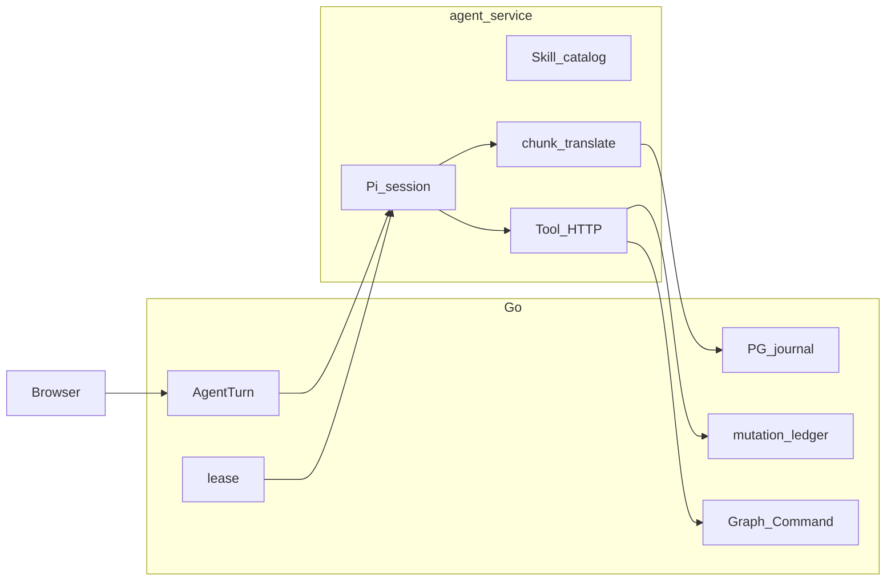

# Agent 运行时所有权重构账本

本账本管理 Agent 运行时职责的归属和迁移顺序。它不替代、不缩小 [`agent-production-readiness.md`](agent-production-readiness.md) 的生产可靠性合同。

## 来源与使用规则

- 来源：仓库协作会话在 2026-09-01 确认的《Agent 运行时所有权重构》计划；S0 按计划先建立账本，再开始代码迁移。
- 状态枚举与生产就绪账本一致：`完成`、`部分完成`、`缺失`、`违背`。
- `完成`：当前代码 owner、贴近所有权边界的自动化测试和本刀 Gate 都有新证据，且相关生产就绪项仍为 `完成` 或 `部分完成`。
- `部分完成`：目标边界已有实现，但仍有双作者、残留读写路径、测试缺口或未过 Gate。
- `缺失`：尚未开始迁移，或没有足以判断的证据。冻结决策被接受不等于实现完成。
- `违背`：当前实现与冻结决策相反，例如本地文件成为浏览器事实源、Node 写业务终态或两侧解释同一恢复策略。
- 每次状态变化必须同时填写 owner、测试或实测证据、验证日期和缺口。不得只写“已实现”。
- 每一刀开始前，先在本账本确认条款；若合同变化，先写“决策变更”并取得用户确认。代码与账本证据放在同一 checkpoint。

## 与生产就绪账本的关系

生产可靠性的唯一验收指标仍是 [`agent-production-readiness.md`](agent-production-readiness.md)。本账本只回答职责放在哪一侧以及迁移如何分刀。

| 生产就绪 ID | 本重构约束与切片 |
|---|---|
| D-01 | `unknown`、`terminal_reason_code`、interrupted message 不变；S2/S4 只能收口终态作者，不能改窄语义。 |
| D-02 | effect 对账语义不变；S5 把策略解释的唯一 owner 收到 Go。 |
| D-03 | foreground Pi 与 `background_resumable` 合同不变；S6 不引入旁路模型执行器。 |
| D-04 | 单管理员、单商家和 7 天压缩边界不变；本重构不宣告生产就绪。 |
| D-05 | 25 Turn、100 SSE、1 万事件、1000 Turn 容量门不变；S1 保留 batching/WAL 性能合同。 |
| C-01 | manifest 与 `recovery_policy` wire schema 保持兼容；S5 只迁移解释权。 |
| C-02 | `tool_effect_intent` v1 字段和有界 payload 不变；S5 保留 checkpoint 证明。 |
| C-03 | `terminal_reason_code` 列与枚举不变；S2/S4 由 Go 写和投影。 |
| C-04 | model invocation identity、fencing、usage 合同不变；S1/S2/S6 不绕过它。 |
| C-05 | checkpoint 和 assistant message 字段不变；S6 只拆模块所有权。 |
| C-06 | Pi adapter 的 background 能力仍为 false；S6 不扩大执行模式。 |
| C-07 | 产品/全局事件页合同不变；S1/S4 保证浏览器继续只读 PG。 |
| C-08 | UI 事件类型保持兼容；S2/S4 不新增 Turn 枚举。 |
| C-09 | Go/Agent metrics 鉴权边界不变；拆文件不得改变端点注册。 |
| S1 | schema/contract 基础不得回退；本账本 S1 只改 journal 写路径所有权。 |
| S2 | 崩溃恢复解释器语义不得回退；本账本 S2/S5 分别收口终态与 effect 作者。 |
| S3 | pending identity 与恢复不得回退；本账本 S3 删除 same-Turn 路径之外的残留。 |
| S4 | ConversationRuntime gap 自愈不得回退；本账本 S4 只替换服务端活投影来源。 |
| S5 | usage、metrics、alerts 不得回退；本账本 S5 删除 Node 第二策略解释器。 |
| S6 | 压缩和读取边界不得回退；本账本 S6 拆薄 Pi adapter。 |
| G-01 | 每刀运行对应单元/合同门。 |
| G-02 | S2/S5 保持 PostgreSQL effect、scanner 和 fencing 覆盖。 |
| G-03 | S1/S2 运行既有四点 SIGKILL 证据；不能用窄单测代替。 |
| G-04 | S4 保持断线、gap、重复帧、generation、overflow、terminal、approval 浏览器合同。 |
| G-05 | S1 若改 batch/WAL，重跑 journal 容量门。 |
| G-06 | 本重构不扩大真实 provider 能力；已完成的 Luna/WorkflowRun/图片链不得退化。 |
| G-07 | 每刀记录局部门；S6 跑全量门。干净 checkout 当前仍缺，不因重构而标完成。 |

重构切片标为 `完成` 的前提是相关条目保持 `完成` 或 `部分完成`，且本刀 Gate 有 2026-09-01 或之后的新证据。若生产就绪账本出现 `违背`，相关重构切片不得标为完成。

## 冻结决策

| ID | 决策 | 状态 | owner | 当前证据、日期与缺口 |
|---|---|---|---|---|
| D-R01 | PostgreSQL `agent_turn_events` 是浏览器与列表的 journal 权威；本地文件不得成为第二事实源。 | 完成 | Go `go/internal/agent/journal.go`、`sse.go`；ADR 0017 | 2026-09-01：生产就绪 C-07/C-08 已完成。S1 仍需收口写路径作者。 |
| D-R02 | 本地磁盘只做有界 WAL 与 Pi session；ACK 失败原序重试或诚实终止，不跳 seq；保留批量提交，不退回每 token await PG。 | 完成 | `agent-service/src/store.ts`、`pi-runtime.ts`、`journal-publisher.ts` | 2026-09-01：S1 删除 Store publisher；runtime 显式读取未入 batch 的 WAL 连续前缀，receipt 匹配后推进 ACK。阈值保持 20ms/64/768KiB；Agent 166 passed，10k WAL P95=0.98ms，PG batch P95=221.27ms。 |
| D-R03 | 丢失的 in-flight 执行只由 Go lease 过期扫描写终态；Node 重启只 confirm 可证明前缀。 | 完成 | `go/internal/agent/recovery.go`；`agent-service/src/pi-runtime.ts` | 2026-09-01：Node handoff 只 confirm/drain WAL 或采用 PG terminal，不再生成 recovery approval/unknown `turn/end`；drain 后保留 in-flight lease 给 Go scanner。Go 显式跳过 `requires_input`/`awaiting_confirmation`。Agent 166 passed；Go agent 通过；G-03 四点 SIGKILL 通过。 |
| D-R04 | 工具副作用证明只在 `agent_tool_mutations`；TypeScript 与 Go 不各自运行 `recovery_policy` 解释器。 | 完成 | `go/internal/agent/effect_reconcile.go`、`agent-service/src/tool-effect.ts` | 2026-09-01：S5 增加 lease-scoped live reconcile 命令；Node 只写 intent、单次 mutation、5xx 查询 Go 并消费终态，policy 查询/重试/二次对账只在 Go。 |
| D-R05 | 提问续跑保持同一 Turn 的 answer + Pi resume；删除 `ContinuationTurnID` 残留。 | 完成 | `go/internal/agent/turns.go`、`sync.go`、schema、Web Agent projection | 2026-09-01：S3 删除 DB 列/索引、Go DTO/reader/cleanup、OpenAPI 字段和 Web orphan filter；`just go-migrate`、`just go-test`、Agent question/restart 29 tests、Web 634 tests/build 通过。答案 route 仍把两个既有响应成员指向同一 Turn。 |
| D-R06 | agent-service 只拥有 Pi session、Skill、chunk 合帧和 Tool HTTP，不拥有商品、图或确认事务。 | 部分完成 | `agent-service/src/pi-runtime.ts`、`tools.ts` | 2026-09-01：业务事务与 effect policy 已在 Go；Pi adapter 仍混有 journal handoff/recovery 编排，待 S6。 |
| D-R07 | 不把生产就绪已完成合同改窄；冲突必须先写双方“决策变更”。 | 完成 | 两份 audit ledger | 2026-09-01：本账本建立关系矩阵；暂无决策变更。 |
| D-R08 | 一刀一提交；上一刀未提交不得开始下一刀。 | 完成 | Git checkpoint 协议 | 2026-09-01：S0 建账；后续按 checkpoint-1 至 checkpoint-6 串行。 |

## 目标边界与当前诊断

| 诊断 | 当前证据 | 目标 owner | 处理切片 |
|---|---|---|---|
| journal publisher 循环注入（已收口） | 2026-09-01：`setEventPublisher` 与 Store publisher 字段已删除；`pi-runtime.ts` 的显式 WAL handoff 是唯一 lease-aware batch/ACK writer | 单一 lease-aware batch/ACK writer；本地 WAL 私有 | S1 |
| 丢失执行双终态作者（已收口） | 2026-09-01：Node startup/handoff 删除 recovery `turn/end`；`go/internal/agent/recovery.go` 是 lease-expiry terminal owner | Go lease expiry scanner | S2 |
| same-Turn 提问 continuation 身份残留（已删除） | 2026-09-01：运行时代码/wire/UI 已无 `ContinuationTurnID` 或 orphan cleanup；仅 migration DDL 保留列名用于 `DROP COLUMN IF EXISTS` | 原 Turn answer + Pi resume | S3 |
| worker 读取 Node Turn 快照更新活投影（已收口） | 2026-09-01：Gateway/worker/read route 的 `GetTurn` snapshot path 已删除；`AppendEvents` 同事务增量 fold active status 与三列摘要 | PG journal fold；worker 只绑定 harness ID、重试 start 或恢复持久化答案 | S4 |
| effect policy 两侧解释（已收口） | 2026-09-01：Node 删除 `not_applied -> retry -> second reconcile` 与 per-tool reconcile callbacks；live/manual/scanner 共用 Go `reconcileEffectIntent` | Go mutation ledger/reconciler | S5 |
| Pi adapter 编排范围过宽 | `agent-service/src/pi-runtime.ts` 同时包含 session、journal、恢复、effect 协调 | Pi session/Skill/chunk/Tool adapter | S6 |

## 不退化合同

| ID | 用户可见合同 | 生产就绪映射 | owner 与测试/页面锚点 | 状态 |
|---|---|---|---|---|
| R-01 | Agent-first 创建继续通过 `finalize_product_intake_v1` 完成 intake。 | C-01、C-02、G-06 | `agent-service/src/tools.test.ts`、`skills.test.ts`；创建页 Agent 流程 | 完成 |
| R-02 | 单步图修改直接 apply，多步修改 propose ChangeSet，均走 Graph Command。 | D-02、C-01、S2-04 | `agent-service/src/graph-command-schema.test.ts`、`tools.test.ts`；工作台画布 | 完成 |
| R-03 | `ask_user` 在同一 Turn 写答案并恢复同一 Pi session，不创建 continuation Turn。 | S2-02、S3-03 | `go/internal/agent/question_resume_gopg_test.go`、`agent-service/src/question-resume.test.ts` | 完成 |
| R-04 | workflow run、graph proposal、全局 Draft 的确认只产生一次业务副作用。 | D-02、S3-01～S3-04、G-02/G-03 | `task_graph_test.go`、`recovery_proposal_draft_test.go`、`pending_identity_test.go` | 完成 |
| R-05 | Turn `unknown` 和各 `terminal_reason_code` 继续显示准确中断/对账文案。 | D-01、C-03、C-08、S2-07 | `web/src/pages/workbench/agent/AgentConversationComponents.test.ts` | 完成 |
| R-06 | 浏览器 SSE 只读 PG journal；断线、关闭页面不取消 Agent。 | C-07、S4-01～S4-06、G-04 | `web/src/pages/workbench/agent/conversation/runtime.test.ts`、live browser recovery spec | 完成 |
| R-07 | Product Goal 仍只由用户 complete/cancel；Turn 或 graph run 终态只把 Goal 留在 `waiting_user/goal_loop`。 | D-04 | `go/internal/agent/task_graph_test.go`、`sync_task_contract_test.go` | 完成 |
| R-08 | Turn running 时画布仍可编辑，Agent 不持有画布编辑锁。 | D-04、G-06 | 工作台画布交互；`web/src/pages/workbench/chrome/workflowCanvasInteraction.test.ts` | 部分完成：现有交互测试覆盖锁/只读，S6 全量 Web gate 防回归；缺专门 running-Turn 用例。 |

## 实施切片

| ID | 验收要求 | 代码 owner | 状态 | 测试/实测证据 | 缺口 |
|---|---|---|---|---|---|
| S0 | 建立本账本、索引、ADR 0018、ROADMAP 入口；0007 仅状态行指向后继。 | `docs/audits/`、`docs/adr/`、`docs/ROADMAP.md` | 完成 | 2026-09-01：`just docs-check` 通过；checkpoint-0 提交前 staged 范围核对。 | 无；代码切片仍按 S1-S6 保持缺失。 |
| S1 | 删除 `store.setEventPublisher -> runtime.publishDurableEvent` 回环；WAL 私有；lease-aware batch/ACK 单一作者；保持 20ms/64/768KiB。 | `agent-service/src/main.ts`、`store.ts`、`pi-runtime.ts`、journal/runtime tests | 完成 | 2026-09-01：`just agent-service-test` 20 files、166 passed/2 skipped；带 dev env 的 `go test -C go ./internal/agent -count=1` 通过（86.1s）；10k WAL P95=0.98ms；PG 10k/25 Turn/100 SSE 容量门通过，batch P95=221.27ms。 | 无；S2 继续收口 recovery 终态作者。 |
| S2 | Go lease 过期扫描是丢失 in-flight 的唯一终态作者；Node 只 drain/confirm 证明前缀；parked 状态不误标 unknown。 | `go/internal/agent/recovery.go`、`agent-service/src/pi-runtime.ts`、process restart tests | 完成 | 2026-09-01：`just agent-service-test` 20 files、166 passed/2 skipped；Go agent（dev env）通过，87.8s；聚焦 recovery 35.5s；`TestSIGKILLLeaseHolderAgainstGoPG` 四点全过。进程重启 E2E 断言不重放模型、不写 Node terminal、confirm 已提交前缀。 | 无；S3 删除 question continuation 残留。 |
| S3 | 删除 `ContinuationTurnID`、`cancelUnusedContinuation` 及 schema 残留；same-Turn 行为不变。 | Go turns/sync/DTO/schema、OpenAPI、Web types/projection | 完成 | 2026-09-01：`just go-migrate` 通过；`just go-test` 整树通过（agent 90.7s）；Agent question/restart 29 passed/1 skipped；Web 92 files、634 passed及 build 通过。全树 scan 仅在本账本和 idempotent `DROP COLUMN` DDL 中保留删除目标名称。 | 无；ADR 0007 冻结正文不重写，0018 已说明后继合同。 |
| S4 | `sync.go` 不再用 Node `GetTurn` 快照写活状态；三列摘要由 PG journal fold；worker 只绑定 harness ID、重试 start。 | `go/internal/agent/sync.go`、journal projection、Web SSE | 完成 | 2026-09-01：`AppendEvents` 同事务增量 fold active status、output/thinking/tool steps；exact replay 不重复 fold，terminal 前重载 row。Gateway/worker/read route 删除 snapshot reader，worker 只处理未绑定 start 与答案 resume。Go agent 全包通过（87.5s）；Web 92 files、634 passed。 | 无；S5 收口 effect policy interpreter。 |
| S5 | Node 只 checkpoint intent、发 mutation、5xx 查询 Go；`recovery_policy` 解释器仅在 Go。 | `agent-service/src/tool-effect.ts`、Go effect ledger/reconciler | 完成 | 2026-09-01：lease-scoped live API 只从当前 execution 的 PG intent 读取 policy/payload；Node 单次 mutation 后只查询 Go 终态。八工具四态矩阵、live/manual/scanner 共享解释器通过；Go agent 全包 92.8s；Agent 166 passed/2 skipped。 | 无；S6 拆薄 Pi adapter。 |
| S6 | `pi-runtime.ts` 只保留 session、drain、chunk 订阅、Skill/Tool 注册；稳定事实写回 ARCHITECTURE/CONTEXT。 | `agent-service/src/pi-runtime.ts` 及提取模块；`docs/ARCHITECTURE.md`、`CONTEXT.md` | 缺失 | 2026-09-01：尚未开始代码修改。 | 依赖 S1-S5；需全量 Gate。 |

## Checkpoint 协议

执行本计划视为已授权每刀在 Gate 通过后直接提交，不再逐刀请求确认。

| ID | 提交内容 | 提交前最低 Gate |
|---|---|---|
| checkpoint-0 | 仅文档：本账本、索引、ADR 0018、ROADMAP、0007 状态行 | `just docs-check` |
| checkpoint-1 | S1 代码、账本证据；写路径成为活事实时同步 ARCHITECTURE | `just agent-service-test`；`go test -C go ./internal/agent`；改 batch/WAL 时加 journal 容量门 |
| checkpoint-2 | S2 代码与账本 | checkpoint-1 的相关门；生产就绪 G-03 四点 SIGKILL（若 Go agent 全包已包含则记录测试名） |
| checkpoint-3 | S3 代码、必要 schema 与账本 | `just go-test`；有 schema 时 `just go-migrate`；Agent 提问测试 |
| checkpoint-4 | S4 代码与账本 | Go agent tests；Web 对话/SSE 相关测试 |
| checkpoint-5 | S5 代码与账本 | 八工具四态矩阵；共享解释器测试；`just agent-service-test` |
| checkpoint-6 | S6 拆分、ARCHITECTURE/CONTEXT、账本收口 | `just go-test`；`just agent-service-test`；`pnpm --dir web test:run`；`just docs-check`；`git diff --check` |

规则：

1. 一次提交只对应一刀；范围外问题另记缺口或另开提交。
2. 上一刀未提交不得开始下一刀；提交后工作区允许保留用户已有但未纳入本刀的改动。
3. 不使用 `--no-verify`。提交 hook 失败后修复再提交；已推送提交不 amend。
4. 不提交 `.env`、data 根、缓存或构建输出。
5. 每个 checkpoint 提交前用 `git diff --cached --name-only` 核对归属，避免纳入既有工作区改动。

## Gate 与验证记录

### 固定 Gate

- Journal/WAL：`just agent-service-test`、`go test -C go ./internal/agent`；改容量参数或 WAL 时加 `just agent-service-test-local-journal-capacity`、`just go-test-agent-journal-capacity`。
- Recovery：Go agent 全包中的 `TestSIGKILLLeaseHolderAgainstGoPG` 必须实际运行，覆盖 model start、mutation result 前、approval 后、turn/end 响应前。
- Question/schema：`just go-test`、Agent question tests；删 schema 列时 `just go-migrate`。
- Projection：Go agent tests、`pnpm --dir web test:run` 中对话/runtime/SSE 覆盖。
- Tool effect：Go 八工具四态矩阵和共享解释器测试、`just agent-service-test`。
- 最终：checkpoint-6 全量命令；G-07 的干净 checkout 仍单独保持 `部分完成`，除非确实在干净 checkout 重跑。

### 验证记录

| 日期 | checkpoint | 命令与结果 | 备注 |
|---|---|---|---|
| 2026-09-01 | checkpoint-0 | `just docs-check`：通过；目标文档 `git diff --check`：通过 | S0 仅修改账本、索引、ROADMAP、ADR 0007 状态行并新增 ADR 0018。 |
| 2026-09-01 | checkpoint-1 | `just agent-service-test`：166 passed/2 skipped；Go agent（dev env）：通过，86.1s；local WAL 10k P95=0.98ms；PG batch 10k/25 Turn/100 SSE：通过，P95=221.27ms | Store publisher residue scan 为空；20ms/64/768KiB 常量未变。 |
| 2026-09-01 | checkpoint-2 | `just agent-service-test`：166 passed/2 skipped；Go agent（dev env）：通过，87.8s；聚焦 recovery：通过，35.5s；G-03 `TestSIGKILLLeaseHolderAgainstGoPG`：model_start/mutation/approval/turn_end 全过 | Node process restart E2E 改为等待 Go owner，不再期待 Node 自写 unknown。 |
| 2026-09-01 | checkpoint-3 | `just go-migrate`：通过；`just go-test`：整树通过；Agent question/restart：29 passed/1 skipped；Web：92 files、634 passed，build 通过 | schema ExtraDDL 删除旧索引和列；OpenAPI/Go/Web 不再暴露 `continuation_turn_id`。 |
| 2026-09-01 | checkpoint-4 | Go agent 全包：通过，87.5s；PG fold 聚焦测试与 SSE TTFB：通过，P95=15.87ms；Web：92 files、634 passed | snapshot reader residue scan 为空；exact replay 不重复摘要，bound running worker dispatch 被消费。 |
| 2026-09-01 | checkpoint-5 | 八工具四态矩阵：通过；live/manual/scanner 共享解释器：通过；Go agent 全包：通过，92.8s；Agent：166 passed/2 skipped；`just docs-check`：通过 | Node policy/retry branch residue scan 为空；网络丢响应测试断言一次 mutation、一次 Go reconcile。 |

## 明确不做

- 后台 durable Task、模型请求原地续跑、跨进程 `not_applied` 自动重试。
- 用本重构宣告生产就绪或把 G-07 改成完成。
- 新对话壳、建议 chip、新 Tool 等用户可见扩面。
- 给 `ProductFlowClient` 增加无行为的包装层；把 Skill 当权限层；浏览器直连 agent-service；替换 Pi；在 Node 写 Graph Command。

## 决策变更

暂无。后续记录必须包含日期、提出者、原条款、替代条款、迁移影响、生产就绪账本影响和验收 Gate；不得直接覆盖冻结决策。
