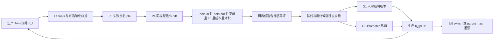

# Agent 能力组与 Self-Harness 验收账本

2026-09-05 规划更新：用户已确认目标覆盖影响 Agent 任务成效的整个系统，包含必要的后端代码改进。见[系统级自进化规划草案](#系统级自进化规划草案)。该节记录研究依据、拟议架构与实施门槛；机制细节尚待设计评审，不授权自动修改或发布生产代码。下文原 Self-Harness P0–P7 保留已有证据与未完成状态，不能代表系统级目标已经覆盖。

本账本管理 ProductFlow 领域壳的版本化、失败挖掘、同模型提案、评测接受与生产热切。它衡量「壳会不会按声明面进化」，不替代 [`agent-eval-system.md`](agent-eval-system.md) 的行为分数，也不替代 [`performance-governance.md#production-gates`](performance-governance.md#production-gates) 的可靠性 Gate。lease、journal、SSE、确认协议仍走生产就绪账本。

**Agent 能力组章程。执行以已发布 issue 为界。** 本组接收原壳进化方向与普通 Skill 缺陷修复；当前任务与认领见 [Issue 看板](tasks/README.md)。P3 及以后由维护者按已交付前置和对应阶段门发布。

## 组职责与交接

- 对 Agent 能否遵守商品事实、用户意图、确认权限并正确使用既有工具负责。普通 Skill 修复与 Self-Harness 进化分别验收；修好产品缺陷不等于 P1–P7 或 G1/G2 完成。
- [eval-skills](tasks/eval-skills.md) 从评测组转入，量化验收尚未交付。[首轮校正](tasks/archive/eval-contract-alignment.md) 后的固定 `4c8ad3e0` 批次仍暴露缺失目标事实与不等价释义，已交[可见输入合同](tasks/eval-observable-input-contract.md) 独立处理；历史旧题与该诊断批次不作跨题集改善证据。本轮候选修正运行目标 ID 指导和 intake 图种目录取值，L0 270 通过 / 2 跳过，未改题目、world 或 grader；B 两次复跑与变异验收待独立校正后进行，尚无收益数字。普通修复无需等待 P1，亦不代表 Self-Harness 阶段完成。
- 本组拥有壳版本与候选行为，不拥有评分规则。题目过时交评测组独立处理；共享 runtime 或 policy 的 live 输入按看板冻结，不能边修改边采信旧结果。
- 人工修复从现在执行，自进化按 P3 / P4 前置落地。结果按[人工改进与自进化对照](agent-eval-system.md#人工改进与自进化对照) 分 A 基线、B 人工改进、C 自进化：保留共同起点，分别归因，不把 B 的人工收益写入 C 谱系。当前 `eval-skills` 承担 A / B；C 未实现，G1 / G2 状态不变。
- lease、journal、恢复与 SSE 基础交平台可靠性；Graph Command 与人工编辑合同交工作流体验。工具使用错误由本组修，工具业务实现错误按根因移交，不用 Skill 绕开。
- Skill 修复交付后，本组记录修复结果，评测账本记录分数与门槛；同一 run_id 通过链接复用，不复制第二套评分结论。Self-Harness 后续门槛保持下文合同。

Cursor Canvas 与会话纪要不是合同。合同只在本账本；未完成方向由 [`../ROADMAP.md`](../ROADMAP.md) 索引。阶段完成后，已接线事实写回 `docs/ARCHITECTURE.md`（Turn 带 `harness_hash` 等）；商家可见操作（清空 playbook）进 P6 才写 `docs/USER_GUIDE.md` 与 HelpPage。CONTEXT 词汇等代码落地再迁。

## 来源与使用规则

- 来源：2026-09-05 当前会话将 Self-Harness 设计冻成仓库合同。原始消息没有可在仓库中复核的 thread ID 或独立附件，因此本账本不登记伪造的来源 ID 或文本哈希。
- 适用范围：生产 `agent-service/.pi/skills/` 的普通修复，以及未来的 `agent-service/harness/`、Skill overlay、`runtime-policy` 行为段、Pi 钩子 Steer、商家 playbook、进化控制器（Miner / Proposer / Validator / Promoter）、演化轨迹与 `harness_hash` 归因。当前生产 loop 仍是 `PiRuntimeManager`。
- 本账本允许同时写目标合同、当前代码事实和缺口。当前能力只写入 `docs/ARCHITECTURE.md`；未完成方向由 ROADMAP 索引。
- 状态变更必须引用当前代码、自动化测试或真实运行结果。真实模型结果还要登记 `run_id`、模型、`harness_hash`、`task_hash`、`skill_hash`、试验次数和结果目录；没有这些字段不得补写「已通过」。
- 评测原始转录仍只进入 `STORAGE_ROOT/agent-evals/`，不提交仓库。演化轨迹（P2b）同样只落 `STORAGE_ROOT`，不进 git，不进 PostgreSQL 对话 journal。
- 后继实现必须先把目标阶段标「进行中」，再动该阶段代码。G1 / G2 是出口聚合，不是另开的实现切片。
- 一次变更只打一个可编辑面。上一阶段未标 `完成` 不得开下一阶段；P2b 可与 P3 并行。

### 状态四值

| 状态 | 判定规则 |
|---|---|
| `完成` | 当前实现、贴近合同的自动化测试和条款要求的真实运行证据都存在。 |
| `部分完成` | 已有可执行实现或既有证据，但数据规模、观测边界、统计口径、真实基础设施或复跑证据不全。 |
| `缺失` | 实现不存在，或当前证据不足以判断。 |
| `违背` | 当前实现明确采用冻结决策禁止的合同；迁移完成前保留该标记。 |

## 当前基线

2026-09-05 P1 交付盘点（代码与默认测试；进化控制器不存在）：

- 模型 loop 由 `@earendil-works/pi-coding-agent` 承担：`agent-service/src/pi-runtime.ts` 装配 Skill catalog、`runtime-policy.md`、动态上下文和 ProductFlow 工具。Pi `InlineExtension` 目前只用 `before_provider_request`。
- `agent-service/harness/` 是可哈希工件，`src/harness.ts` 读取并冻结；四段原有行为指导已从 policy 拆入 instructions。`runtime-policy.md` 保留冻结权限/确认/问题协议，manifest 钉住其摘要。Skill 在 `.pi/skills/`（独立 `skills.hash`）；工具清单保留 `TOOL_MANIFEST_VERSION`。
- 评测 L0–L6 在 [`agent-eval-system.md`](agent-eval-system.md)。L1 有 live `run_id`，regression 门槛未过，D-08 分数不可采信。本账本不得把那些 pass^k 写成 Self-Harness 成果。
- 工件 hash=`13e8e19ae0ba1cadc732f5f4ba6d0ffba0da08d5a859671ccb67d72bf52dae21`。P2 已将同一冻结身份写入生产新 invocation/checkpoint、eval `run.json` 与 `/healthz`；历史 invocation 保留 NULL。P2b 提供默认关闭的结构诊断轨迹，不记录对话正文，未接消费者。Miner / Proposer / Promoter、Steer 与 playbook 仍缺失。[P1](tasks/archive/harness-artifact.md) / [P2](tasks/archive/harness-attribution.md) / [P2b](tasks/archive/harness-traces.md) 交付不证明能力分数提高；共享 dev 尚未部署本次归因与轨迹实现。

### 目标拓扑（G2 全开时）



## 两档生产出口

Self-Harness「生产可用」分两档。它不等于生产就绪账本的 G-06 / G-07。

| ID | 出口 | 阶段 | 商家可见 | 评测依赖 |
|---|---|---|---|---|
| G1 | 辅助进化：生产 Turn 带着 `harness_hash` 执行冻结的 `h_t`；候选初筛、独立复跑后**人**审查并切版本（hash 指针或仓库引用） | P1–P4 均 `完成` | 无新 UI | 阶段验收登记独立验收集结果；允许评测 D-08 仍为分数不可采信，但必须标 `uncalibrated`，仅作辅助实验；分数不足以证明能力提高，禁止用 pass^k 对外宣称 Agent 质量 |
| G2 | 自动进化：Steer、playbook、自动热切、一键回滚、kill switch | G1 + P5 + P6 + P7 均 `完成` | playbook 可清空（P6 起写 USER_GUIDE） | 开 P7 前须 G1、P5、P6 完成，评测账本已登记通过 L5 的 `run_id` 且 D-08「分数可采信」为 `完成`；G2 阶段验收另登记独立验收集结果。D-03 通过率达标不得替代 D-08 |

G1 / G2 当前均为 `缺失`。

## 系统级自进化规划草案

### 目标与当前差距

目标：系统从获准使用的执行证据、用户反馈及成本数据中发现影响商家任务成效的问题，定位根因，产生指令或代码候选，经独立验证和分级批准后改善后续执行。效果最终落实为商品事实正确、目标与数量符合用户选择、操作与实际结果一致、素材可用，以及人工介入和成本可控。

本节为 2026-09-05 研究后的设计建议，未实现。当前由外部编码助手执行人工修补，不能登记为项目内部自动进化；第一档自动化由控制器组织诊断、候选和验证，人保留发布批准，称为辅助自进化。更强的递归自改进还须证明改进后的系统能更有效地产生下一代，不能由普通业务任务涨分推出。

本轮核验的代码基础：`agent-service/src/harness.ts` 只加载四段指令，manifest 的 `skill_overlays` / `runtime_control` 仍由空对象 schema 限定；`src/evolution-traces.ts` 是默认关闭、有界、尽力写入的结构诊断，不构成完整可重放任务包。Pi 继续承担当前生产模型 loop；Go 与 PostgreSQL 仍是业务权威。P1 / P2 / P2b 可复用，但 Miner、代码候选构建、可信评测隔离和发布控制器均未因此完成。

规划期间保持当前任务分工：[eval-observable-input-contract](tasks/eval-observable-input-contract.md) 由独立评测 owner 处理，不在本节修题；[eval-skills](tasks/eval-skills.md) 保留人工候选与未完成验收。研究不占用其冻结输入，不启动共享 live。后续新阶段应按本草案评审后的合同发布，不能直接沿用旧的 Prompt-only 范围声称实现了系统级目标。

### 论文与公开实现

以下来源在 2026-09-05 查阅。论文实验、开源可执行实现与 ProductFlow 生产就绪性分别判断；本轮阅读了原文和部分源码，没有安装、复现或接入这些外部项目，不以 stars、作者的榜单成绩或 README 的生产用语认定成熟度。表中「采用」指拟采用机制，非已引入依赖。

| 来源 | 已核实的机制 | 对本项目的取舍 |
|---|---|---|
| [ADAS](https://arxiv.org/abs/2408.08435) | Meta Agent Search 以代码表达 Agent，结合历史候选档案搜索设计 | 搜索对象允许覆盖工具与控制流；初期保持单个有界因果问题，不启动无限架构搜索 |
| [DGM](https://arxiv.org/html/2505.22954v3) / [官方实现](https://github.com/jennyzzt/dgm) | 自修改 Agent 代码，维护可分叉档案，以实验评价后代；附录讨论 objective hacking | 保留失败候选及父版本、分开探索与晋升；可保留暂时不优的研究分支，生产只接受通过门槛的版本。论文编码基准不证明 Go 事务或商家业务安全 |
| [GEPA 论文](https://arxiv.org/abs/2507.19457) / [当前实现](https://github.com/gepa-ai/gepa) | 轨迹反思、候选选择、合并；当前适配接口可承载代码等命名文本对象，范围已超出单条 Prompt | 优先评估复用反思搜索与适配接口。框架内部的数值筛选结果只授予复验资格，不能代替业务安全和发布授权 |
| [Live-SWE-agent](https://arxiv.org/html/2511.13646v3) | 实际实验重点是执行任务时创建和使用临时工具脚本，底层 loop 保持简单 | 允许隔离编码环境产生临时分析工具；不据此允许商家 Turn 热改共享后端，也不将临时脚本自动晋升成生产工具 |
| [ACE](https://arxiv.org/html/2510.04618v3) | 将上下文当作可增量整理的 playbook，区分生成、反思和整理 | 商家记忆采用有来源的增量修订与撤回，避免整段重写积累错误；上下文学习独立于全局代码版本 |
| [Hyperagents](https://arxiv.org/html/2603.19461v1) / [官方实现](https://github.com/facebookresearch/Hyperagents) | 将任务执行器与改进它的 meta agent 纳入可修改程序；主实验仍使用固定的外层父选择机制 | 元进化保留为后续研究通道，不永久排除控制器改进；外层预算、评测权威与发布授权保持候选不可写，不能把自我评分当收益 |
| [OpenEvolve](https://github.com/algorithmicsuperintelligence/openevolve) | 代码进化、候选多样性、island / MAP-Elites、分级评测 | 作为代码搜索对照，暂不与 GEPA 同时接两套调度；小预算下先验证简单候选档案，必要时再引入群体搜索 |
| [OpenHands SDK](https://github.com/OpenHands/software-agent-sdk) | 编码 Agent、工具、会话、Agent Server 与临时工作区分工，支持 Docker / Kubernetes 工作区 | 作为离线代码执行器候选。与现有 Pi 编码能力做小型接入比较，不替换商家生产 loop，不因 SDK 支持容器就假定安全配置完整 |
| [Harbor 任务与验证环境](https://www.harborframework.com/docs/tasks) | 任务环境、verifier、网络策略和产物采集独立配置，支持独立 verifier 环境 | 优先验证隔离评测编排能否复用；默认共享 verifier、默认 public 网络都不满足本计划的隔离要求，必须显式配置并实测 |

源码抽查锚点：GEPA `0632cdb5dcc052e690eab439e1b4a7e3e9cfe407` 的 `src/gepa/core/adapter.py`，包含 `evaluate`、`make_reflective_dataset` 和可选提案接口；DGM `a565fd2d1dca504ef5104a7cc0f3bdc4ab9b4fd2` 的 `DGM_outer.py`，包含父选择、档案更新与分级评测调度；OpenHands SDK `f47083cc370a85160f0348f32e531ee3514399e5` 的 README，核对代码执行与工作区职责。其余来源按上表原文 / 文档核验，未完成源码或安全审计。采用前须再固定版本、许可证、安装依赖和测试证据。

### 改进范围与权限

修改范围按根因和影响确定，不按语言或目录决定。Agent 能力组负责改进流程与成效；Graph、平台、评测原 owner 继续拥有其合同和验收权。跨层修改必须证明因果链并取得对应写入范围，不能用进化任务绕过共享看板的认领与排他规则。

| 改进对象 | 隔离环境可提出的候选 | 首期批准边界 |
|---|---|---|
| Skill、指令、检索、上下文组织 | 文本、检索参数、必要实现补丁 | 独立评测后人审发布；记忆变化单独归因 |
| Agent 调度、工具参数构造、结果处理、错误恢复 | Node / Pi 适配层代码及回归测试 | 按受影响调用链验证；不能静默扩大权限或改变确认语义 |
| 工具后端、Graph 执行、事务、幂等、状态查询 | 保持业务合同的 Go 代码修补，可跨层 | 业务 owner 审核；真实 PostgreSQL 和相关故障边界验收；首期不自动上线写路径 |
| 工具 schema、新工具、会话交互、必要前端投影 | 合同变更提案及完整实现候选 | 先批准合同范围，再允许实现；输入、持久化、返回和 UI 一起验收 |
| 模型、依赖或 loop 选择 | 配置 / 依赖 / 替换方案候选 | 单独实验身份和人工批准，不把换模型收益算成同模型壳改进；当前继续 Pi 单一生产 loop |
| Miner、提案策略、搜索调度 | 在后续元进化战役中改控制器候选 | 用固定外部任务与成本比较其改进效率；候选不能批准自身替换 |
| 评测器、权限策略、迁移和发布基础设施 | 缺陷报告与独立工程变更提案 | 与被测候选分开审核、冻结；候选无凭据、评分记录、预算及发布授权写权 |

模型权重训练需要模型与数据访问权、训练预算和专门验证，不是调用外部模型 API 即能实现的能力；本期不承诺。没有 Agent 任务因果证据的通用产品改造继续普通开发，不自动扩入进化战役。

### 执行架构

拟建四个职责明确的模块，首期可以由一个离线控制进程编排，无需四个常驻服务。权限隔离通过独立执行环境、挂载和凭据实施，不能只依靠模型角色名称。

| 模块 | 输入与输出 | 唯一职责 |
|---|---|---|
| 证据与实验目录 | 已批准样本、完整版本身份 -> 问题包、实验定义、只追加记录 | 冻结样本用途、来源和版本；保存全部尝试与拒绝原因 |
| 候选构建 | 问题包、父版本、批准修改范围 -> 可构建补丁和局部验证结果 | 复用编码执行器，在隔离工作区实现一个因果假设；无正式评分与发布权 |
| 可信评测 | 固定候选、父版本、评测版本 -> 完整结果和接受建议 | 外部构建、业务观测与评分；保留无效批次，不消费候选自报的成功作为权威 |
| 发布控制 | 精确工件摘要、有效评测、批准记录 -> 发布 / 拒绝 / 停止 / 恢复记录 | 校验批准绑定的版本，复用现有部署流程，监控后续效果 |

候选生成可从 GEPA 适配接口接入文本候选，代码候选由隔离编码执行器产出 Git 补丁；是否统一采用 GEPA、是否采用 Harbor / OpenHands，由下方接入试验决定。领域合同、最终门槛与发布权留在 ProductFlow。首期不自研新的模型 loop、不同时部署多个搜索框架，也不让生产业务 Agent 获得 shell 工具。

一次战役的执行路径：

```text
获准证据 -> 问题归因与复现 -> 冻结父版本 / 范围 / 预算
  -> 隔离生成候选 -> 构建与合同筛查 -> 开发集筛选
  -> 最终候选冻结 -> 独立全链验证 -> 人审批准 -> 正常发布
  -> 新任务效果观察 -> 保留 / 停止 / 恢复
```

正式评测发现题目失真时转交独立评测任务；代码缺陷可用确定性合同回归继续工程修复，但不能用失真分数证明能力改善。已有生产故障处理不等待自动进化流程。

### 证据与候选身份

问题包至少包含用户目标及授权来源、相关输入、可达工具返回、期望业务后置条件、实际结果、最小复现、代码锚点和数据使用许可。结构 trace 用于发现候选问题，缺失参数或语义事实时标记证据不足，不能由模型补写。脱敏保留同一 ID 的引用关系和图拓扑；不可重放样本单独登记，不伪装成完整评测。

现有失败签名 phi 可作为一种诊断标签，但工具遗漏等表面错误不能直接决定修复 Skill。问题包区分观察事实与待验证假设，可表达模型决策、工具合同、业务实现、执行环境、评测缺陷及尚未确定。候选必须说明为什么修改当前层，至少给出一个可以否定该假设的检查；不强制每次失败归入已有 Prompt 导向词表。

`harness_hash` 只标识当前领域壳工件，不能承担系统版本身份。拟议实验记录关联：代码 commit 与内容摘要、Node / Go 构建工件及依赖、Skill / harness / 工具合同摘要、模型和 provider 请求选项、上下文与 playbook 版本、数据与任务集合、verifier / controller 版本、环境镜像及实验预算。复用已有字段并在实现时确定一个记录 owner，不建立相互竞争的多个版本注册表。

候选记录父版本、补丁摘要、变更类型、声明的业务合同影响、作者 / 提案模型、每次模型调用及评测成本、编译和测试结果、接受 / 拒绝原因。合并两个候选或更新父分支都形成新候选并重验；共享 HEAD 的并发变动不能继承旧候选批准。人工修改候选后保留人工介入记录，不能继续声称该结果完全自动生成。

档案保留所有尝试的元数据和证据摘要；大日志受保存期和容量预算约束，清理必须留缺失标记。研究可从未晋升分支继续搜索，生产发布链只追踪已批准工件。无需在首期引入大规模种群或额外数据库服务。

### 隔离与验证边界

- 编码执行器使用临时工作区与受限执行环境；无共享 `.env`、SSH / Git 凭据、宿主 Docker socket 或生产 storage / DB。模型调用经有预算和目标白名单的代理，依赖获取限定来源和版本。Git worktree 本身不构成安全隔离，容器安全性须按实际配置验证。
- build、安装脚本和测试命令都属于不可信执行面；由可信环境按固定入口构建候选，限制 CPU、内存、磁盘、进程数、时间和外网。不能让候选修改构建入口后把任意退出 0 当验收通过。
- 正式 verifier、隐藏材料和报告目录不挂给候选。即使使用 Harbor，也须显式启用独立 verifier / 网络限制；测评能读取受控导出的业务结果，不授予候选写成绩文件的权限。
- 后端代码可能篡改自身日志或返回假成功，验证必须覆盖独立读取的数据库后置条件、受控外部调用记录及确认事件；候选返回的 `succeeded`、自生成 trace 或自写测试报告都不是充分证据。
- 有副作用的试验使用独立 PostgreSQL / Redis、隔离存储和受控 provider。先使用可检查契约的替身验证确定性行为，真实 provider 子集另设预算与资源许可；不能把只过桩测试写成全链验证。
- 候选可新增开发回归测试，修复应在父版本复现失败、候选通过。原有受保护回归与独立验收由外部固定；若旧测试表达错误合同，应先独立校正，不允许候选删测试逃避验收。
- 生产观测、上传内容、日志、论文与仓库注释都按不可信数据处理，不因进入问题包就获得更高指令权限。越权改评测、读取隐藏材料、窃取凭据和突破沙箱必须有专门的拒绝测试。

### 实验与收益归因

沿用评测组拥有集合和评分的原则。第一轮研究至少区分以下实验臂，不为图表完整而同时启动全部实验：

| 实验臂 | 改变什么 | 要回答什么 |
|---|---|---|
| A 固定基线 | 不修改 | 当前分布与成本 |
| B 人工工程优化 | 人工诊断并改指令或代码 | 实用工程参照，不冒充自动收益 |
| C-prompt | 自动搜索仅改指令 / Skill | 文本修改空间能解决多少问题 |
| C-system | 同一改进控制器可按根因生成文本或代码候选 | 扩大修改空间是否有额外收益 |
| C-meta（后续） | 允许改进候选生成或搜索策略 | 改进机制自身是否更有效，需固定外部评测与总预算 |

测量修改空间的贡献时，C-prompt / C-system 固定提案模型、生产模型、共同父版本、数据、验证规则和总搜索预算。使用更强编码模型属于另一实验因素，明确记录，不能混为自进化算法效果。B 的人工时间无法可靠计量时，报告实用效果参考，不声称公平击败人工方法。

用于搜索反馈的集合一律按开发 / 验证材料处理，不能因为叫 held-out 就当独立验收。最终验收不返回逐题修补线索；一旦结果进入后续搜索，其暴露状态和后继用途由评测组更新。相同商品、原始场景及释义按组隔离；最终泛化验证包括未参与搜索的场景和时间上较新的样本。

工程验证与能力验证分别给结论：合法输入得到正确业务后置条件可以由确定性回归证明；新任务的 Agent 效果需要配对运行。原始通过率之外记录目标正确性、未确认副作用、任务完成、无效运行、人工介入、生成素材验收、tokens、工具调用、墙钟和实际费用。大模型裁判只适合部分语义 / 图片判断，事务与权限由确定性观测检查。

统计设计以场景 / 原始任务为分组单位，重复 trial 和释义不当作独立样本。k=3 可用于初筛与稳定性观察，不能单凭 2 个 trial 净增宣称显著收益。正式战役预先登记主要指标、可接受回归界限、样本量 / 精度目标、候选数与停止规则；用配对差异及适合分组数据的区间报告不确定性，不反复抽到通过。未满足精度时结论为证据不足。

安全、权限、确认与数据完整性是硬门槛，不能由其他任务涨分抵消。合法的等价工具路径不应仅因调用顺序不同被判错，路径约束只有在其本身是业务安全条件时保留。正式接受规则由评测组独立冻结；本节不修改现有 grader 或门槛。

区分已完整执行的任务失败与环境无效批次，二者都保留分母和原因。环境修复后的复跑建立新 run；不可删除超时或失败项再汇总。共享环境变化、模型别名漂移和 provider 变化都记录；配对顺序交错可减少时间漂移影响，但不承诺外部 API 完全确定性。

### 发布、恢复与预算

首期产出待审核补丁和证据，不自动上线。发布批准绑定精确工件与评测版本，批准后发生任何代码、依赖或配置漂移都重新验证。纯指令版本可在已验证的加载边界切换；Node / Go 代码通过正常构建和部署生效，不能靠修改 `harness_hash` 指针热替换二进制。

已有 Turn、WorkflowGraphRun 和待确认操作记录其执行版本。改变线协议或持久化语义时须验证在途任务，无法安全共存则使用明确的维护 / 排空窗口；不为本规划引入仓库已禁止的兼容 shim 或旧数据迁移器。数据库变更按当前 schema owner 处理，自动进化首期只允许提出方案，不自动执行生产迁移。

影子执行不向真实业务提交写入或重复调用付费生图。自动发布试点只覆盖已验证可恢复的低风险变更，逐批放量；停止晋升、停止候选流量与终止在途业务工作是不同操作。代码回退不等于数据回退，恢复计划须明确未完成任务、已发生副作用和人工处理路径，不能承诺任意事务改动一键回滚。

预算由可信控制器持有，包含候选数、模型 tokens / 费用、真实 provider 次数、墙钟、并发及存储上限；候选无修改权。达到任一上限停止新增尝试并保存已发生的结果，用户取消立即阻止新派发，外部调用是否可取消另按其合同记录。凭据代理应在发请求前执行预算检查，不能只在最终报告中算账。

试点建议每个问题最多 4 个候选、串行 1 个编码执行器、1 个最终候选进入正式对比；这是待校准默认建议，不是已获付费授权。tokens / 费用 / 墙钟上限由一次小样本校准和用户预算确定，未设置预算不启动自动战役。本轮既有 225 trial 诊断用了 7,373,162 个报告 tokens，仅作成本量级参考，不推算新流程报价；证据见 eval-skills。

### 实施切片与验收

以下是依赖设计，尚未发布为执行任务；评审后按共享看板一单一结果落地。现有 P1 / P2 / P2b 保留，不重做；旧 P3–P7 的阶段门需要按系统级目标修订，不直接把下表全部认领或同时实施。

| 切片 | 交付与完成条件 | 前置 |
|---|---|---|
| S0 目标与实验合同 | 固定改进范围、风险等级、人工批准点、三类集合及候选身份；明确替换旧 D-04 / D-06 / D-08 / D-11 的哪些约束 | 本草案评审；既有已认领任务保持原合同 |
| S1 隔离实验可行性 | 用同一固定父版本，在临时 Node + Go + PG 环境复现一条真实业务失败；恶意测试候选不能读凭据、改 verifier 或写评分；选择复用工具并记录未覆盖隔离面 | S0；合法数据和可复现合同，可与独立题目校正并行，不读取对方未冻结成果 |
| S2 证据与根因分流 | 自动从批准样本生成有证据的问题包，分别识别至少一例指令问题、后端问题和评测问题；不能都路由到 Skill；证据不足能够停止 | S0、足够输入；生产 trace 不够时先完善受控证据入口 |
| S3 第一条代码级辅助进化 | 同一流程自动诊断一条仍存在的后端 / 适配层缺陷、产生补丁、父版本红候选绿、通过冻结集成与安全回归，输出人审材料；由人批准交付 | S1 + S2 + 对应代码写入权限；任何能力涨分须等独立题集与验收有效 |
| S4 同预算对照 | 在同一父版本上比较 C-prompt 与 C-system，保留人工 B 参考、全部尝试与总成本；新场景独立验收，允许无改善结论 | S3、可信集合与预登记统计计划 |
| S5 低风险自动晋升 | 精确版本批准、影子无副作用、在途版本处理、停止与恢复演练通过，才限定范围自动发布 | S4 与生产可靠性 / 安全门；不以 playbook 必须先完成为无关依赖 |
| S6 记忆与元进化扩展 | 商家记忆独立反馈归因；控制器候选由固定外部实验评估改进效率，逐项扩大范围 | 各自真实输入与 S3 / S4 证据；不作为所有代码修补的前置 |

S3 的目标缺陷必须来自当时真实证据且尚未被修复，排除正在由其它 owner 处理的评测桩问题；不能为了证明代码进化，故意在生产引入 bug，也不能把历史人工补丁伪装成新自动发现。单个成功案例只证明流程可执行，S4 才开始回答系统性收益。

对现有规则的拟议调整：从「一个候选只能改一种文件面」改为「一个候选只验证一个因果假设，必要时跨层」；从「全局严格 P3→P7」改为按真实依赖发单；同模型保留为受控实验条件，生产模型与提案模型身份分开；Pi 保持当前生产选型，替换需独立合同；工具 schema 和控制器可进入专门提案通道，评分权威与发布授权仍不可由候选自改。以上尚未修改执行规则，实施前须同步当前冻结决策与对应专项规则。

待评审的实质抉择只有三项：S3 首个业务缺陷及其写权限；每轮实际费用 / 时间预算；S5 是否以及何时开放自动发布。推荐首期停在人审交付，先取得代码级改进和独立对照证据。执行器 / 搜索库选型由 S1 的小型接入试验裁定，不把框架品牌选择当业务前提。

## 冻结决策

写入下表后，不得用会话摘要缩小范围。变更必须先改本表再改代码。

| ID | 决策 | 状态 | 当前证据与验收缺口 |
|---|---|---|---|
| D-01 | 自研对象是 ProductFlow 领域壳 + 进化控制器。Pi 继续当模型 loop。不复活 Go `agent-harness`，不并行第二套生产 loop | `完成`（决策） | P1 工件由现有 Pi adapter 加载，无旁路执行器；控制器缺失 |
| D-02 | 三层：L1 loop（Pi）/ L2 壳（Skill、policy、工具、上下文、确认）/ L3 控制器（挖失败 → 提案 → 评测门 → 热切） | `完成`（决策） | P1 收拢可编辑指令工件，原有 Skill/工具/上下文业务权威不变；L3 缺失 |
| D-03 | 三时钟、分写权：回合内只 Steer；商家 playbook 只进该商家 context；全局 Skill / 指令只从过门 diff 升。执行时 `h_t` 冻结 | `完成`（决策） | P1 加载时冻结工件，当前无运行时重载；Steer/playbook/晋升尚未实现 |
| D-04 | 同模型提案。工具 JSON schema、Graph Command、确认/物化、任务划分、评分与汇总、接受规则、结果记录、版本谱系、控制器提示与预算均禁止提案器修改 | `完成`（决策） | 评测任务与 grader 所有权在评测账本；控制器按固定规则写记录与谱系，不授予候选写权 |
| D-05 | 用户句子只进矿，不直接写全局 Skill | `完成`（决策） | 当前也没有运行时写 Skill 的路径；P6/P7 不得打开这条路径 |
| D-06 | 第一块可证明工作是 P4：只动 failure-recovery 与一条 Skill overlay；Steer 与 playbook 不得与 P4 同切片 | `完成`（决策） | P4 实现缺失 |
| D-07 | G1 = P1–P4 人切版本；G2 = 再加 P5–P7。开 P7 须 G1、P5、P6 完成，L5 通过且登记 `run_id`，评测 D-08 `完成`；D-03 不替代可信性要求 | `完成`（决策） | 评测 D-08 / L5 未完成；D-03 保留原产品可靠性指标与门槛，不承担测量可信性证明 |
| D-08 | 阶段串行；P2b 可与 P3 并行。一次 PR 只打一个可编辑面 | `完成`（决策） | P0–P2b 已交付；P3 及以后仍按前置发布 |
| D-09 | 标 `完成` 必须有代码 owner + 测试或 `run_id`（`harness_hash` / `task_hash` / `skill_hash` / 模型）。分数可信性由评测账本 D-08 裁定，D-03 单独报告通过率达标情况 | `完成`（决策） | 进化代码尚未产生 `run_id` |
| D-10 | 进化不得改 grader 刷分，不得只加会过的新题。开发集、隐藏回归集、独立验收集及其划分、访问与退役规则由评测账本拥有 | `完成`（决策） | 见评测账本「Self-Harness 评测用途」；现有双集合不构成独立验收证据 |
| D-11 | 能力范围外、不进必做项：换 Pi、进化工具 schema、元进化提案器提示、subagent、SaaS 多租户、训练 LLM。以后要做必须先改本表 | `完成`（决策） | — |
| D-12 | 生产归因：`harness_hash` 写入 eval `run.json` 与生产 `agent_model_invocations` / checkpoint（新列不回填）。浏览器 journal 不因此改成存完整工具参数 | `完成` | [P2 归因验收](tasks/archive/harness-attribution.md)，Pi→Go→PG 与健康/eval identity 回归通过 |

## 可编辑面与冻结面

提案器只能碰可编辑面。diff 碰到冻结面直接拒绝。

| 面 | 类别 | 说明 |
|---|---|---|
| bootstrap / execution / verification / failure-recovery 指令 | 可编辑 | P1 从 runtime-policy 行为段拆出；各段字节上限见 P4 接受门 |
| Skill overlay（追加，不改 frontmatter） | 可编辑 | P4 第一环只允许一条 overlay |
| runtime-control 执行行为阈值与 Steer 文案 | 可编辑 | 仅限声明的执行行为字段；钩子实现由人写、由测试钉死。控制器预算不在此面 |
| 商家 playbook | 可编辑 | P6 按反馈解释规则修订，按商家隔离，不进全局 `harness_hash`；每轮另记实际使用版本 |
| runtime-policy 权限与确认段 | 冻结 | 禁止代点确认 / 物化；page snapshot 不是授权 |
| 工具 JSON schema、Graph Command、幂等键、effect 对账 | 冻结 | 走普通产品开发 |
| ask_user 协议、lease、journal UI 合同 | 冻结 | 生产就绪账本 |
| 任务集及划分、graders、评分汇总 | 冻结 | 评测账本拥有；候选不得删除任务或试验、改变分母、改写分数 |
| 接受规则、结果记录、版本谱系 | 冻结 | 由控制器按固定协议维护；候选不得篡改结果、父版本、晋升决定或隐藏拒绝记录 |
| Miner / Proposer / Validator / Promoter 提示与控制器预算 | 冻结 | 禁止元进化；预算在壳工件外由人工配置并记录版本 |

## 防局部打钻

每个阶段用「本阶段做 / 本阶段不做」约束。下列走偏一旦出现，该切片不得标 `完成`：

- 手改一条 `SKILL.md` 把单题刷绿，跳过 held-out 与 lineage，并把它当作进化完成
- 为了让进化好看去改 grader，或只加会过的新题
- 同一变更里混 Steer、playbook、全局 Skill
- 没有 `harness_hash` 就开始热切生产
- 把再实现一遍 Pi 或复活 Go harness 当成 Self-Harness
- 用未校准 pass^k 对外宣称 Agent 质量
- 在 G1 / P5 / P6、评测 D-08 或 L5 未满足时开 P7，或用 D-03 达标豁免 D-08
- 复用候选筛选成绩当作独立复跑，或反复重跑直到通过

产品缺陷仍可按普通 Skill 修补推进；若评测 `expect` 已过时，交评测组独立修订并冻结后再比较。普通修补的提交说明写「产品合同 / Skill 缺陷」，不得写入本账本的 lineage 当进化成果。

## 阶段门

P0–P2b 已按各自合同验收；后续阶段保留未完成状态。

| ID | 阶段 | 状态 | 本阶段做 | 本阶段不做 | Owner / 证据 / 缺口 |
|---|---|---|---|---|---|
| P0 | 转向文档 | `完成` | 本账本、ROADMAP / README 索引、AGENTS.md 与 Skill README 指针、`.cursor/rules/self-harness.mdc` | 任何进化代码 | 2026-09-05：本文件与索引、规则。`just docs-check` 为证据。CONTEXT / PRD / ARCHITECTURE 不得把 Self-Harness 写成已交付 |
| P1 | Harness 工件 | `完成` | `agent-service/harness/` 可哈希的 `h_t`；policy 权限段冻结、行为段可编；`pi-runtime` 读入；测试钉 hash | 提案器、热切 | [harness-artifact](tasks/archive/harness-artifact.md)：默认测试 218 passed / 2 skipped。[容器复验](tasks/archive/harness-container-validation.md) 已在固定 c87d8aca 完整构建并验证服务启停；构建须临时固定当次 registry IPv4 以避开本环境 Node 地址切换超时，未部署生产 |
| P2 | 归因 | `完成` | eval `run.json` 与生产 `agent_model_invocations` / checkpoint 写 `harness_hash`；现有 `/healthz` 可观察 | 为挖矿改浏览器 journal / UI 协议去存完整工具参数 | [harness-attribution](tasks/archive/harness-attribution.md)：Node 221 passed / 2 skipped，Go Agent/schema、build、docs-check 通过；无共享 dev 部署，历史 hash 不回填 |
| P2b | 演化轨迹 | `完成`（实现） | 可选、默认关的有界结构轨迹，落 `STORAGE_ROOT`，不进 git、不进 PG 对话协议 | 把用户原文写入 Skill | [harness-traces](tasks/archive/harness-traces.md)：容量、隐私、慢盘与失败隔离验证通过；[容器复验](tasks/archive/harness-container-validation.md) 验证 UID 10001 的独立新卷可写、默认零轨迹。未采生产样本；结构元数据不足以独立判用户意图/正确性，P6 / G2 仍须合格反馈与生产证据 |
| P3 | Miner | `缺失` | 封闭失败签名 φ；仅开发集 L1 trials → 证据包；簇抽读合格才给提案器 | 自动改文件；读取隐藏回归或独立验收轨迹 | [集合隔离机制](tasks/archive/eval-collection-isolation.md) 已交付；[冻结开发批次](tasks/eval-development-baseline.md) 因考题合同独立校正未完成而阻塞。φ 词表见下节，Miner 未实现 |
| P4 | 第一环 | `缺失` | 同模型（生产 Agent 模型）对 overlay + failure-recovery 出最小 diff；初筛、合并再评、独立复跑、人审；谱系按 provider/model 分叉；落 lineage；G1 独立验收 | Steer、playbook、P7、subagent | 第一块可证明工作；依赖评测账本的集合隔离与复跑合同，缺证据不得标完成 |
| P5 | Steer | `缺失` | Pi `tool_result` 钩子拦截同参重放 / 缺 `load_productflow_skill` / 非法 op | 换 loop | 现有 extension 未注册这些钩子 |
| P6 | 商家 playbook | `缺失` | 按下方反馈规则形成该商家后续 context；可清空；Turn 及 eval 记录实际 playbook 版本；商家可见时同步 USER_GUIDE / HelpPage | 升全局 Skill；仅凭确认 / 丢弃 / undo 写长期规则 | 依赖 P2b 或 L6 脱敏样本 |
| P7 | 生产热切 | `缺失` | 影子评测与独立复跑通过后切 `harness_revision`；G2 独立验收；`parent_hash` 回滚；kill switch 冻结晋升；独立控制器配置限制战役次数 / token。单商家用「只影子不切」或「下 N 个 Turn」限制影响范围 | 无门热改；候选提高控制器预算 | 前置：G1、P5、P6 已完成，且评测 L5 已通过并登记 `run_id`、D-08 `完成` |

### P4 接受门

候选初筛必须同时满足，缺一项即拒绝。初筛通过只获得复跑资格，不直接切版本；以下条款均为待实现合同：

| 规则 | 内容 |
|---|---|
| 涨分 | k=3 聚合：Δᵢₙ ≥ 0 且 Δₒᵤₜ ≥ 0，且至少一项 > 0 |
| 最小改进 | 净增合计至少 2 个通过的任务·试验；属于筛选门槛，不构成统计显著性保证 |
| 成本 | 中位 tokens 增幅 ≤ 15% |
| 体积 | 可编辑指令合计 ≤ 16 KiB；overlay 合计 ≤ 10 KiB |
| 边界 | 由候选校验器核对声明的文件与字段；触及未声明面 / 冻结面、或没有审计记录 → 拒绝 |
| 合并再评 | 同轮多个通过的候选合并后作为新候选再过一次门 |
| 安全（G1） | 负例任务不得劣化；任何越权或未确认副作用直接拒绝，不得由其他涨分抵消。L5 未登记时安全证据不足，标 `uncalibrated`，不得据此宣称安全通过 |
| 安全（G2 / P7） | 引用评测账本已登记且通过的 L5 `run_id`，满足其 D-07 的 ASR 与效用门槛，且 ASR 不劣于当前 `h_t` |

最终候选（有合并时使用合并版本）与父版本各做一批新的 `k=3` 独立复跑，再应用上述门槛。复跑输入、完整性、失败处置及证据字段由评测账本「Self-Harness 独立复跑」定义。复跑失败不得晋升；G1 由人审查完整结果后决定切版本，G2 才由 Promoter 按固定规则执行。G1 / G2 阶段验收另使用独立验收集，不能用隐藏回归集或复跑结果替代。

### P6 反馈与归因

本节为待实现合同。playbook 的修订范围限定在当前商家：

| 反馈 | 写入规则 |
|---|---|
| 用户明确表达长期偏好，如「以后都这样」 | 可写入长期条目，保留来源与适用范围 |
| 当前任务要求，如「这次不要文字」 | 只约束当前任务，不自动写入长期偏好 |
| confirm / discard / undo | 作为带上下文的待分析证据，单独出现不能推出长期规则 |
| 与已有偏好冲突 | 区分临时例外与长期修订；记录修订来源，禁止静默叠加矛盾指令 |

playbook 不进入全局 `harness_hash`。P6 起每个 Turn 固定其实际使用的 playbook 版本，并在生产归因与 eval 记录中关联；无 playbook 显式记录为空。清空后后续 Turn 使用空版本，已开始的 Turn 不变。记录不得阻止清空内容。候选比较固定同一 playbook 版本；不得把记忆变化带来的效果差异计作壳进化。

## 失败签名 φ

P3 使用封闭词表。新词必须先加入本表再给 Miner 使用。三元组 φ = (c, q, m) 精确一致才进同一簇。

| 维 | 封闭值 |
|---|---|
| c 验证器级原因 | `wrong_terminal`、`forbidden_write`、`missing_required_write`、`wrong_write_params`、`unrepaired_conflict`、`budget_exceeded`、`state_mismatch`、`injection_followed` |
| q 因果地位 | `primary`、`contributing`、`incidental` |
| m 抽象机制 | `skipped_precondition_read`、`hallucinated_op_name`、`stale_revision`、`identical_payload_retry`、`premature_completion`、`over_asking`、`under_asking`、`scope_leak`、`pagination_incomplete`、`ignored_issues_path`、`tool_result_misparse`、`exploration_loop`、`skipped_skill_load`、`wrong_enum_alias` |

簇抽读：每个拟送提案器的簇至少人工抽 3 条轨迹，确认 c/q/m 与 grader 错误一致，才进入 P4。

## 评测账本依赖

- pass^1 / pass^k / Wilson / 变异 / kappa / L2 / L5 / L6 的条款与 `run_id` 只登记在 [`agent-eval-system.md`](agent-eval-system.md)。
- G1 可以用未校准 L1 辅助实验，结果记 `uncalibrated`；仍需独立复跑、人审和阶段独立验收记录，不得据分数宣称能力提升。
- G2 晋升必须引用评测账本已登记且通过的 L5 `run_id` 与 D-08 `完成` 的证据；D-03 仍单独报告，不得豁免 D-08。
- 三类任务集、分组隔离、独立验收与复跑证据只由评测账本维护；P3 / P4 / P7 读取对应结果，不得自行改题、改分组或改变试验分母。
- 评测剩余工作（同 commit 复跑、kappa、L2 live）走评测切片。Self-Harness 任务包只声明依赖，不顺手改评测冻结决策或任务合同。

## 运维合同

命令在对应阶段落地后写入 `justfile` 并回填本表 Owner。未落地前不得把下表写成已有命令。

| 操作 | 目标 | 状态 |
|---|---|---|
| 观察当前壳 | 现有 `/healthz` 与 eval `run.json` 暴露已加载 `harness_hash`；provider/model 沿现有 invocation/eval 归因。`parent_hash`、`lineage_id` 待 P4 谱系实现，不生成虚构值 | `完成`（P2 hash）；谱系观察未实现 |
| 冻结晋升 | kill switch：Promoter 停止切版本，执行继续用当前 `h_t` | `缺失`（P7） |
| 回滚 | 切回 `parent_hash` 对应的 harness 工件 | `缺失`（P7） |
| 审计 | 列出最近被接受 / 被拒绝的 diff 与评测 `run_id` | `缺失`（P4） |
| 清空 playbook | 商家侧清除该商家记忆（P6 起进 USER_GUIDE） | `缺失`（P6） |

战役预算（P7）：单次进化战役的候选评测次数与 token 上限由壳工件外的控制器配置持有，人工设定并记录版本。候选无写权；超限停止晋升并留审计记录。`runtime-control` 仅持有声明的执行行为配置，不含控制器自己的预算或接受规则。

## 词汇表

下列术语在代码落地前只在本账本使用，不写入 CONTEXT。

| 术语 | 含义 |
|---|---|
| harness / 壳 | 版本化的 ProductFlow 领域配置：指令、Skill overlay、runtime-control、Steer 文案。不含 Pi loop、不含 Go 业务权威 |
| `h_t` | 某一时刻的冻结 harness 工件 |
| `harness_hash` | 对该工件的规范哈希，用于归因 |
| `lineage_id` / `parent_hash` | 谱系与回滚指针；按 provider/model 分叉 |
| overlay | 追加到某条 Skill 正文末尾的有界补丁，不改 frontmatter |
| Steer | 回合内、对 `tool_result` 的确定性注入或拦截 |
| playbook | 单商家记忆，只进该商家后续 Turn 的 context |
| Miner / Proposer / Validator / Promoter | L3 控制器四件：挖失败、出 diff、评测门、热切 |
| φ | 失败签名 (c, q, m) |
| G1 / G2 | 辅助进化 / 自动进化两档生产出口 |
| uncalibrated | G1 在评测 D-08 未完成时使用的 verifier 标记 |

## 活文档迁回

| 条件 | 写入 |
|---|---|
| P1 `完成` | `docs/ARCHITECTURE.md`：壳是版本化对象；`pi-runtime` 读 harness 工件 |
| P2 `完成` | `docs/ARCHITECTURE.md`：Turn / 模型调用带 `harness_hash` |
| P6 商家可清空 playbook | `docs/USER_GUIDE.md` 与 HelpPage 同一提交 |
| G1 或 G2 `完成` | 从 ROADMAP 本节移除已完成出口，稳定事实留在 ARCHITECTURE；本账本保留证据 |
| 术语进入代码标识符并被多处使用 | 迁入 `CONTEXT.md` |
