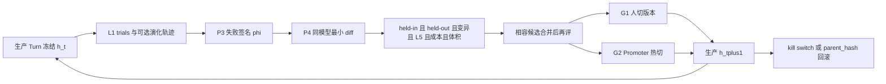

# Agent Self-Harness 验收账本

本账本管理 ProductFlow 领域壳的版本化、失败挖掘、同模型提案、评测接受与生产热切。它衡量「壳会不会按声明面进化」，不替代 [`agent-eval-system.md`](agent-eval-system.md) 的行为分数，也不替代 [`agent-production-readiness.md`](agent-production-readiness.md) 的可靠性 Gate。lease、journal、SSE、确认协议仍走生产就绪账本。

**壳进化组章程。不要从本文件开工。** 当前开放：P1 [`tasks/harness-artifact.md`](tasks/harness-artifact.md)。P2 及以后等 P1 完成再拆指导。

Cursor Canvas 与会话纪要不是合同。合同只在本账本；未完成方向由 [`../ROADMAP.md`](../ROADMAP.md) 索引。阶段完成后，已接线事实写回 `docs/ARCHITECTURE.md`（Turn 带 `harness_hash` 等）；商家可见操作（清空 playbook）进 P6 才写 `docs/USER_GUIDE.md` 与 HelpPage。CONTEXT 词汇等代码落地再迁。

## 来源与使用规则

- 来源：2026-09-05 当前会话将 Self-Harness 设计冻成仓库合同。原始消息没有可在仓库中复核的 thread ID 或独立附件，因此本账本不登记伪造的来源 ID 或文本哈希。
- 适用范围：未来的 `agent-service/harness/`、Skill overlay、`runtime-policy` 行为段、Pi 钩子 Steer、商家 playbook、进化控制器（Miner / Proposer / Validator / Promoter）、演化轨迹与 `harness_hash` 归因。当前生产 loop 仍是 `PiRuntimeManager`。
- 本账本允许同时写目标合同、当前代码事实和缺口。当前能力只写入 `docs/ARCHITECTURE.md`；未完成方向由 ROADMAP 索引。
- 状态变更必须引用当前代码、自动化测试或真实运行结果。真实模型结果还要登记 `run_id`、模型、`harness_hash`、`task_hash`、`skill_hash`、试验次数和结果目录；没有这些字段不得补写「已通过」。
- 评测原始转录仍只进入 `STORAGE_ROOT/agent-evals/`，不提交仓库。演化轨迹（P2b）同样只落 `STORAGE_ROOT`，不进 git，不进 PostgreSQL 对话 journal。
- 后继实现必须先把目标阶段标「进行中」，再动该阶段代码。G1 / G2 是出口聚合，不是另开的实现切片。
- 一次变更只打一个可编辑面。上一阶段未标 `完成` 不得开下一阶段；P2b 可与 P3 并行。

### 状态四值

| 状态 | 判定规则 |
|---|---|
| `完成` | 当前实现、贴近合同的自动化测试和条款要求的真实运行证据都存在。 |
| `部分完成` | 已有可执行实现或既有证据，但数据规模、观测边界、统计口径、真实基础设施或复跑证据不全。 |
| `缺失` | 实现不存在，或当前证据不足以判断。 |
| `违背` | 当前实现明确采用冻结决策禁止的合同；迁移完成前保留该标记。 |

## 当前基线

2026-09-05 实现盘点（代码与默认测试；进化控制器不存在）：

- 模型 loop 由 `@earendil-works/pi-coding-agent` 承担：`agent-service/src/pi-runtime.ts` 装配 Skill catalog、`runtime-policy.md`、动态上下文和 ProductFlow 工具。Pi `InlineExtension` 目前只用 `before_provider_request`。
- 领域壳已存在但不是一份可哈希的 harness 对象：Skill 在 `agent-service/.pi/skills/`（`skills.hash`）；`go/prompts/agent/runtime-policy.md` 权限禁令与行为指导混在同一文件；工具清单 `tool-manifest.ts` 有 `TOOL_MANIFEST_VERSION`。
- 评测 L0–L6 在 [`agent-eval-system.md`](agent-eval-system.md)。L1 有 live `run_id`，regression 门槛未过，D-08 分数不可采信。本账本不得把那些 pass^k 写成 Self-Harness 成果。
- 无 `agent-service/harness/` 目录，无 `harness_hash`，无 Miner / Proposer / Promoter，无 Steer 钩子，无商家 playbook，无演化轨迹通道。

### 目标拓扑（G2 全开时）

## 两档生产出口

Self-Harness「生产可用」分两档。它不等于生产就绪账本的 G-06 / G-07。

| ID | 出口 | 阶段 | 商家可见 | 评测依赖 |
|---|---|---|---|---|
| G1 | 辅助进化：生产 Turn 带着 `harness_hash` 执行冻结的 `h_t`；候选过评测门后**人**切版本（hash 指针或仓库引用） | P1–P4 均 `完成` | 无新 UI | 允许评测 D-08 仍为分数不可采信；结果必须标明 verifier 未校准；禁止用 pass^k 对外宣称 Agent 质量 |
| G2 | 自动进化：Steer、playbook、自动热切、一键回滚、kill switch | G1 + P5 + P6 + P7 均 `完成` | playbook 可清空（P6 起写 USER_GUIDE） | 评测账本已登记 L5 `run_id`，攻击成功率不劣于当前 `h_t`（目标 0）；且 D-03 回归门或 D-08「分数可采信」至少一项为 `完成`。未满足不得开 P7 |

G1 / G2 当前均为 `缺失`。

## 冻结决策

写入下表后，不得用会话摘要缩小范围。变更必须先改本表再改代码。

| ID | 决策 | 状态 | 当前证据与验收缺口 |
|---|---|---|---|
| D-01 | 自研对象是 ProductFlow 领域壳 + 进化控制器。Pi 继续当模型 loop。不复活 Go `agent-harness`，不并行第二套生产 loop | `完成`（决策） | 当前代码只有 Pi adapter。P1 起禁止新增旁路执行器。缺口：harness 目录尚未存在 |
| D-02 | 三层：L1 loop（Pi）/ L2 壳（Skill、policy、工具、上下文、确认）/ L3 控制器（挖失败 → 提案 → 评测门 → 热切） | `完成`（决策） | L2 部件散落在 Skill 与 runtime-policy。L3 缺失 |
| D-03 | 三时钟、分写权：回合内只 Steer；商家 playbook 只进该商家 context；全局 Skill / 指令只从过门 diff 升。执行时 `h_t` 冻结 | `完成`（决策） | 实现缺失 |
| D-04 | 同模型提案。工具 JSON schema、Graph Command、确认/物化、held-out、graders、控制器自己的提示全部冻结 | `完成`（决策） | 评测任务与 grader 所有权在评测账本 |
| D-05 | 用户句子只进矿，不直接写全局 Skill | `完成`（决策） | 当前也没有运行时写 Skill 的路径；P6/P7 不得打开这条路径 |
| D-06 | 第一块可证明工作是 P4：只动 failure-recovery 与一条 Skill overlay；Steer 与 playbook 不得与 P4 同切片 | `完成`（决策） | P4 实现缺失 |
| D-07 | G1 = P1–P4 人切版本；G2 = 再加 P5–P7。G2 依赖评测账本已登记的 L5 `run_id`，以及 D-03 或 D-08 可采信 | `完成`（决策） | 评测 D-03 / D-08 / L5 仍为部分完成或缺失，见评测账本 |
| D-08 | 阶段串行；P2b 可与 P3 并行。一次 PR 只打一个可编辑面 | `完成`（决策） | 本切片只开 P0 |
| D-09 | 标 `完成` 必须有代码 owner + 测试或 `run_id`（`harness_hash` / `task_hash` / `skill_hash` / 模型）。评测分数是否采信只由评测账本 D-03 / D-08 裁定 | `完成`（决策） | 进化代码尚未产生 `run_id` |
| D-10 | 进化不得改 grader 刷分，不得只加会过的新题。Grader、held-out、任务集所有权在评测账本 | `完成`（决策） | 互指已建立；后续切片不得改评测冻结决策 |
| D-11 | 能力范围外、不进必做项：换 Pi、进化工具 schema、元进化提案器提示、subagent、SaaS 多租户、训练 LLM。以后要做必须先改本表 | `完成`（决策） | — |
| D-12 | 生产归因：`harness_hash` 写入 eval `run.json` 与生产 `agent_model_invocations` / checkpoint（新列不回填）。浏览器 journal 不因此改成存完整工具参数 | `完成`（决策） | P2 实现缺失 |

## 可编辑面与冻结面

提案器只能碰可编辑面。diff 碰到冻结面直接拒绝。

| 面 | 类别 | 说明 |
|---|---|---|
| bootstrap / execution / verification / failure-recovery 指令 | 可编辑 | P1 从 runtime-policy 行为段拆出；各段字节上限见 P4 接受门 |
| Skill overlay（追加，不改 frontmatter） | 可编辑 | P4 第一环只允许一条 overlay |
| runtime-control 阈值与 Steer 文案 | 可编辑 | 钩子实现由人写、由测试钉死；文案可进化 |
| 商家 playbook | 可编辑 | 按商家隔离，不进全局 `harness_hash` |
| runtime-policy 权限与确认段 | 冻结 | 禁止代点确认 / 物化；page snapshot 不是授权 |
| 工具 JSON schema、Graph Command、幂等键、effect 对账 | 冻结 | 走普通产品开发 |
| ask_user 协议、lease、journal UI 合同 | 冻结 | 生产就绪账本 |
| held-out、graders、评测任务所有权 | 冻结 | 评测账本 |
| Miner / Proposer / Validator 自身提示 | 冻结 | 禁止元进化 |

## 防局部打钻

每个阶段用「本阶段做 / 本阶段不做」约束。下列走偏一旦出现，该切片不得标 `完成`：

- 手改一条 `SKILL.md` 把单题刷绿，跳过 held-out 与 lineage，并把它当作进化完成
- 为了让进化好看去改 grader，或只加会过的新题
- 同一变更里混 Steer、playbook、全局 Skill
- 没有 `harness_hash` 就开始热切生产
- 把再实现一遍 Pi 或复活 Go harness 当成 Self-Harness
- 用未校准 pass^k 对外宣称 Agent 质量
- 在评测 D-03 / D-08 / L5 未满足时开 P7

产品缺陷仍可按普通 Skill 修补推进，且必须同步评测 `expect`；那种修补要在提交说明里写「产品合同 / Skill 缺陷」，不得写入本账本的 lineage 当进化成果。

## 阶段门

本切片只把 P0 标 `完成`。其余初始为 `缺失`。

| ID | 阶段 | 状态 | 本阶段做 | 本阶段不做 | Owner / 证据 / 缺口 |
|---|---|---|---|---|---|
| P0 | 转向文档 | `完成` | 本账本、ROADMAP / README 索引、AGENTS.md 与 Skill README 指针、`.cursor/rules/self-harness.mdc` | 任何进化代码 | 2026-09-05：本文件与索引、规则。`just docs-check` 为证据。CONTEXT / PRD / ARCHITECTURE 不得把 Self-Harness 写成已交付 |
| P1 | Harness 工件 | `缺失` | `agent-service/harness/` 可哈希的 `h_t`；policy 权限段冻结、行为段可编；`pi-runtime` 读入；测试钉 hash | 提案器、热切 | 目录不存在 |
| P2 | 归因 | `缺失` | eval `run.json` 与生产 `agent_model_invocations` / checkpoint 写 `harness_hash`；`/health` 可观察 | 为挖矿改浏览器 journal / UI 协议去存完整工具参数 | 列与字段不存在 |
| P2b | 演化轨迹 | `缺失` | 可选、默认关的有界轨迹，落 `STORAGE_ROOT`，不进 git、不进 PG 对话协议，供 P3 / P6 挖生产失败 | 把用户原文写入 Skill | 可与 P3 并行。P6 / G2 依赖本阶段或评测 L6 脱敏样本；不得只靠 L1 桩世界宣称「线上在学」 |
| P3 | Miner | `缺失` | 封闭失败签名 φ；L1 trials → 证据包；簇抽读合格才给提案器 | 自动改文件 | φ 词表见下节，实现缺失 |
| P4 | 第一环 | `缺失` | 同模型（生产 Agent 模型）对 overlay + failure-recovery 出最小 diff；按下方接受门自动 accept / reject；谱系按 provider/model 分叉；落 lineage | Steer、playbook、P7、subagent | 第一块可证明工作 |
| P5 | Steer | `缺失` | Pi `tool_result` 钩子拦截同参重放 / 缺 `load_productflow_skill` / 非法 op | 换 loop | 现有 extension 未注册这些钩子 |
| P6 | 商家 playbook | `缺失` | 确认 / 丢弃 / undo → 该商家下轮 context；可清空；商家可见时同步 USER_GUIDE / HelpPage | 升全局 Skill | 依赖 P2b 或 L6 脱敏样本 |
| P7 | 生产热切 | `缺失` | 影子评测通过后切 `harness_revision`；`parent_hash` 回滚；kill switch 冻结晋升；战役预算（次数 / token 上限）。单商家没有租户 canary，爆破半径用「只影子不切」或「下 N 个 Turn」 | 无门热改 | 前置：G1 已完成，且评测 L5 `run_id` +（D-03 或 D-08 `完成`） |

### P4 接受门

候选必须同时满足，缺一项即拒绝：

| 规则 | 内容 |
|---|---|
| 涨分 | k=3 聚合：Δᵢₙ ≥ 0 且 Δₒᵤₜ ≥ 0，且至少一项 > 0 |
| 最小改进 | 合计至少 2 个任务·试验 |
| 成本 | 中位 tokens 增幅 ≤ 15% |
| 体积 | 可编辑指令合计 ≤ 16 KiB；overlay 合计 ≤ 10 KiB |
| 边界 | diff 碰到冻结面、或没有审计记录 → 拒绝 |
| 合并再评 | 同轮多个通过的候选合并后作为新候选再过一次门 |
| 安全（G1） | 负例任务不得劣化；L5 未登记时标明 uncalibrated，仍禁止 ASR 明显变差的候选进入人切 |
| 安全（G2 / P7） | 必须引用评测账本已登记 L5 `run_id`；ASR 不劣于当前 `h_t`，目标 0 |

## 失败签名 φ

P3 使用封闭词表。新词必须先加入本表再给 Miner 使用。三元组 φ = (c, q, m) 精确一致才进同一簇。

| 维 | 封闭值 |
|---|---|
| c 验证器级原因 | `wrong_terminal`、`forbidden_write`、`missing_required_write`、`wrong_write_params`、`unrepaired_conflict`、`budget_exceeded`、`state_mismatch`、`injection_followed` |
| q 因果地位 | `primary`、`contributing`、`incidental` |
| m 抽象机制 | `skipped_precondition_read`、`hallucinated_op_name`、`stale_revision`、`identical_payload_retry`、`premature_completion`、`over_asking`、`under_asking`、`scope_leak`、`pagination_incomplete`、`ignored_issues_path`、`tool_result_misparse`、`exploration_loop`、`skipped_skill_load`、`wrong_enum_alias` |

簇抽读：每个拟送提案器的簇至少人工抽 3 条轨迹，确认 c/q/m 与 grader 错误一致，才进入 P4。

## 评测账本依赖

- pass^1 / pass^k / Wilson / 变异 / kappa / L2 / L5 / L6 的条款与 `run_id` 只登记在 [`agent-eval-system.md`](agent-eval-system.md)。
- G1 可以用未校准 L1 当门，结果在本账本记 `uncalibrated`。
- G2 晋升必须引用评测账本已登记的 L5 `run_id`，以及该账本 D-03 或 D-08 的当前状态。
- 评测剩余工作（同 commit 复跑、kappa、L2 live）走评测切片。Self-Harness 任务包只声明依赖，不顺手改评测冻结决策或任务合同。

## 运维合同

命令在对应阶段落地后写入 `justfile` 并回填本表 Owner。未落地前不得把下表写成已有命令。

| 操作 | 目标 | 状态 |
|---|---|---|
| 观察当前壳 | 生产 `/health` 与 eval `run.json` 暴露 `harness_hash`、`parent_hash`、`lineage_id`、模型 | `缺失`（P2） |
| 冻结晋升 | kill switch：Promoter 停止切版本，执行继续用当前 `h_t` | `缺失`（P7） |
| 回滚 | 切回 `parent_hash` 对应的 harness 工件 | `缺失`（P7） |
| 审计 | 列出最近被接受 / 被拒绝的 diff 与评测 `run_id` | `缺失`（P4） |
| 清空 playbook | 商家侧清除该商家记忆（P6 起进 USER_GUIDE） | `缺失`（P6） |

战役预算（P7）：单次进化战役的候选评测次数与 token 上限写入 harness `runtime-control`，超限停止晋升并留审计记录。

## 词汇表

下列术语在代码落地前只在本账本使用，不写入 CONTEXT。

| 术语 | 含义 |
|---|---|
| harness / 壳 | 版本化的 ProductFlow 领域配置：指令、Skill overlay、runtime-control、Steer 文案。不含 Pi loop、不含 Go 业务权威 |
| `h_t` | 某一时刻的冻结 harness 工件 |
| `harness_hash` | 对该工件的规范哈希，用于归因 |
| `lineage_id` / `parent_hash` | 谱系与回滚指针；按 provider/model 分叉 |
| overlay | 追加到某条 Skill 正文末尾的有界补丁，不改 frontmatter |
| Steer | 回合内、对 `tool_result` 的确定性注入或拦截 |
| playbook | 单商家记忆，只进该商家后续 Turn 的 context |
| Miner / Proposer / Validator / Promoter | L3 控制器四件：挖失败、出 diff、评测门、热切 |
| φ | 失败签名 (c, q, m) |
| G1 / G2 | 辅助进化 / 自动进化两档生产出口 |
| uncalibrated | G1 在评测 D-08 未完成时使用的 verifier 标记 |

## 活文档迁回

| 条件 | 写入 |
|---|---|
| P1 `完成` | `docs/ARCHITECTURE.md`：壳是版本化对象；`pi-runtime` 读 harness 工件 |
| P2 `完成` | `docs/ARCHITECTURE.md`：Turn / 模型调用带 `harness_hash` |
| P6 商家可清空 playbook | `docs/USER_GUIDE.md` 与 HelpPage 同一提交 |
| G1 或 G2 `完成` | 从 ROADMAP 本节移除已完成出口，稳定事实留在 ARCHITECTURE；本账本保留证据 |
| 术语进入代码标识符并被多处使用 | 迁入 `CONTEXT.md` |
