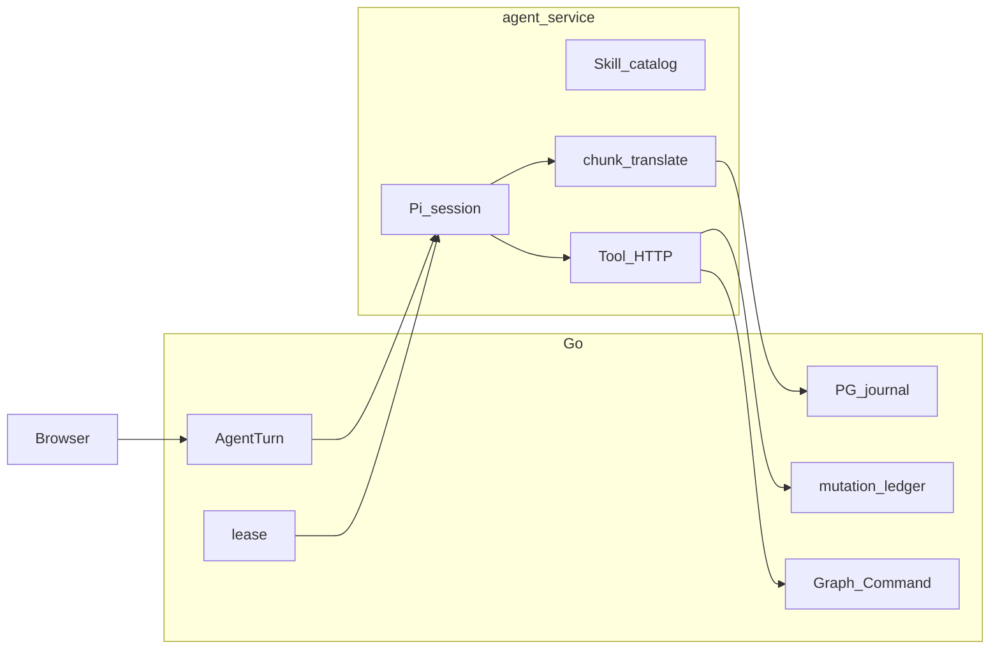

# Agent 运行时开发时间线

从 2026-08-12 接入自研 harness，到 2026-09-01 收口 Turn 写入所有权。本文只记录已经发生的决策和代码路径，不替代 ADR、ARCHITECTURE 或验收账本。

怎么读：

- 活事实以 [`docs/ARCHITECTURE.md`](../ARCHITECTURE.md) 和当前代码为准。
- ADR 正文冻结。被取代的条款在后继 ADR 的状态行标明，不把旧 ADR 改写成今天的实现。典型例子：ADR 0007 仍写 FastAPI 和 continuation Turn；活代码是 Go BFF + 同一 Turn 的 `answer` / `resume`。
- 生产可靠性的唯一验收指标是 [`docs/audits/performance-governance.md#production-gates`](../audits/performance-governance.md#production-gates)。职责迁移证据在 [`docs/history/agent-runtime-timeline.md#runtime-ownership-evidence`](../history/agent-runtime-timeline.md#runtime-ownership-evidence)。
- 日期取自 `codex/development` 上对应提交的 author date（+08:00）。

## 主线

工作流 Agent 在三周内换了四次运行时边界：

1. **草皮自建**：Go 进程 vendor `agent-harness`，FastAPI 做业务权威。
2. **切 Pi SDK**：Node 22 嵌入 `@earendil-works/pi-coding-agent` 0.83，harness 迁到 `exp`。
3. **通信与渲染**：浏览器始终打 Go；直播从「每 token 写 PG + 500ms 轮询」改成「进程内 `waitForEvents`」，再改成「全量 PG journal + UI 协议」。
4. **持久化与所有权**：本地 JSONL WAL 只做 ACK 前缓冲；PostgreSQL `agent_turn_events` 是浏览器事实源；丢失执行的终态只由 Go lease 扫描写。

贯穿始终的不变量：Skill 不是权限层；Pi session 不是业务权威；浏览器不直连 agent-service；无法证明的结果保持 `unknown`。

## 阶段总表

| 日期 | 阶段 | 关键提交 / ADR | 用户可见结果 |
|---|---|---|---|
| 2026-08-12 | 接入自研 Go harness | `92a18e31` | 工作流对话可以调独立 Agent 服务 |
| 2026-08-16 | harness 上长工具步骤投影 | `9e3ab74d`、ADR 0005 | 对话里能看到有界工具行，不是只有终答 |
| 2026-08-17～18 | 全局 Agent / Dock / Task | 多条 `feat: 增加全局…` | 全局会话、素材 Draft、跑图请求 |
| 2026-08-19 | 写下切 Pi 的边界 | `60586913`、ADR 0007 | 主线目标 runtime 定为 Pi |
| 2026-08-20 | 实现切 Pi，并立刻补耐久 | `47731cdf`、`6419fd83`、`e5f1923f` | 模型 loop 换成 Pi；lease / checkpoint 留下 |
| 2026-08-21～25 | 图与创建合同 | ADR 0008 / 0009 | live schema-v3 图；人主控画布；商品路径去掉 WorkflowDraft |
| 2026-08-29～31 | 业务后端迁 Go，Python 离开主线 | ADR 0011 / 0016 | Web / Pi 合同尽量不动；BFF 换成 Go |
| 2026-08-30 | 直播放到 agent-service | `e3dcbe88`、ADR 0013 | token 不再每条写 PG；Assembler 按帧渲染 |
| 2026-08-31 | 全量 journal 与 UI 协议 | `f363429d`、ADR 0017 | 浏览器只读已提交的 PG 事件 |
| 2026-08-31 | 本地 WAL 与 ACK | `6180fbf3` | 重启按 PG 确认前缀再续写 |
| 2026-08-31～09-01 | 单商家生产就绪合同 | 生产就绪账本 | `unknown`、effect 对账、容量门、Luna 真链 |
| 2026-09-01 | Turn 写入所有权 | ADR 0018、checkpoint-0～6 | Go 写终态 / journal / effect；Node 只跑 Pi loop |

## 1. 草皮自建：Go + vendored `agent-harness`（2026-08-12～19）

### 卡点

商品工作台需要多轮对话、工具、提问和草稿，但 FastAPI 业务后端不能同时长出一套通用 Agent loop。直接在 Python 里写模型循环，会把 provider 适配、会话压缩、工具调度和商品事务缠在一起。

当时对照的产品形态是 DeepSeek Harness 一类的对话壳：交错时间线、工具降噪、思考折叠。wire 却只投影终答、Question 和 WorkflowDraft，中间步骤看不见。

### 决策

- 独立进程 `agent-service`，语言是 Go。
- vendor `third_party/agent-harness` 快照，不把它当可随意改的内部包；SOURCE.md 声明 unmodified snapshot。
- FastAPI 继续拥有商品、Draft、确认和 WorkflowRun。Agent 只通过 internal HTTP 调业务 API。
- 浏览器只打 ProductFlow 业务 API，不直连 Agent 服务（ADR 0001）。

### 处理

`92a18e31`（2026-08-12）接入：`agent-service/cmd/productflow-agent-service`、`internal/app` 的 manager / server / tools、`internal/productflow` 客户端。harness 提供 Task、durable tool、HTTP 控制面和 journal。

`9e3ab74d`（2026-08-16）在 snapshot 上本地扩展 `ToolProjector`：durable journal 同步时投影有界 `tool.step`（`inspect_image` / `propose_draft` / `inspect_context` / `read_history` / `organize_assets`）。提交自己注明：原位改 vendored 快照，unmodified 声明需要后续刷新。这就是 ADR 0005「工具步骤投影」的第一版落地。

随后两天把全局 Dock、并行 Task、素材整理 Draft、工作流执行请求接到同一套 harness 合同上。

### 技术选型

| 选项 | 结论 | 理由 |
|---|---|---|
| FastAPI 内嵌 loop | 拒绝 | 业务事务和模型循环会一起膨胀 |
| 自研完整 coding agent | 拒绝 | 会话、压缩、provider 适配成本过高 |
| vendor harness + 薄 Go adapter | 采用 | 立刻有 Turn / journal / 提问 / 工具 HTTP |
| 浏览器直连 harness | 拒绝 | 还要再做一遍 session / ACL，工具副作用仍回 FastAPI |
| 把 filesystem 工具卡搬进工作台 | 拒绝 | ProductFlow 工具是看图、改图、提 Draft，不是 bash |

这一阶段的耐久语义来自 harness：本地 journal、Task、部分恢复。它覆盖了「能跑的对话」，没有覆盖 ProductFlow 的 lease、effect 对账和浏览器回放合同。

## 2. 切 Pi SDK（2026-08-19～20）

### 卡点

harness 已经承担通用 loop、Skill、模型适配、会话，又承担 ProductFlow 业务适配。继续扩自研底座，验证成本会叠在两类目标上：通用 runtime 和商品合同。原位改 vendor snapshot 也已经破坏「未修改快照」的前提。

### 决策（ADR 0007）

- `main` 的目标 runtime 是 Node.js 22 + Pi SDK ProductFlow adapter。
- `exp` 保留切换前的 Go Agent 与 `agent-harness`，研究后台 Task、崩溃恢复、效果重放。两条线不共享 journal / session / 调度实现。
- 主路径 **嵌入 SDK**（`createAgentSession`、隔离的 `DefaultResourceLoader`、custom tools、事件订阅）。Pi RPC 只作故障域隔离备选，不能把 Pi 原始 JSONL 暴露给浏览器。
- 默认关掉 Pi 的 `read` / `write` / `edit` / `bash` / `grep` / `find` / `ls`。只注册仓库审查过的 ProductFlow tools。
- Skills / Extensions 由仓库版本管理。用户输入不能动态写 Skill 文件。
- Pi session file 只服务模型 loop，不是商品、图、Draft、WorkflowRun 的权威。
- 不在 `main` 保留两个可自由切换的在线 runtime，也不做隐式 fallback。

明确排除：超长 system prompt 塞全部业务规则；把 Skill 当权限 / 事务层；Pi 直连 PostgreSQL / Redis / storage / provider。

### 处理

`47731cdf`（2026-08-20）一次性删掉 Go `agent-service` 与 `third_party/agent-harness`，换成 TypeScript：

- 依赖：`@earendil-works/pi-ai` 0.83.0、`@earendil-works/pi-coding-agent` 0.83.0。
- 入口：`src/main.ts` → `server.ts` → 当时的 `pi-runtime.ts`（单文件同时管 HTTP、Pi session、工具、store）。
- Skill 放在 `agent-service/.pi/skills/`（后来收口所有权，正文仍走受控 loader）。
- 对 FastAPI 的 HTTP / SSE 外部合同尽量保持，方便对照样本。

同一天立刻补耐久，而不是等 Pi session persistence「自动等于」业务恢复：

- `6419fd83`：PostgreSQL execution lease、owner / attempt / phase / fencing、semantic checkpoint。
- `e5f1923f`：durable execution；启动只重放尚未开始的 queued Turn；无法证明的 in-flight 标 `unknown`。
- `5bbe67b4`：问题回答落库后续接。当时合同仍是「答案写入后创建 continuation Turn，复用同一 Conversation 和 Pi session」——这条后来被删掉。

### 技术选型

| 选项 | 结论 | 理由 |
|---|---|---|
| 继续扩 Go harness | 拒绝 | 通用 loop 和商品规则会继续缠在一起 |
| Pi SDK 嵌入 | 采用 | 复用模型适配、会话、压缩、事件流 |
| Pi RPC 独立进程 | 备选未作默认 | 多一个故障域，但仍须翻译成 ProductFlow 事件；默认嵌入更简单 |
| 官方 OpenAI 执行器绕过 Pi | 拒绝 | 生产就绪 D-03 再次冻结：不增加旁路执行器 |
| 打开 Pi 默认 coding tools | 拒绝 | 没有内置权限系统，会碰到磁盘和进程 |
| 把 Pi session 当业务权威 | 拒绝 | session 证明不了 Graph Command、确认和多实例 claim |

Pi 切入后立刻暴露的语义差：Pi 的 session persistence ≠ harness 的 durable journal。后台 Task、崩溃后原地续跑模型请求、跨进程 effect 重放，全部单独列为验收项，没有因为「Pi 能存 session」就标完成。

## 3. 产品合同收口：图、画布、创建路径（2026-08-21～25）

Agent runtime 换底座的同时，业务对象也在换权威。

| 卡点 | 决策 | 处理 |
|---|---|---|
| Agent 提交完整 WorkflowDraft，和画布 live 图形成双拓扑 | ADR 0008：只有一份 canonical graph；写入走 Graph Command / ChangeSet | schema-v3 替换在线图；商品路径删除 Draft 确认闸门 |
| 「开始对话」写入 collecting Draft、onboarding Task，并自动开场 Turn；有 Task 时 `harness_run_id` 不一致 | ADR 0009：人是画布主控；创建写出生物是 live 图；Session 按商品 / 全局拆开 | `44e2a05d` 落地沙箱与 Turn 运行身份；`180c7c58` 商品路径退休 WorkflowDraft，intake 挂 Product |
| 对话挡住画布，Turn running 锁整张图 | 关闭或从未打开对话也必须能加节点、连线、运行 | 工作台手感不跟 Agent 切片捆绑；Goal 是显式 `AgentTask`，跑图结束不等于完成 |

选型细节：单步可逆改图立即 `apply`；多节点重构写成未应用的 `WorkflowGraphProposal`，画布预览后确认。Agent 与人走同一套 Graph Command，没有「从 Agent 收回控制权」的步骤。

## 4. 业务 BFF 换成 Go（2026-08-29～31）

### 卡点

Python FastAPI 仍是业务 API / worker / dispatcher。Agent 已经在 Node。继续让 FastAPI 当浏览器 BFF，等于三条运行时（Python、Go 实验线、Node）同时解释 Turn。

### 决策

- ADR 0011：业务后端按垂直切片迁 Go。封印线是当时 live Python 的 HTTP / SSE / queue 合同，不是 Python 目录布局。Web 与 Pi 默认零合同变更。
- 明确拒绝把 `exp` 上的 Go Agent / harness 当业务后端起点。那是 runtime 实验。
- ADR 0016：Python 树打到 `retired/python`，主线删除 `backend/`。仓库根 `contracts/` 留下 2026-08-29 HTTP 封印快照。

### 处理

`2411a5e0` 用 Go 实现 Agent 投影、SSE 与内部工具。`ac5b55a8` 把默认业务后端切到 Go。`b0d843de` 退休 Python。

这一步对 Agent 的意义：浏览器 cookie、Turn 归属、Graph Command、Question 落库、lease 的作者变成 `go/internal/agent`。agent-service 继续只被 internal token 调用。

## 5. 通信与渲染：三次改写直播路径（2026-08-30～31）

这是用户问的「通信渲染怎么处理」的核心。同一条浏览器 URL 换了三次实现。

### 5.1 第一次：每 token 写 PG + 500ms 轮询

Pi 切入后的默认形状：

```
Pi token
  → agent-service 本地 log
  → HTTP AppendEvent（lease + 一行 PG）
  → Go SSE 每 500ms ListEvents
  → 浏览器
```

卡点：直播固定多 500ms + 一次 HTTP/PG；高 token 率会打满 journal 写入；崩溃时 token 行也救不回正在飞的模型请求。

### 5.2 第二次：ADR 0013，直播留在 agent-service（2026-08-30）

卡点：第二份 live journal 多余。Turn 投影已有 `output_text` / `thinking_text` / `tool_steps`。进程崩溃时 in-flight 标 `unknown`，token 行救不回模型请求。

决策：

- 浏览器 URL 不变：`GET /api/v2/agent-conversations/:id/turns/:projection_id/events`。
- Go 验 session 后，把内部 `streamEvents`（agent-service `waitForEvents`）原样写成 EventSource。`sequence` 是 **runtime cursor**。
- `publishDurableEvent` 只收低频控制事件：`question.*`、`tool.step` 状态、`turn.*` 终态、lease checkpoint。`text.delta` / `thinking.delta` 不进 PostgreSQL。
- Pi `@earendil-works/pi-ai` 0.83 的 `assistantMessageEvent` 在 `pi-chunks.ts` 归一。未知 type 丢掉。`toolcall_*` 原始 arguments 不进 UI。
- 前端 `web/src/pages/workbench/agent/conversation/`：`ConversationAssembler` + `requestAnimationFrame` 发布 + keyed 节点。流式正文轻量渲染，settled 后再 GFM。

处理：`e3dcbe88`、`d35b787e`、`3cdc8c67`。提问续跑在这次提交里改为不再新开 Turn（ADR 0007 正文仍写 continuation，活代码已变）。

代价（后来被 0017 收回）：

- PG `agent_turn_events` 允许 sequence 空洞。
- 崩溃后流式正文无法从 PG 回放。
- 历史 Turn 只能按 `thinking_text → tool_steps → output_text` 折叠。
- 审批曾靠 `turn.succeeded` 再 remap 成 `awaiting_confirmation`。

排除方案：浏览器直连 agent-service；继续每 token 写 PG 再用 LISTEN/NOTIFY 优化轮询；Cordis / Slot / Typert。

### 5.3 第三次：ADR 0017，全量 journal + 稳定 UI 协议（2026-08-31）

卡点：0013 换来了低延迟，丢掉了断线回放和交错历史。本地文件若对浏览器可见，会形成第二事实源。

决策：

- 合帧后的 `text.chunk` / `thinking.chunk` **全部**按连续 `sequence` 写入 `agent_turn_events`。
- 浏览器 SSE **只读已经进入 PG 的事件**。删除 agent-service 本地 `/events`、`streamEvents`、Store waiter。
- Go `projectTurnEvent` 把 journal 译成稳定 UI 通知：`turn.started`、`item.*`、`approval.requested` / `approval.resolved`、`turn.completed | awaiting_confirmation | failed | canceled | unknown`。
- `turn/end(reason)` 由运行时原生发出，含 `awaiting_confirmation`。`ask_user`、workflow 确认、artifact 确认共用 approval 形状。
- 会话 SSE 只发内容。Dock / lease 走 `GET /api/v2/agent-control/events`。图运行走节点级 `run.event`。
- 浏览器发现 `sequence > cursor + 1` 时调用 `events/page?after=&limit=` 补洞。连接 generation 隔离旧 EventSource。buffer 上限 512 条或 1 MiB；连续三代失败才报协议错误。
- 终态 Turn 回放 PG 后发 `stream.complete`。超过保留期的 chunk payload 收成 `{"compacted":true}`，seq 保留。

处理：`f363429d`、`8c910d3d`。前端 `ConversationRuntime` 成为 Workbench 与全局 Dock 的单例，避免第二 EventSource。

### 渲染管线（当前）

| 层 | Owner | 做什么 |
|---|---|---|
| Pi runtime event | `pi-runtime.ts` / `pi-chunks.ts` | 归一成 ProductFlow chunk；合帧，不是每 token 一行 PG |
| 本地 WAL | `store.ts` | append-only JSONL + fsync；未 ACK 前缀私有 |
| 批量提交 | `journal-publisher.ts` | 20ms / 64 events / 768 KiB；tool / question / approval / message / terminal 是 drain 屏障 |
| PG journal | `go/internal/agent` `AppendEvents` | 同事务校验连续 seq、写事件、增量 fold 三列摘要 |
| UI 投影 | `sse.go` `projectTurnEvent` | journal kind → Turn / Item / approval 通知 |
| 浏览器 runtime | `conversation/runtime.ts` | generation、gap repair、去重、有界 buffer |
| 浏览器 assembler | `conversation/assembler.ts` | token / thinking 按 animation-frame 发布；结构事件立即发布 |
| 浏览器 reducer | `agentEventReducer.ts` | 按 seq 折进 thinking / text / tool item；未变化对象保持引用 |

对照 DeepSeek Harness 的取舍（ADR 0005）：布局、降噪、思考折叠、Send/Stop 可以学；不搬 terminal / read / search / web 工具卡；chip token（`/skill`、`@subagent`）没有语义对象时不引入。

## 6. 持久化：四层各管什么（2026-08-31～09-01）

当前不是「一个数据库存一切」，也不是「Pi session 就是恢复」。四层职责：

| 层 | 存什么 | 权威范围 | 不是什么 |
|---|---|---|---|
| Pi session 文件 | 模型 loop 消息、compaction、Skill 加载所需 runtime | 仅当前进程内的模型续跑 | 不能证明 Graph Command、确认、跨进程 claim |
| 本地 JSONL WAL | 已合帧、尚未被 PG ACK 的连续前缀 | 持有 lease 的 Node 进程私有缓冲 | 浏览器不可见；ACK 失败不得跳 seq |
| PostgreSQL `agent_turn_events` | 全量 Turn journal，连续 sequence | 浏览器 SSE、历史回放、列表 fold 的事实源 | 不是模型 transcript；压缩后 chunk 只留 seq |
| PostgreSQL 业务表 | Turn 投影、lease / fencing、`agent_model_invocations`、`agent_tool_mutations`、Question、Graph、Goal | 商品、图、副作用证明、终态 | worker 不得用 Node Turn 快照回写活状态 |

### WAL 与批量提交的选型

生产就绪账本「持久日志提交语义」冻结了两端都不能走的路：

- 每原始 token 单独 `await` PG：batch API 退化为单事件，打不过 25 Turn / 1 万事件、P95 ≤ 300ms。
- 本地返回后无界后台提交：PG 变成无限期 eventual sink，浏览器会看到未提交事件或跳号。

实际参数：`JOURNAL_BATCH_FLUSH_MS = 20`、`MAX_EVENTS = 64`、`MAX_BYTES = 768KiB`。普通 chunk 先入队；结构事件等待 drain。失败批次留在队首，原序重试（250ms 起、最高 30s 指数退避）或诚实终止。10k WAL P95 ≈ 1ms；PG batch P95 ≈ 220ms。

启动 handoff：先空 confirm 读 PG head / 权威终态，再 exact-confirm 本地前缀。内容 409 跳过 divergent 前缀并服从 `persisted_through`。PG-only terminal 以 PG projection 收敛本地状态。

### 恢复与副作用

| 卡点 | 决策 | 处理 |
|---|---|---|
| 进程被 kill -9，模型请求丢了 | 不续跑丢失的模型 loop；从已落盘 chunk 组装 interrupted message，Turn 为 `unknown` | `recovery.go`；`terminal_reason_code` 区分 provider / 中断 / effect / 持久化失败 |
| 工具可能已经改了图，回复没写完 | 先对账 mutation ledger；`applied` 自动收敛；`not_applied` 只对 `reconcile_then_retry` 用原幂等键重试一次 | 八工具四态矩阵；二次 `not_applied` 不再持久化该状态 |
| Node 和 Go 都解释 `recovery_policy` | 策略解释只在 Go | ADR 0018 S5：Node 只写 intent、发一次 mutation、5xx 查终态 |
| 提问后重启 | 同一 Turn 写答案，Pi `resume` 注入 `ask_user` tool result；不创建 continuation Turn | S3 删除 `ContinuationTurnID` 列和 UI orphan filter |
| waiting_input / awaiting_confirmation 被标 unknown | parked 状态跳过 lease-expiry unknown | scanner 显式跳过；新 claim 才继续 |

容量合同（D-05）：25 并发 Turn、100 SSE、单 Turn 1 万事件、单会话 1000 Turn。100 SSE 超限 503。7 天 chunk 压缩只在 canonical assistant message 已存在时进行。

## 7. 写入所有权收口（2026-09-01）

### 卡点

PG journal 已经是浏览器权威，但 Node 仍同时参与：Store publisher 回环、启动时自写 recovery `turn/end`、worker 读 Node Turn 快照更新活投影、TypeScript 第二份 `recovery_policy` 解释器。lease 竞争时会出现两个终态作者。

### 决策（ADR 0018）

Go 唯一拥有：Turn 投影与 `terminal_reason_code`、连续 journal、lease / fencing、mutation ledger、Question / approval / Graph Command 事务。

Node 只拥有：Pi session、Skill catalog、chunk 合帧、Tool HTTP、有界 WAL。

丢失的 in-flight 只由 Go lease 过期扫描写终态。Node 重启只 confirm / drain 可证明前缀。

### 处理（一刀一提交）

| 刀 | 做了什么 | Gate |
|---|---|---|
| S0 | 建账本、ADR 0018、ROADMAP 入口 | `just docs-check` |
| S1 | 删除 `store.setEventPublisher` 回环；TurnRuntime 显式读 WAL 连续前缀，receipt 匹配后 ACK | Agent 166 passed；WAL / PG 容量门 |
| S2 | Node 不再写 recovery `turn/end`；Go scanner 是唯一丢失执行终态作者 | 四点 SIGKILL：model start / mutation / approval / turn/end |
| S3 | 删除 `ContinuationTurnID` 及 OpenAPI / Web 残留 | migrate + go-test + 提问测试 |
| S4 | `AppendEvents` 同事务 fold 活状态；删除 `GetTurn` snapshot 读路径 | Go agent + Web SSE 测试 |
| S5 | live / manual / scanner 共用 Go `reconcileEffectIntent` | 八工具四态矩阵 |
| S6 | `pi-runtime.ts` 拆成 session adapter；manager / scope / turn-runtime / journal / tool-step-projection 分文件 | 全量 Go / Agent / Web / docs-check |

当前模块边界：

```
浏览器
  → Go HTTP / SSE（只读 PG）
  → runtime-manager（进程队列、并发、handoff）
  → turn-runtime（lease、journal 生命周期、提问 / 终态）
  → pi-runtime（单 Turn 的 Pi session / model / chunk / Skill / Tool）
  → tools.ts → Go Graph Command / intake / 确认 API
```

`pi-runtime.ts` 在 S6 之后不再是 God module。

## 当前数据流

```
Browser cookie
  → Go /api/v2/... 提交 Turn
  → PG AgentTurnProjection queued
  → Go worker StartTurn → agent-service
  → Node claim lease / fencing
  → Pi createAgentSession.prompt
  → chunk 合帧 → 本地 WAL
  → events/batch → PG agent_turn_events（连续 seq，同事务 fold 摘要）
  → Go SSE 从 PG 投影 item.* / approval.*
  → 工具副作用：checkpoint intent → mutation → Go reconciler
  → 丢失执行：lease 过期 → Go recovery 写 unknown / reason code
```

虚线：Pi session 文件只给下一轮模型调用；浏览器看不到。

## 反复出现的卡点模式

这三周里真正反复出现的不是「选哪个 SDK」，而是同一类边界：

1. **第二事实源**。本地文件、Turn 快照、Pi session、稀疏 PG 控制事件，只要对浏览器或恢复器可见，就会和权威 journal 打架。每次都收回到「浏览器只读已提交的 PG」。
2. **两个终态作者**。Node 启动恢复和 Go lease 扫描都想写 `turn/end`。最后只留 Go scanner；Node 只 confirm 前缀。
3. **把通用 loop 的能力误当成业务保证**。Pi session persistence 不能推出后台 Task、原地续跑模型、跨进程 `not_applied` 重试。这些仍在 ROADMAP，未宣告完成。
4. **投影过厚**。原始 tool arguments、完整 Skill 正文、图片 bytes、token 用量不能进工作台。工具步骤只有白名单字段。
5. **continuation 身份**。提问续跑一度新开 Turn，wire / DB / UI 留下 `ContinuationTurnID`。活语义改成 same-Turn 后，残留列会让恢复和 orphan 清理走错路，必须删掉而不是继续读。

## 明确不做（到 2026-09-01 仍成立）

- 后台 durable Task、模型请求原地续跑、跨进程 `not_applied` 自动重试。
- 用所有权重构宣告生产就绪，或把 G-07（干净 checkout 全量重跑）改成完成。
- 浏览器直连 agent-service，或读取本地 event file。
- 给 `ProductFlowClient` 加无行为包装层；把 Skill 当权限层；在 Node 写 Graph Command。
- 替换 Pi；增加绕过 Pi 的官方 OpenAI 执行器。
- 新对话壳、建议 chip、新 Tool 等用户可见扩面（ROADMAP「Agent 对话壳」仍单列）。

## 证据锚点

| 主题 | 代码 | 测试 / Gate |
|---|---|---|
| Pi 装配 | `agent-service/src/pi-runtime.ts`、`skills.ts`、`tools.ts` | `just agent-service-test` |
| WAL / batch | `store.ts`、`journal-publisher.ts`、`turn-runtime.ts` | `just agent-service-test-local-journal-capacity` |
| Journal / SSE | `go/internal/agent/sse.go`、`execution.go` | `just go-test-agent-journal-capacity`、SSE TTFB |
| 恢复 | `go/internal/agent/recovery.go`、`effect_reconcile.go` | `TestSIGKILLLeaseHolderAgainstGoPG`、八工具矩阵 |
| 浏览器 runtime | `web/src/pages/workbench/agent/conversation/runtime.ts` | Chromium `agent-conversation-runtime.spec.ts`、`agent-workbench-recovery.spec.ts` |
| 合同漂移 | `tool-manifest.ts` → `tool_manifest_generated.go` | `pnpm --dir agent-service check-contract-artifacts` |

<a id="runtime-ownership-evidence"></a>

## 运行时所有权验收归档

2026-09-05 合组时将已关闭的运行时所有权账本收入此处。下列迁移条款、checkpoint 协议和验证数字保留原历史语境，不授权重新开工。当前责任归平台可靠性组，当前事实仍须核对代码与候选基线。

### 来源与使用规则

- 来源：仓库协作会话在 2026-09-01 确认的《Agent 运行时所有权重构》计划；S0 按计划先建立账本，再开始代码迁移。
- 状态枚举与生产就绪账本一致：`完成`、`部分完成`、`缺失`、`违背`。
- `完成`：当前代码 owner、贴近所有权边界的自动化测试和本刀 Gate 都有新证据，且相关生产就绪项仍为 `完成` 或 `部分完成`。
- `部分完成`：目标边界已有实现，但仍有双作者、残留读写路径、测试缺口或未过 Gate。
- `缺失`：尚未开始迁移，或没有足以判断的证据。冻结决策被接受不等于实现完成。
- `违背`：当前实现与冻结决策相反，例如本地文件成为浏览器事实源、Node 写业务终态或两侧解释同一恢复策略。
- 每次状态变化必须同时填写 owner、测试或实测证据、验证日期和缺口。不得只写“已实现”。
- 每一刀开始前，先在本账本确认条款；若合同变化，先写“决策变更”并取得用户确认。代码与账本证据放在同一 checkpoint。

### 与生产就绪账本的关系

生产可靠性的唯一验收指标仍是 [`performance-governance.md#production-gates`](../audits/performance-governance.md#production-gates)。本账本只回答职责放在哪一侧以及迁移如何分刀。

| 生产就绪 ID | 本重构约束与切片 |
|---|---|
| D-01 | `unknown`、`terminal_reason_code`、interrupted message 不变；S2/S4 只能收口终态作者，不能改窄语义。 |
| D-02 | effect 对账语义不变；S5 把策略解释的唯一 owner 收到 Go。 |
| D-03 | foreground Pi 与 `background_resumable` 合同不变；S6 不引入旁路模型执行器。 |
| D-04 | 单管理员、单商家和 7 天压缩边界不变；本重构不宣告生产就绪。 |
| D-05 | 25 Turn、100 SSE、1 万事件、1000 Turn 容量门不变；S1 保留 batching/WAL 性能合同。 |
| C-01 | manifest 与 `recovery_policy` wire schema 保持兼容；S5 只迁移解释权。 |
| C-02 | `tool_effect_intent` v1 字段和有界 payload 不变；S5 保留 checkpoint 证明。 |
| C-03 | `terminal_reason_code` 列与枚举不变；S2/S4 由 Go 写和投影。 |
| C-04 | model invocation identity、fencing、usage 合同不变；S1/S2/S6 不绕过它。 |
| C-05 | checkpoint 和 assistant message 字段不变；S6 只拆模块所有权。 |
| C-06 | Pi adapter 的 background 能力仍为 false；S6 不扩大执行模式。 |
| C-07 | 产品/全局事件页合同不变；S1/S4 保证浏览器继续只读 PG。 |
| C-08 | UI 事件类型保持兼容；S2/S4 不新增 Turn 枚举。 |
| C-09 | Go/Agent metrics 鉴权边界不变；拆文件不得改变端点注册。 |
| S1 | schema/contract 基础不得回退；本账本 S1 只改 journal 写路径所有权。 |
| S2 | 崩溃恢复解释器语义不得回退；本账本 S2/S5 分别收口终态与 effect 作者。 |
| S3 | pending identity 与恢复不得回退；本账本 S3 删除 same-Turn 路径之外的残留。 |
| S4 | ConversationRuntime gap 自愈不得回退；本账本 S4 只替换服务端活投影来源。 |
| S5 | usage、metrics、alerts 不得回退；本账本 S5 删除 Node 第二策略解释器。 |
| S6 | 压缩和读取边界不得回退；本账本 S6 拆薄 Pi adapter。 |
| G-01 | 每刀运行对应单元/合同门。 |
| G-02 | S2/S5 保持 PostgreSQL effect、scanner 和 fencing 覆盖。 |
| G-03 | S1/S2 运行既有四点 SIGKILL 证据；不能用窄单测代替。 |
| G-04 | S4 保持断线、gap、重复帧、generation、overflow、terminal、approval 浏览器合同。 |
| G-05 | S1 若改 batch/WAL，重跑 journal 容量门。 |
| G-06 | 本重构不扩大真实 provider 能力；已完成的 Luna/WorkflowRun/图片链不得退化。 |
| G-07 | 每刀记录局部门；S6 跑全量门。实现基线 `fb658633` 已于 2026-09-04 在 clean checkout 通过无缓存全量门；该记录不表示之后的 checkout 自动通过。生产就绪仍由生产账本独立决定。 |

重构切片标为 `完成` 的前提是相关条目保持 `完成` 或 `部分完成`，且本刀 Gate 有 2026-09-01 或之后的新证据。若生产就绪账本出现 `违背`，相关重构切片不得标为完成。

### 冻结决策

| ID | 决策 | 状态 | owner | 当前证据、日期与缺口 |
|---|---|---|---|---|
| D-R01 | PostgreSQL `agent_turn_events` 是浏览器与列表的 journal 权威；本地文件不得成为第二事实源。 | 完成 | Go `go/internal/agent/journal.go`、`sse.go`；ADR 0017 | 2026-09-01：生产就绪 C-07/C-08 已完成；S1 已由 TurnRuntime 和 journal publisher 收口 Node 的 lease-aware 写路径。 |
| D-R02 | 本地磁盘只做有界 WAL 与 Pi session；ACK 失败原序重试或诚实终止，不跳 seq；保留批量提交，不退回每 token await PG。 | 完成 | `agent-service/src/store.ts`、`turn-runtime.ts`、`journal-publisher.ts` | 2026-09-01：S1 删除 Store publisher；TurnRuntime 显式读取未入 batch 的 WAL 连续前缀，receipt 匹配后推进 ACK。阈值保持 20ms/64/768KiB；Agent 166 passed，10k WAL P95=0.98ms，PG batch P95=221.27ms。 |
| D-R03 | 丢失的 in-flight 执行只由 Go lease 过期扫描写终态；Node 重启只 confirm 可证明前缀。 | 完成 | `go/internal/agent/recovery.go`；`agent-service/src/turn-runtime.ts` | 2026-09-01：带 durable execution identity 的 Node handoff 只 confirm/drain WAL 或采用 PG terminal，不生成第二业务终态；drain 后保留 in-flight lease 给 Go scanner。无 execution identity 的旧本地 snapshot 仍可由 Store 写本地 unknown，但不会与 Go 已 claim execution 竞争。Go 显式跳过 `requires_input`/`awaiting_confirmation`。Agent 166 passed；Go agent 通过；G-03 四点 SIGKILL 通过。 |
| D-R04 | 工具副作用证明只在 `agent_tool_mutations`；TypeScript 与 Go 不各自运行 `recovery_policy` 解释器。 | 完成 | `go/internal/agent/effect_reconcile.go`、`agent-service/src/tool-effect.ts` | 2026-09-01：S5 增加 lease-scoped live reconcile 命令；Node 只写 intent、单次 mutation、5xx 查询 Go 并消费终态，policy 查询/重试/二次对账只在 Go。 |
| D-R05 | 提问续跑保持同一 Turn 的 answer + Pi resume；删除 `ContinuationTurnID` 残留。 | 完成 | `go/internal/agent/turns.go`、`sync.go`、schema、Web Agent projection | 2026-09-01：S3 删除 DB 列/索引、Go DTO/reader/cleanup、OpenAPI 字段和 Web orphan filter；`just go-migrate`、`just go-test`、Agent question/restart 29 tests、Web 634 tests/build 通过。答案 route 仍把两个既有响应成员指向同一 Turn。 |
| D-R06 | agent-service 只拥有 Pi session、Skill、chunk 合帧和 Tool HTTP，不拥有商品、图或确认事务。 | 完成 | `agent-service/src/pi-runtime.ts`、`turn-runtime.ts`、`runtime-manager.ts`、`runtime-scope.ts`、`runtime-journal.ts`、`tool-step-projection.ts`、`tools.ts` | 2026-09-01：`pi-runtime.ts` 已收敛为单 Turn 的 Pi session/model、drain、chunk 订阅和 Skill/Tool adapter；进程调度、scope 校验、lease/journal/question/terminal 编排、有界工具步骤投影分别由提取模块拥有。业务事务与 effect policy 仍在 Go。 |
| D-R07 | 不把生产就绪已完成合同改窄；冲突必须先写双方“决策变更”。 | 完成 | 两份 audit ledger | 2026-09-01：本账本建立关系矩阵；暂无决策变更。 |
| D-R08 | 一刀一提交；上一刀未提交不得开始下一刀。 | 完成 | Git checkpoint 协议 | 2026-09-01：S0 建账；后续按 checkpoint-1 至 checkpoint-6 串行。 |

### 目标边界与当前诊断



| 诊断 | 当前证据 | 目标 owner | 处理切片 |
|---|---|---|---|
| journal publisher 循环注入（已收口） | 2026-09-01：`setEventPublisher` 与 Store publisher 字段已删除；`turn-runtime.ts` 的显式 WAL handoff 是唯一 lease-aware batch/ACK writer | 单一 lease-aware batch/ACK writer；本地 WAL 私有 | S1 |
| 丢失执行双终态作者（已收口） | 2026-09-01：带 durable execution identity 的 Node startup/handoff 不写 recovery `turn/end`；`go/internal/agent/recovery.go` 是 lease-expiry terminal owner。Store 对无 execution identity 的旧本地 snapshot 仍有本地 unknown 收敛分支 | Go lease expiry scanner | S2 |
| same-Turn 提问 continuation 身份残留（已删除） | 2026-09-01：运行时代码/wire/UI 已无 `ContinuationTurnID` 或 orphan cleanup；仅 migration DDL 保留列名用于 `DROP COLUMN IF EXISTS` | 原 Turn answer + Pi resume | S3 |
| worker 读取 Node Turn 快照更新活投影（已收口） | 2026-09-01：Gateway/worker/read route 的 `GetTurn` snapshot path 已删除；`AppendEvents` 同事务增量 fold active status 与三列摘要 | PG journal fold；worker 只绑定 harness ID、重试 start 或恢复持久化答案 | S4 |
| effect policy 两侧解释（已收口） | 2026-09-01：Node 删除 `not_applied -> retry -> second reconcile` 与 per-tool reconcile callbacks；live/manual/scanner 共用 Go `reconcileEffectIntent` | Go mutation ledger/reconciler | S5 |
| Pi adapter 编排范围过宽（已收口） | 2026-09-01：`pi-runtime.ts` 只保留 Pi session/model、drain、chunk 订阅和 Skill/Tool adapter；`runtime-manager.ts`、`runtime-scope.ts`、`turn-runtime.ts`、`runtime-journal.ts`、`tool-step-projection.ts` 分别承接进程调度、contract、lease/journal/终态编排、journal 辅助和工具步骤投影 | Pi session/Skill/chunk/Tool adapter | S6 |

### 不退化合同

| ID | 用户可见合同 | 生产就绪映射 | owner 与测试/页面锚点 | 状态 |
|---|---|---|---|---|
| R-01 | Agent-first 创建继续通过 `finalize_product_intake_v1` 完成 intake。 | C-01、C-02、G-06 | `agent-service/src/tools.test.ts`、`skills.test.ts`；创建页 Agent 流程 | 完成 |
| R-02 | 单步图修改直接 apply，多步修改 propose ChangeSet，均走 Graph Command。 | D-02、C-01、S2-04 | `agent-service/src/graph-command-schema.test.ts`、`tools.test.ts`；工作台画布 | 完成 |
| R-03 | `ask_user` 在同一 Turn 写答案并恢复同一 Pi session，不创建 continuation Turn。 | S2-02、S3-03 | `go/internal/agent/question_resume_gopg_test.go`、`agent-service/src/question-resume.test.ts` | 完成：`waitDurableTurnTerminal` 轮询 PostgreSQL projection `succeeded`、execution `terminal` 且恰好一条 `turn/end` 后再断言；2026-09-04 `TestDurableAnswerCreatesNewAttemptAndInjectsPiToolResult -count=10` 通过。 |
| R-04 | workflow run、graph proposal、全局 Draft 的确认只产生一次业务副作用。 | D-02、S3-01～S3-04、G-02/G-03 | `task_graph_test.go`、`recovery_proposal_draft_test.go`、`pending_identity_test.go` | 完成 |
| R-05 | Turn `unknown` 和各 `terminal_reason_code` 继续显示准确中断/对账文案。 | D-01、C-03、C-08、S2-07 | `web/src/pages/workbench/agent/AgentConversationComponents.test.ts` | 完成 |
| R-06 | 浏览器 SSE 只读 PG journal；断线、关闭页面不取消 Agent。 | C-07、S4-01～S4-06、G-04 | `web/src/pages/workbench/agent/conversation/runtime.test.ts`、live browser recovery spec | 完成 |
| R-07 | Product Goal 仍只由用户 complete/cancel；Turn 或 graph run 终态只把 Goal 留在 `waiting_user/goal_loop`。 | D-04 | `go/internal/agent/task_graph_test.go`、`sync_task_contract_test.go` | 完成 |
| R-08 | Turn running 时画布仍可编辑，Agent 不持有画布编辑锁。 | D-04、G-06 | 工作台画布交互；`web/src/pages/workbench/chrome/workflowCanvasInteraction.test.ts`；`web/e2e/running-turn-canvas.spec.ts` | 完成：2026-09-05 `just web-e2e-running-turn-canvas` 1 passed（1.6m）。内部 claim 后写 `turn/start`，inspector 改标题并自动保存，Turn 仍 `running`。闸门期间 SIGSTOP 了 just-dev 的 Node Agent，避免它抢走 lease。 |

### 实施切片

| ID | 验收要求 | 代码 owner | 状态 | 测试/实测证据 | 缺口 |
|---|---|---|---|---|---|
| S0 | 建立本账本、索引、ADR 0018、ROADMAP 入口；0007 仅状态行指向后继。 | `docs/audits/`、`docs/adr/`、`docs/ROADMAP.md` | 完成 | 2026-09-01：`just docs-check` 通过；checkpoint-0 提交前 staged 范围核对。 | 无；S1-S6 后续均已完成。 |
| S1 | 删除 `store.setEventPublisher -> runtime.publishDurableEvent` 回环；WAL 私有；lease-aware batch/ACK 单一作者；保持 20ms/64/768KiB。 | `agent-service/src/main.ts`、`store.ts`、`turn-runtime.ts`、`journal-publisher.ts`、runtime tests | 完成 | 2026-09-01：`just agent-service-test` 20 files、166 passed/2 skipped；带 dev env 的 `go test -C go ./internal/agent -count=1` 通过（86.1s）；10k WAL P95=0.98ms；PG 10k/25 Turn/100 SSE 容量门通过，batch P95=221.27ms。 | 无；S2 继续收口 recovery 终态作者。 |
| S2 | Go lease 过期扫描是丢失 in-flight 的唯一终态作者；Node 只 drain/confirm 证明前缀；parked 状态不误标 unknown。 | `go/internal/agent/recovery.go`、`agent-service/src/turn-runtime.ts`、process restart tests | 完成 | 2026-09-01：`just agent-service-test` 20 files、166 passed/2 skipped；Go agent（dev env）通过，87.8s；聚焦 recovery 35.5s；`TestSIGKILLLeaseHolderAgainstGoPG` 四点全过。进程重启 E2E 断言不重放模型、不写 Node terminal、confirm 已提交前缀。 | 无；S3 删除 question continuation 残留。 |
| S3 | 删除 `ContinuationTurnID`、`cancelUnusedContinuation` 及 schema 残留；same-Turn 行为不变。 | Go turns/sync/DTO/schema、OpenAPI、Web types/projection | 完成 | 2026-09-01：`just go-migrate` 通过；`just go-test` 整树通过（agent 90.7s）；Agent question/restart 29 passed/1 skipped；Web 92 files、634 passed及 build 通过。全树 scan 仅在本账本和 idempotent `DROP COLUMN` DDL 中保留删除目标名称。 | 无；ADR 0007 冻结正文不重写，0018 已说明后继合同。 |
| S4 | `sync.go` 不再用 Node `GetTurn` 快照写活状态；三列摘要由 PG journal fold；worker 只绑定 harness ID、重试 start。 | `go/internal/agent/sync.go`、journal projection、Web SSE | 完成 | 2026-09-01：`AppendEvents` 同事务增量 fold active status、output/thinking/tool steps；exact replay 不重复 fold，terminal 前重载 row。Gateway/worker/read route 删除 snapshot reader，worker 只处理未绑定 start 与答案 resume。Go agent 全包通过（87.5s）；Web 92 files、634 passed。 | 无；S5 收口 effect policy interpreter。 |
| S5 | Node 只 checkpoint intent、发 mutation、5xx 查询 Go；`recovery_policy` 解释器仅在 Go。 | `agent-service/src/tool-effect.ts`、Go effect ledger/reconciler | 完成 | 2026-09-01：lease-scoped live API 只从当前 execution 的 PG intent 读取 policy/payload；Node 单次 mutation 后只查询 Go 终态。八工具四态矩阵、live/manual/scanner 共享解释器通过；Go agent 全包 92.8s；Agent 166 passed/2 skipped。 | 无；S6 拆薄 Pi adapter。 |
| S6 | `pi-runtime.ts` 只保留 session、drain、chunk 订阅、Skill/Tool 注册；稳定事实写回 ARCHITECTURE/CONTEXT。 | `agent-service/src/pi-runtime.ts` 及提取模块；`docs/ARCHITECTURE.md`、`CONTEXT.md` | 完成 | 2026-09-01：完成 Pi adapter 拆分；`runtime-manager.ts`、`runtime-scope.ts`、`turn-runtime.ts`、`runtime-journal.ts`、`tool-step-projection.ts` 明确承接运行时编排与纯投影职责；effect reconcile 路由加入 Go sealed route contract。 | 依赖 S1-S5；checkpoint-6 全量 Gate 通过。 |

### Checkpoint 协议

执行本计划视为已授权每刀在 Gate 通过后直接提交，不再逐刀请求确认。

| ID | 提交内容 | 提交前最低 Gate |
|---|---|---|
| checkpoint-0 | 仅文档：本账本、索引、ADR 0018、ROADMAP、0007 状态行 | `just docs-check` |
| checkpoint-1 | S1 代码、账本证据；写路径成为活事实时同步 ARCHITECTURE | `just agent-service-test`；`go test -C go ./internal/agent`；改 batch/WAL 时加 journal 容量门 |
| checkpoint-2 | S2 代码与账本 | checkpoint-1 的相关门；生产就绪 G-03 四点 SIGKILL（若 Go agent 全包已包含则记录测试名） |
| checkpoint-3 | S3 代码、必要 schema 与账本 | `just go-test`；有 schema 时 `just go-migrate`；Agent 提问测试 |
| checkpoint-4 | S4 代码与账本 | Go agent tests；Web 对话/SSE 相关测试 |
| checkpoint-5 | S5 代码与账本 | 八工具四态矩阵；共享解释器测试；`just agent-service-test` |
| checkpoint-6 | S6 拆分、ARCHITECTURE/CONTEXT、账本收口 | `just go-test`；`just agent-service-test`；`pnpm --dir web test:run`；`just docs-check`；`git diff --check` |

规则：

1. 一次提交只对应一刀；范围外问题另记缺口或另开提交。
2. 上一刀未提交不得开始下一刀；提交后工作区允许保留用户已有但未纳入本刀的改动。
3. 不使用 `--no-verify`。提交 hook 失败后修复再提交；已推送提交不 amend。
4. 不提交 `.env`、data 根、缓存或构建输出。
5. 每个 checkpoint 提交前用 `git diff --cached --name-only` 核对归属，避免纳入既有工作区改动。

### Gate 与验证记录

#### 固定 Gate

- Journal/WAL：`just agent-service-test`、`go test -C go ./internal/agent`；改容量参数或 WAL 时加 `just agent-service-test-local-journal-capacity`、`just go-test-agent-journal-capacity`。
- Recovery：Go agent 全包中的 `TestSIGKILLLeaseHolderAgainstGoPG` 必须实际运行，覆盖 model start、mutation result 前、approval 后、turn/end 响应前。
- Question/schema：`just go-test`、Agent question tests；删 schema 列时 `just go-migrate`。
- Projection：Go agent tests、`pnpm --dir web test:run` 中对话/runtime/SSE 覆盖。
- Tool effect：Go 八工具四态矩阵和共享解释器测试、`just agent-service-test`。
- 最终：checkpoint-6 全量命令；实现基线 `fb658633` 的 clean/no-cache 全量门已于 2026-09-04 重跑并通过。之后的 checkout 必须重新验证；G-06 的真实 Agent 审批到 WorkflowRun 链仍由生产就绪账本单独跟踪。

#### 验证记录

| 日期 | checkpoint | 命令与结果 | 备注 |
|---|---|---|---|
| 2026-09-01 | checkpoint-0 | `just docs-check`：通过；目标文档 `git diff --check`：通过 | S0 仅修改账本、索引、ROADMAP、ADR 0007 状态行并新增 ADR 0018。 |
| 2026-09-01 | checkpoint-1 | `just agent-service-test`：166 passed/2 skipped；Go agent（dev env）：通过，86.1s；local WAL 10k P95=0.98ms；PG batch 10k/25 Turn/100 SSE：通过，P95=221.27ms | Store publisher residue scan 为空；20ms/64/768KiB 常量未变。 |
| 2026-09-01 | checkpoint-2 | `just agent-service-test`：166 passed/2 skipped；Go agent（dev env）：通过，87.8s；聚焦 recovery：通过，35.5s；G-03 `TestSIGKILLLeaseHolderAgainstGoPG`：model_start/mutation/approval/turn_end 全过 | Node process restart E2E 改为等待 Go owner，不再期待 Node 自写 unknown。 |
| 2026-09-01 | checkpoint-3 | `just go-migrate`：通过；`just go-test`：整树通过；Agent question/restart：29 passed/1 skipped；Web：92 files、634 passed，build 通过 | schema ExtraDDL 删除旧索引和列；OpenAPI/Go/Web 不再暴露 `continuation_turn_id`。 |
| 2026-09-01 | checkpoint-4 | Go agent 全包：通过，87.5s；PG fold 聚焦测试与 SSE TTFB：通过，P95=15.87ms；Web：92 files、634 passed | snapshot reader residue scan 为空；exact replay 不重复摘要，bound running worker dispatch 被消费。 |
| 2026-09-01 | checkpoint-5 | 八工具四态矩阵：通过；live/manual/scanner 共享解释器：通过；Go agent 全包：通过，92.8s；Agent：166 passed/2 skipped；`just docs-check`：通过 | Node policy/retry branch residue scan 为空；网络丢响应测试断言一次 mutation、一次 Go reconcile。 |
| 2026-09-01 | checkpoint-6 | Agent TypeScript 编译通过；`just go-test`（整树，99.8s）、`just agent-service-test`（167 passed/2 skipped）、`pnpm --dir web test:run`（92 files、635 passed）、`pnpm --dir web build`、`just docs-check`、`git diff --check` 通过 | Pi runtime 拆分完成；effect reconcile sealed route contract 已补齐；并发工作区中的 Graph lock 改动未纳入本 checkpoint。 |
| 2026-09-04 | 实现基线 `fb658633` gate verification | 该 clean checkout 执行无缓存 `go test -C go ./... -count=1 -p 1`、`just agent-service-test`（167 passed/2 skipped）、Web 637 tests/lint/build、schema fresh/upgrade、`just go-migrate`、`just docs-check`、`git diff --check` 全部通过；journal/WAL/Graph query-plan 专项也通过 | G-07 在该实现基线具备 clean/no-cache 证据；G-06 的真实 Agent 审批到 WorkflowRun 完整 UI 链未在该基线重跑，生产账本仍保持部分完成。 |
| 2026-09-04 | 归档复核 | Agent focused 38/38、Web focused 47/47、`just docs-check` 通过；`go test -C go ./internal/agent -count=1` 失败 2 项。单独复跑 effect reconciliation 通过；durable answer 用例 `-count=3` 为 2 通过、1 次在 PG projection 仍为 `running` 时失败 | 当时 R-03 等待边界不稳定、R-08 缺专门用例；本账本不可归档。 |
| 2026-09-05 | Running Turn 画布闸门 | `just web-e2e-running-turn-canvas` 1 passed（1.6m）；claim 后补 `turn/start`，标题自动保存，Turn 仍 running | 本账本不可归档：评测 L1–L6 门槛与干净 checkout 全量门仍缺。 |

### 明确不做

- 后台 durable Task、模型请求原地续跑、跨进程 `not_applied` 自动重试。
- 用本重构宣告生产就绪；G-07 必须由生产账本定义的独立 clean/no-cache 全量 Gate 证明，不能凭重构自动改为完成。
- 新对话壳、建议 chip、新 Tool 等用户可见扩面。
- 给 `ProductFlowClient` 增加无行为的包装层；把 Skill 当权限层；浏览器直连 agent-service；替换 Pi；在 Node 写 Graph Command。

### 决策变更

暂无。后续记录必须包含日期、提出者、原条款、替代条款、迁移影响、生产就绪账本影响和验收 Gate；不得直接覆盖冻结决策。

<a id="architecture-assessment-history"></a>

## 架构候选调查来源

2026-09-05 架构重构组撤销，AR-01 交工作流体验，AR-02 交平台可靠性。当前合同在对应组文档与任务，以下只保留来源与原调查验证，不保留第二套发布权。

### 来源与复核

- 用户指定报告：`/tmp/architecture-review-20260905-033823.html`，标题为「ProductFlow 架构深化候选」，原报告基线 `9c10b99e`。仓库相对路径 `tmp/architecture-review-20260905-033823.html` 不存在。
- 原报告 SHA-256：`9acacc7e8b755c84ed7ddaf641b780eb591e4eb40c488f8b8a05681e79a556bf`。临时 HTML 只作来源定位；本章程保留候选、源码锚点和判断限制，不要求执行者依赖该临时文件。
- 2026-09-05 建组复核：从 `25653846` 工作树读取两条调用链；期间另一个文档交付提交至 `37507921`，归档了性能组的 ImageSession 详情任务。本轮保留所有并行改动，未修改业务实现。
- 下面的“已复核”表示源码结构得到确认。浏览器交错行为、Go/PostgreSQL 故障场景和重构效果没有因此通过验收。

### 建组验证记录

2026-09-05 在上述工作树重跑原报告的两条确定性命令：

```bash
pnpm --dir web exec vitest run src/pages/workbench/canvas/GraphNodeInspector.test.ts src/pages/workbench/agent/conversation/runtime.test.ts
pnpm --dir agent-service exec vitest run src/journal-publisher.test.ts src/pi-runtime.test.ts -t 'mismatched event receipt|retries a 5xx journal batch|merges multiple events|failed transactional batch'
```

结果：Web 2 文件、36 条通过；Agent 2 文件、4 条通过、32 条因筛选跳过。未运行 Go/PostgreSQL、真实供应商、运行中检查器浏览器和进程重启验证。以上仅为建组复核基线，未认领或完成任何候选实施任务。
