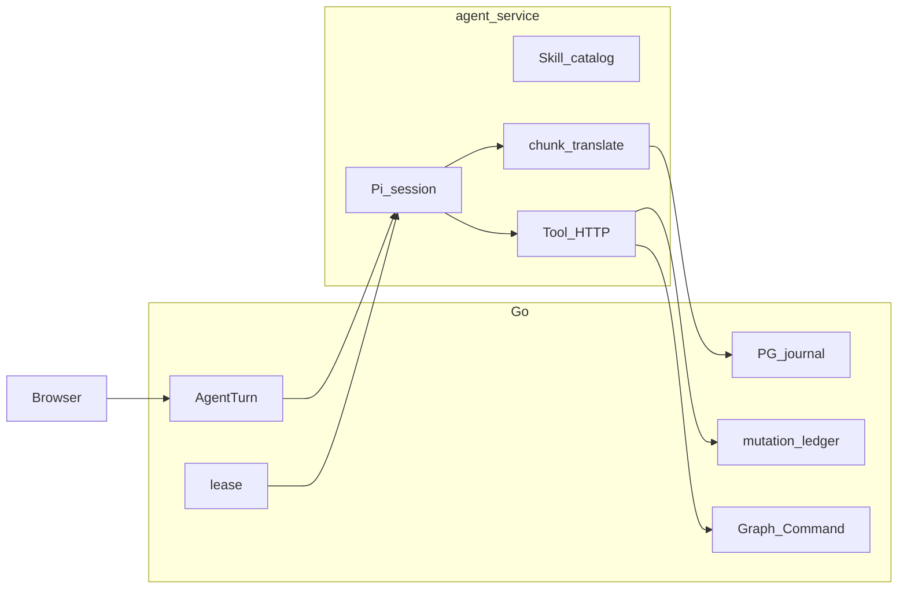

# Agent 运行时开发时间线

从 2026-08-12 接入自研 harness，到 2026-09-01 收口 Turn 写入所有权。本文只记录已经发生的决策和代码路径，不替代 ADR、ARCHITECTURE 或验收账本。

怎么读：

- 活事实以 [`docs/ARCHITECTURE.md`](../ARCHITECTURE.md) 和当前代码为准。
- ADR 正文冻结。被取代的条款在后继 ADR 的状态行标明，不把旧 ADR 改写成今天的实现。典型例子：ADR 0007 仍写 FastAPI 和 continuation Turn；活代码是 Go BFF + 同一 Turn 的 `answer` / `resume`。
- 生产可靠性的唯一验收指标是 [`docs/audits/performance-governance.md#production-gates`](../audits/performance-governance.md#production-gates)。职责迁移证据在 [`docs/history/agent-runtime-timeline.md#runtime-ownership-evidence`](../history/agent-runtime-timeline.md#runtime-ownership-evidence)。
- 日期取自 `codex/development` 上对应提交的 author date（+08:00）。

## 主线

工作流 Agent 在三周内换了四次运行时边界：

1. **草皮自建**：Go 进程 vendor `agent-harness`，FastAPI 做业务权威。
2. **切 Pi SDK**：Node 22 嵌入 `@earendil-works/pi-coding-agent` 0.83，harness 迁到 `exp`。
3. **通信与渲染**：浏览器始终打 Go；直播从「每 token 写 PG + 500ms 轮询」改成「进程内 `waitForEvents`」，再改成「全量 PG journal + UI 协议」。
4. **持久化与所有权**：本地 JSONL WAL 只做 ACK 前缓冲；PostgreSQL `agent_turn_events` 是浏览器事实源；丢失执行的终态只由 Go lease 扫描写。

贯穿始终的不变量：Skill 不是权限层；Pi session 不是业务权威；浏览器不直连 agent-service；无法证明的结果保持 `unknown`。

## 阶段总表

| 日期 | 阶段 | 关键提交 / ADR | 用户可见结果 |
|---|---|---|---|
| 2026-08-12 | 接入自研 Go harness | `92a18e31` | 工作流对话可以调独立 Agent 服务 |
| 2026-08-16 | harness 上长工具步骤投影 | `9e3ab74d`、ADR 0005 | 对话里能看到有界工具行，不是只有终答 |
| 2026-08-17～18 | 全局 Agent / Dock / Task | 多条 `feat: 增加全局…` | 全局会话、素材 Draft、跑图请求 |
| 2026-08-19 | 写下切 Pi 的边界 | `60586913`、ADR 0007 | 主线目标 runtime 定为 Pi |
| 2026-08-20 | 实现切 Pi，并立刻补耐久 | `47731cdf`、`6419fd83`、`e5f1923f` | 模型 loop 换成 Pi；lease / checkpoint 留下 |
| 2026-08-21～25 | 图与创建合同 | ADR 0008 / 0009 | live schema-v3 图；人主控画布；商品路径去掉 WorkflowDraft |
| 2026-08-29～31 | 业务后端迁 Go，Python 离开主线 | ADR 0011 / 0016 | Web / Pi 合同尽量不动；BFF 换成 Go |
| 2026-08-30 | 直播放到 agent-service | `e3dcbe88`、ADR 0013 | token 不再每条写 PG；Assembler 按帧渲染 |
| 2026-08-31 | 全量 journal 与 UI 协议 | `f363429d`、ADR 0017 | 浏览器只读已提交的 PG 事件 |
| 2026-08-31 | 本地 WAL 与 ACK | `6180fbf3` | 重启按 PG 确认前缀再续写 |
| 2026-08-31～09-01 | 单商家生产就绪合同 | 生产就绪账本 | `unknown`、effect 对账、容量门、Luna 真链 |
| 2026-09-01 | Turn 写入所有权 | ADR 0018、checkpoint-0～6 | Go 写终态 / journal / effect；Node 只跑 Pi loop |

## 1. 草皮自建：Go + vendored `agent-harness`（2026-08-12～19）

### 卡点

商品工作台需要多轮对话、工具、提问和草稿，但 FastAPI 业务后端不能同时长出一套通用 Agent loop。直接在 Python 里写模型循环，会把 provider 适配、会话压缩、工具调度和商品事务缠在一起。

当时对照的产品形态是 DeepSeek Harness 一类的对话壳：交错时间线、工具降噪、思考折叠。wire 却只投影终答、Question 和 WorkflowDraft，中间步骤看不见。

### 决策

- 独立进程 `agent-service`，语言是 Go。
- vendor `third_party/agent-harness` 快照，不把它当可随意改的内部包；SOURCE.md 声明 unmodified snapshot。
- FastAPI 继续拥有商品、Draft、确认和 WorkflowRun。Agent 只通过 internal HTTP 调业务 API。
- 浏览器只打 ProductFlow 业务 API，不直连 Agent 服务（ADR 0001）。

### 处理

`92a18e31`（2026-08-12）接入：`agent-service/cmd/productflow-agent-service`、`internal/app` 的 manager / server / tools、`internal/productflow` 客户端。harness 提供 Task、durable tool、HTTP 控制面和 journal。

`9e3ab74d`（2026-08-16）在 snapshot 上本地扩展 `ToolProjector`：durable journal 同步时投影有界 `tool.step`（`inspect_image` / `propose_draft` / `inspect_context` / `read_history` / `organize_assets`）。提交自己注明：原位改 vendored 快照，unmodified 声明需要后续刷新。这就是 ADR 0005「工具步骤投影」的第一版落地。

随后两天把全局 Dock、并行 Task、素材整理 Draft、工作流执行请求接到同一套 harness 合同上。

### 技术选型

| 选项 | 结论 | 理由 |
|---|---|---|
| FastAPI 内嵌 loop | 拒绝 | 业务事务和模型循环会一起膨胀 |
| 自研完整 coding agent | 拒绝 | 会话、压缩、provider 适配成本过高 |
| vendor harness + 薄 Go adapter | 采用 | 立刻有 Turn / journal / 提问 / 工具 HTTP |
| 浏览器直连 harness | 拒绝 | 还要再做一遍 session / ACL，工具副作用仍回 FastAPI |
| 把 filesystem 工具卡搬进工作台 | 拒绝 | ProductFlow 工具是看图、改图、提 Draft，不是 bash |

这一阶段的耐久语义来自 harness：本地 journal、Task、部分恢复。它覆盖了「能跑的对话」，没有覆盖 ProductFlow 的 lease、effect 对账和浏览器回放合同。

## 2. 切 Pi SDK（2026-08-19～20）

### 卡点

harness 已经承担通用 loop、Skill、模型适配、会话，又承担 ProductFlow 业务适配。继续扩自研底座，验证成本会叠在两类目标上：通用 runtime 和商品合同。原位改 vendor snapshot 也已经破坏「未修改快照」的前提。

### 决策（ADR 0007）

- `main` 的目标 runtime 是 Node.js 22 + Pi SDK ProductFlow adapter。
- `exp` 保留切换前的 Go Agent 与 `agent-harness`，研究后台 Task、崩溃恢复、效果重放。两条线不共享 journal / session / 调度实现。
- 主路径 **嵌入 SDK**（`createAgentSession`、隔离的 `DefaultResourceLoader`、custom tools、事件订阅）。Pi RPC 只作故障域隔离备选，不能把 Pi 原始 JSONL 暴露给浏览器。
- 默认关掉 Pi 的 `read` / `write` / `edit` / `bash` / `grep` / `find` / `ls`。只注册仓库审查过的 ProductFlow tools。
- Skills / Extensions 由仓库版本管理。用户输入不能动态写 Skill 文件。
- Pi session file 只服务模型 loop，不是商品、图、Draft、WorkflowRun 的权威。
- 不在 `main` 保留两个可自由切换的在线 runtime，也不做隐式 fallback。

明确排除：超长 system prompt 塞全部业务规则；把 Skill 当权限 / 事务层；Pi 直连 PostgreSQL / Redis / storage / provider。

### 处理

`47731cdf`（2026-08-20）一次性删掉 Go `agent-service` 与 `third_party/agent-harness`，换成 TypeScript：

- 依赖：`@earendil-works/pi-ai` 0.83.0、`@earendil-works/pi-coding-agent` 0.83.0。
- 入口：`src/main.ts` → `server.ts` → 当时的 `pi-runtime.ts`（单文件同时管 HTTP、Pi session、工具、store）。
- Skill 放在 `agent-service/.pi/skills/`（后来收口所有权，正文仍走受控 loader）。
- 对 FastAPI 的 HTTP / SSE 外部合同尽量保持，方便对照样本。

同一天立刻补耐久，而不是等 Pi session persistence「自动等于」业务恢复：

- `6419fd83`：PostgreSQL execution lease、owner / attempt / phase / fencing、semantic checkpoint。
- `e5f1923f`：durable execution；启动只重放尚未开始的 queued Turn；无法证明的 in-flight 标 `unknown`。
- `5bbe67b4`：问题回答落库后续接。当时合同仍是「答案写入后创建 continuation Turn，复用同一 Conversation 和 Pi session」——这条后来被删掉。

### 技术选型

| 选项 | 结论 | 理由 |
|---|---|---|
| 继续扩 Go harness | 拒绝 | 通用 loop 和商品规则会继续缠在一起 |
| Pi SDK 嵌入 | 采用 | 复用模型适配、会话、压缩、事件流 |
| Pi RPC 独立进程 | 备选未作默认 | 多一个故障域，但仍须翻译成 ProductFlow 事件；默认嵌入更简单 |
| 官方 OpenAI 执行器绕过 Pi | 拒绝 | 生产就绪 D-03 再次冻结：不增加旁路执行器 |
| 打开 Pi 默认 coding tools | 拒绝 | 没有内置权限系统，会碰到磁盘和进程 |
| 把 Pi session 当业务权威 | 拒绝 | session 证明不了 Graph Command、确认和多实例 claim |

Pi 切入后立刻暴露的语义差：Pi 的 session persistence ≠ harness 的 durable journal。后台 Task、崩溃后原地续跑模型请求、跨进程 effect 重放，全部单独列为验收项，没有因为「Pi 能存 session」就标完成。

## 3. 产品合同收口：图、画布、创建路径（2026-08-21～25）

Agent runtime 换底座的同时，业务对象也在换权威。

| 卡点 | 决策 | 处理 |
|---|---|---|
| Agent 提交完整 WorkflowDraft，和画布 live 图形成双拓扑 | ADR 0008：只有一份 canonical graph；写入走 Graph Command / ChangeSet | schema-v3 替换在线图；商品路径删除 Draft 确认闸门 |
| 「开始对话」写入 collecting Draft、onboarding Task，并自动开场 Turn；有 Task 时 `harness_run_id` 不一致 | ADR 0009：人是画布主控；创建写出生物是 live 图；Session 按商品 / 全局拆开 | `44e2a05d` 落地沙箱与 Turn 运行身份；`180c7c58` 商品路径退休 WorkflowDraft，intake 挂 Product |
| 对话挡住画布，Turn running 锁整张图 | 关闭或从未打开对话也必须能加节点、连线、运行 | 工作台手感不跟 Agent 切片捆绑；Goal 是显式 `AgentTask`，跑图结束不等于完成 |

选型细节：单步可逆改图立即 `apply`；多节点重构写成未应用的 `WorkflowGraphProposal`，画布预览后确认。Agent 与人走同一套 Graph Command，没有「从 Agent 收回控制权」的步骤。

## 4. 业务 BFF 换成 Go（2026-08-29～31）

### 卡点

Python FastAPI 仍是业务 API / worker / dispatcher。Agent 已经在 Node。继续让 FastAPI 当浏览器 BFF，等于三条运行时（Python、Go 实验线、Node）同时解释 Turn。

### 决策

- ADR 0011：业务后端按垂直切片迁 Go。封印线是当时 live Python 的 HTTP / SSE / queue 合同，不是 Python 目录布局。Web 与 Pi 默认零合同变更。
- 明确拒绝把 `exp` 上的 Go Agent / harness 当业务后端起点。那是 runtime 实验。
- ADR 0016：Python 树打到 `retired/python`，主线删除 `backend/`。仓库根 `contracts/` 留下 2026-08-29 HTTP 封印快照。

### 处理

`2411a5e0` 用 Go 实现 Agent 投影、SSE 与内部工具。`ac5b55a8` 把默认业务后端切到 Go。`b0d843de` 退休 Python。

这一步对 Agent 的意义：浏览器 cookie、Turn 归属、Graph Command、Question 落库、lease 的作者变成 `go/internal/agent`。agent-service 继续只被 internal token 调用。

## 5. 通信与渲染：三次改写直播路径（2026-08-30～31）

这是用户问的「通信渲染怎么处理」的核心。同一条浏览器 URL 换了三次实现。

### 5.1 第一次：每 token 写 PG + 500ms 轮询

Pi 切入后的默认形状：

```
Pi token
  → agent-service 本地 log
  → HTTP AppendEvent（lease + 一行 PG）
  → Go SSE 每 500ms ListEvents
  → 浏览器
```

卡点：直播固定多 500ms + 一次 HTTP/PG；高 token 率会打满 journal 写入；崩溃时 token 行也救不回正在飞的模型请求。

### 5.2 第二次：ADR 0013，直播留在 agent-service（2026-08-30）

卡点：第二份 live journal 多余。Turn 投影已有 `output_text` / `thinking_text` / `tool_steps`。进程崩溃时 in-flight 标 `unknown`，token 行救不回模型请求。

决策：

- 浏览器 URL 不变：`GET /api/v2/agent-conversations/:id/turns/:projection_id/events`。
- Go 验 session 后，把内部 `streamEvents`（agent-service `waitForEvents`）原样写成 EventSource。`sequence` 是 **runtime cursor**。
- `publishDurableEvent` 只收低频控制事件：`question.*`、`tool.step` 状态、`turn.*` 终态、lease checkpoint。`text.delta` / `thinking.delta` 不进 PostgreSQL。
- Pi `@earendil-works/pi-ai` 0.83 的 `assistantMessageEvent` 在 `pi-chunks.ts` 归一。未知 type 丢掉。`toolcall_*` 原始 arguments 不进 UI。
- 前端 `web/src/pages/workbench/agent/conversation/`：`ConversationAssembler` + `requestAnimationFrame` 发布 + keyed 节点。流式正文轻量渲染，settled 后再 GFM。

处理：`e3dcbe88`、`d35b787e`、`3cdc8c67`。提问续跑在这次提交里改为不再新开 Turn（ADR 0007 正文仍写 continuation，活代码已变）。

代价（后来被 0017 收回）：

- PG `agent_turn_events` 允许 sequence 空洞。
- 崩溃后流式正文无法从 PG 回放。
- 历史 Turn 只能按 `thinking_text → tool_steps → output_text` 折叠。
- 审批曾靠 `turn.succeeded` 再 remap 成 `awaiting_confirmation`。

排除方案：浏览器直连 agent-service；继续每 token 写 PG 再用 LISTEN/NOTIFY 优化轮询；Cordis / Slot / Typert。

### 5.3 第三次：ADR 0017，全量 journal + 稳定 UI 协议（2026-08-31）

卡点：0013 换来了低延迟，丢掉了断线回放和交错历史。本地文件若对浏览器可见，会形成第二事实源。

决策：

- 合帧后的 `text.chunk` / `thinking.chunk` **全部**按连续 `sequence` 写入 `agent_turn_events`。
- 浏览器 SSE **只读已经进入 PG 的事件**。删除 agent-service 本地 `/events`、`streamEvents`、Store waiter。
- Go `projectTurnEvent` 把 journal 译成稳定 UI 通知：`turn.started`、`item.*`、`approval.requested` / `approval.resolved`、`turn.completed | awaiting_confirmation | failed | canceled | unknown`。
- `turn/end(reason)` 由运行时原生发出，含 `awaiting_confirmation`。`ask_user`、workflow 确认、artifact 确认共用 approval 形状。
- 会话 SSE 只发内容。Dock / lease 走 `GET /api/v2/agent-control/events`。图运行走节点级 `run.event`。
- 浏览器发现 `sequence > cursor + 1` 时调用 `events/page?after=&limit=` 补洞。连接 generation 隔离旧 EventSource。buffer 上限 512 条或 1 MiB；连续三代失败才报协议错误。
- 终态 Turn 回放 PG 后发 `stream.complete`。超过保留期的 chunk payload 收成 `{"compacted":true}`，seq 保留。

处理：`f363429d`、`8c910d3d`。前端 `ConversationRuntime` 成为 Workbench 与全局 Dock 的单例，避免第二 EventSource。

### 渲染管线（当前）

| 层 | Owner | 做什么 |
|---|---|---|
| Pi runtime event | `pi-runtime.ts` / `pi-chunks.ts` | 归一成 ProductFlow chunk；合帧，不是每 token 一行 PG |
| 本地 WAL | `store.ts` | append-only JSONL + fsync；未 ACK 前缀私有 |
| 批量提交 | `journal-publisher.ts` | 20ms / 64 events / 768 KiB；tool / question / approval / message / terminal 是 drain 屏障 |
| PG journal | `go/internal/agent` `AppendEvents` | 同事务校验连续 seq、写事件、增量 fold 三列摘要 |
| UI 投影 | `sse.go` `projectTurnEvent` | journal kind → Turn / Item / approval 通知 |
| 浏览器 runtime | `conversation/runtime.ts` | generation、gap repair、去重、有界 buffer |
| 浏览器 assembler | `conversation/assembler.ts` | token / thinking 按 animation-frame 发布；结构事件立即发布 |
| 浏览器 reducer | `agentEventReducer.ts` | 按 seq 折进 thinking / text / tool item；未变化对象保持引用 |

对照 DeepSeek Harness 的取舍（ADR 0005）：布局、降噪、思考折叠、Send/Stop 可以学；不搬 terminal / read / search / web 工具卡；chip token（`/skill`、`@subagent`）没有语义对象时不引入。

## 6. 持久化：四层各管什么（2026-08-31～09-01）

当前不是「一个数据库存一切」，也不是「Pi session 就是恢复」。四层职责：

| 层 | 存什么 | 权威范围 | 不是什么 |
|---|---|---|---|
| Pi session 文件 | 模型 loop 消息、compaction、Skill 加载所需 runtime | 仅当前进程内的模型续跑 | 不能证明 Graph Command、确认、跨进程 claim |
| 本地 JSONL WAL | 已合帧、尚未被 PG ACK 的连续前缀 | 持有 lease 的 Node 进程私有缓冲 | 浏览器不可见；ACK 失败不得跳 seq |
| PostgreSQL `agent_turn_events` | 全量 Turn journal，连续 sequence | 浏览器 SSE、历史回放、列表 fold 的事实源 | 不是模型 transcript；压缩后 chunk 只留 seq |
| PostgreSQL 业务表 | Turn 投影、lease / fencing、`agent_model_invocations`、`agent_tool_mutations`、Question、Graph、Goal | 商品、图、副作用证明、终态 | worker 不得用 Node Turn 快照回写活状态 |

### WAL 与批量提交的选型

生产就绪账本「持久日志提交语义」冻结了两端都不能走的路：

- 每原始 token 单独 `await` PG：batch API 退化为单事件，打不过 25 Turn / 1 万事件、P95 ≤ 300ms。
- 本地返回后无界后台提交：PG 变成无限期 eventual sink，浏览器会看到未提交事件或跳号。

实际参数：`JOURNAL_BATCH_FLUSH_MS = 20`、`MAX_EVENTS = 64`、`MAX_BYTES = 768KiB`。普通 chunk 先入队；结构事件等待 drain。失败批次留在队首，原序重试（250ms 起、最高 30s 指数退避）或诚实终止。10k WAL P95 ≈ 1ms；PG batch P95 ≈ 220ms。

启动 handoff：先空 confirm 读 PG head / 权威终态，再 exact-confirm 本地前缀。内容 409 跳过 divergent 前缀并服从 `persisted_through`。PG-only terminal 以 PG projection 收敛本地状态。

### 恢复与副作用

| 卡点 | 决策 | 处理 |
|---|---|---|
| 进程被 kill -9，模型请求丢了 | 不续跑丢失的模型 loop；从已落盘 chunk 组装 interrupted message，Turn 为 `unknown` | `recovery.go`；`terminal_reason_code` 区分 provider / 中断 / effect / 持久化失败 |
| 工具可能已经改了图，回复没写完 | 先对账 mutation ledger；`applied` 自动收敛；`not_applied` 只对 `reconcile_then_retry` 用原幂等键重试一次 | 八工具四态矩阵；二次 `not_applied` 不再持久化该状态 |
| Node 和 Go 都解释 `recovery_policy` | 策略解释只在 Go | ADR 0018 S5：Node 只写 intent、发一次 mutation、5xx 查终态 |
| 提问后重启 | 同一 Turn 写答案，Pi `resume` 注入 `ask_user` tool result；不创建 continuation Turn | S3 删除 `ContinuationTurnID` 列和 UI orphan filter |
| waiting_input / awaiting_confirmation 被标 unknown | parked 状态跳过 lease-expiry unknown | scanner 显式跳过；新 claim 才继续 |

容量合同（D-05）：25 并发 Turn、100 SSE、单 Turn 1 万事件、单会话 1000 Turn。100 SSE 超限 503。7 天 chunk 压缩只在 canonical assistant message 已存在时进行。

## 7. 写入所有权收口（2026-09-01）

### 卡点

PG journal 已经是浏览器权威，但 Node 仍同时参与：Store publisher 回环、启动时自写 recovery `turn/end`、worker 读 Node Turn 快照更新活投影、TypeScript 第二份 `recovery_policy` 解释器。lease 竞争时会出现两个终态作者。

### 决策（ADR 0018）

Go 唯一拥有：Turn 投影与 `terminal_reason_code`、连续 journal、lease / fencing、mutation ledger、Question / approval / Graph Command 事务。

Node 只拥有：Pi session、Skill catalog、chunk 合帧、Tool HTTP、有界 WAL。

丢失的 in-flight 只由 Go lease 过期扫描写终态。Node 重启只 confirm / drain 可证明前缀。

### 处理（一刀一提交）

| 刀 | 做了什么 | Gate |
|---|---|---|
| S0 | 建账本、ADR 0018、ROADMAP 入口 | `just docs-check` |
| S1 | 删除 `store.setEventPublisher` 回环；TurnRuntime 显式读 WAL 连续前缀，receipt 匹配后 ACK | Agent 166 passed；WAL / PG 容量门 |
| S2 | Node 不再写 recovery `turn/end`；Go scanner 是唯一丢失执行终态作者 | 四点 SIGKILL：model start / mutation / approval / turn/end |
| S3 | 删除 `ContinuationTurnID` 及 OpenAPI / Web 残留 | migrate + go-test + 提问测试 |
| S4 | `AppendEvents` 同事务 fold 活状态；删除 `GetTurn` snapshot 读路径 | Go agent + Web SSE 测试 |
| S5 | live / manual / scanner 共用 Go `reconcileEffectIntent` | 八工具四态矩阵 |
| S6 | `pi-runtime.ts` 拆成 session adapter；manager / scope / turn-runtime / journal / tool-step-projection 分文件 | 全量 Go / Agent / Web / docs-check |

当前模块边界：

```
浏览器
  → Go HTTP / SSE（只读 PG）
  → runtime-manager（进程队列、并发、handoff）
  → turn-runtime（lease、journal 生命周期、提问 / 终态）
  → pi-runtime（单 Turn 的 Pi session / model / chunk / Skill / Tool）
  → tools.ts → Go Graph Command / intake / 确认 API
```

`pi-runtime.ts` 在 S6 之后不再是 God module。

## 当前数据流

```
Browser cookie
  → Go /api/v2/... 提交 Turn
  → PG AgentTurnProjection queued
  → Go worker StartTurn → agent-service
  → Node claim lease / fencing
  → Pi createAgentSession.prompt
  → chunk 合帧 → 本地 WAL
  → events/batch → PG agent_turn_events（连续 seq，同事务 fold 摘要）
  → Go SSE 从 PG 投影 item.* / approval.*
  → 工具副作用：checkpoint intent → mutation → Go reconciler
  → 丢失执行：lease 过期 → Go recovery 写 unknown / reason code
```

虚线：Pi session 文件只给下一轮模型调用；浏览器看不到。

## 反复出现的卡点模式

这三周里真正反复出现的不是「选哪个 SDK」，而是同一类边界：

1. **第二事实源**。本地文件、Turn 快照、Pi session、稀疏 PG 控制事件，只要对浏览器或恢复器可见，就会和权威 journal 打架。每次都收回到「浏览器只读已提交的 PG」。
2. **两个终态作者**。Node 启动恢复和 Go lease 扫描都想写 `turn/end`。最后只留 Go scanner；Node 只 confirm 前缀。
3. **把通用 loop 的能力误当成业务保证**。Pi session persistence 不能推出后台 Task、原地续跑模型、跨进程 `not_applied` 重试。这些仍在 ROADMAP，未宣告完成。
4. **投影过厚**。原始 tool arguments、完整 Skill 正文、图片 bytes、token 用量不能进工作台。工具步骤只有白名单字段。
5. **continuation 身份**。提问续跑一度新开 Turn，wire / DB / UI 留下 `ContinuationTurnID`。活语义改成 same-Turn 后，残留列会让恢复和 orphan 清理走错路，必须删掉而不是继续读。

## 明确不做（到 2026-09-01 仍成立）

- 后台 durable Task、模型请求原地续跑、跨进程 `not_applied` 自动重试。
- 用所有权重构宣告生产就绪，或把 G-07（干净 checkout 全量重跑）改成完成。
- 浏览器直连 agent-service，或读取本地 event file。
- 给 `ProductFlowClient` 加无行为包装层；把 Skill 当权限层；在 Node 写 Graph Command。
- 替换 Pi；增加绕过 Pi 的官方 OpenAI 执行器。
- 新对话壳、建议 chip、新 Tool 等用户可见扩面（ROADMAP「Agent 对话壳」仍单列）。

## 证据锚点

| 主题 | 代码 | 测试 / Gate |
|---|---|---|
| Pi 装配 | `agent-service/src/pi-runtime.ts`、`skills.ts`、`tools.ts` | `just agent-service-test` |
| WAL / batch | `store.ts`、`journal-publisher.ts`、`turn-runtime.ts` | `just agent-service-test-local-journal-capacity` |
| Journal / SSE | `go/internal/agent/sse.go`、`execution.go` | `just go-test-agent-journal-capacity`、SSE TTFB |
| 恢复 | `go/internal/agent/recovery.go`、`effect_reconcile.go` | `TestSIGKILLLeaseHolderAgainstGoPG`、八工具矩阵 |
| 浏览器 runtime | `web/src/pages/workbench/agent/conversation/runtime.ts` | Chromium `agent-conversation-runtime.spec.ts`、`agent-workbench-recovery.spec.ts` |
| 合同漂移 | `tool-manifest.ts` → `tool_manifest_generated.go` | `pnpm --dir agent-service check-contract-artifacts` |

<a id="runtime-ownership-evidence"></a>

## 运行时所有权验收归档

2026-09-05 合组时将已关闭的运行时所有权账本收入此处。下列迁移条款、checkpoint 协议和验证数字保留原历史语境，不授权重新开工。当前责任归平台可靠性组，当前事实仍须核对代码与候选基线。

### 来源与使用规则

- 来源：仓库协作会话在 2026-09-01 确认的《Agent 运行时所有权重构》计划；S0 按计划先建立账本，再开始代码迁移。
- 状态枚举与生产就绪账本一致：`完成`、`部分完成`、`缺失`、`违背`。
- `完成`：当前代码 owner、贴近所有权边界的自动化测试和本刀 Gate 都有新证据，且相关生产就绪项仍为 `完成` 或 `部分完成`。
- `部分完成`：目标边界已有实现，但仍有双作者、残留读写路径、测试缺口或未过 Gate。
- `缺失`：尚未开始迁移，或没有足以判断的证据。冻结决策被接受不等于实现完成。
- `违背`：当前实现与冻结决策相反，例如本地文件成为浏览器事实源、Node 写业务终态或两侧解释同一恢复策略。
- 每次状态变化必须同时填写 owner、测试或实测证据、验证日期和缺口。不得只写“已实现”。
- 每一刀开始前，先在本账本确认条款；若合同变化，先写“决策变更”并取得用户确认。代码与账本证据放在同一 checkpoint。

### 与生产就绪账本的关系

生产可靠性的唯一验收指标仍是 [`performance-governance.md#production-gates`](../audits/performance-governance.md#production-gates)。本账本只回答职责放在哪一侧以及迁移如何分刀。

| 生产就绪 ID | 本重构约束与切片 |
|---|---|
| D-01 | `unknown`、`terminal_reason_code`、interrupted message 不变；S2/S4 只能收口终态作者，不能改窄语义。 |
| D-02 | effect 对账语义不变；S5 把策略解释的唯一 owner 收到 Go。 |
| D-03 | foreground Pi 与 `background_resumable` 合同不变；S6 不引入旁路模型执行器。 |
| D-04 | 单管理员、单商家和 7 天压缩边界不变；本重构不宣告生产就绪。 |
| D-05 | 25 Turn、100 SSE、1 万事件、1000 Turn 容量门不变；S1 保留 batching/WAL 性能合同。 |
| C-01 | manifest 与 `recovery_policy` wire schema 保持兼容；S5 只迁移解释权。 |
| C-02 | `tool_effect_intent` v1 字段和有界 payload 不变；S5 保留 checkpoint 证明。 |
| C-03 | `terminal_reason_code` 列与枚举不变；S2/S4 由 Go 写和投影。 |
| C-04 | model invocation identity、fencing、usage 合同不变；S1/S2/S6 不绕过它。 |
| C-05 | checkpoint 和 assistant message 字段不变；S6 只拆模块所有权。 |
| C-06 | Pi adapter 的 background 能力仍为 false；S6 不扩大执行模式。 |
| C-07 | 产品/全局事件页合同不变；S1/S4 保证浏览器继续只读 PG。 |
| C-08 | UI 事件类型保持兼容；S2/S4 不新增 Turn 枚举。 |
| C-09 | Go/Agent metrics 鉴权边界不变；拆文件不得改变端点注册。 |
| S1 | schema/contract 基础不得回退；本账本 S1 只改 journal 写路径所有权。 |
| S2 | 崩溃恢复解释器语义不得回退；本账本 S2/S5 分别收口终态与 effect 作者。 |
| S3 | pending identity 与恢复不得回退；本账本 S3 删除 same-Turn 路径之外的残留。 |
| S4 | ConversationRuntime gap 自愈不得回退；本账本 S4 只替换服务端活投影来源。 |
| S5 | usage、metrics、alerts 不得回退；本账本 S5 删除 Node 第二策略解释器。 |
| S6 | 压缩和读取边界不得回退；本账本 S6 拆薄 Pi adapter。 |
| G-01 | 每刀运行对应单元/合同门。 |
| G-02 | S2/S5 保持 PostgreSQL effect、scanner 和 fencing 覆盖。 |
| G-03 | S1/S2 运行既有四点 SIGKILL 证据；不能用窄单测代替。 |
| G-04 | S4 保持断线、gap、重复帧、generation、overflow、terminal、approval 浏览器合同。 |
| G-05 | S1 若改 batch/WAL，重跑 journal 容量门。 |
| G-06 | 本重构不扩大真实 provider 能力；已完成的 Luna/WorkflowRun/图片链不得退化。 |
| G-07 | 每刀记录局部门；S6 跑全量门。实现基线 `fb658633` 已于 2026-09-04 在 clean checkout 通过无缓存全量门；该记录不表示之后的 checkout 自动通过。生产就绪仍由生产账本独立决定。 |

重构切片标为 `完成` 的前提是相关条目保持 `完成` 或 `部分完成`，且本刀 Gate 有 2026-09-01 或之后的新证据。若生产就绪账本出现 `违背`，相关重构切片不得标为完成。

### 冻结决策

| ID | 决策 | 状态 | owner | 当前证据、日期与缺口 |
|---|---|---|---|---|
| D-R01 | PostgreSQL `agent_turn_events` 是浏览器与列表的 journal 权威；本地文件不得成为第二事实源。 | 完成 | Go `go/internal/agent/journal.go`、`sse.go`；ADR 0017 | 2026-09-01：生产就绪 C-07/C-08 已完成；S1 已由 TurnRuntime 和 journal publisher 收口 Node 的 lease-aware 写路径。 |
| D-R02 | 本地磁盘只做有界 WAL 与 Pi session；ACK 失败原序重试或诚实终止，不跳 seq；保留批量提交，不退回每 token await PG。 | 完成 | `agent-service/src/store.ts`、`turn-runtime.ts`、`journal-publisher.ts` | 2026-09-01：S1 删除 Store publisher；TurnRuntime 显式读取未入 batch 的 WAL 连续前缀，receipt 匹配后推进 ACK。阈值保持 20ms/64/768KiB；Agent 166 passed，10k WAL P95=0.98ms，PG batch P95=221.27ms。 |
| D-R03 | 丢失的 in-flight 执行只由 Go lease 过期扫描写终态；Node 重启只 confirm 可证明前缀。 | 完成 | `go/internal/agent/recovery.go`；`agent-service/src/turn-runtime.ts` | 2026-09-01：带 durable execution identity 的 Node handoff 只 confirm/drain WAL 或采用 PG terminal，不生成第二业务终态；drain 后保留 in-flight lease 给 Go scanner。无 execution identity 的旧本地 snapshot 仍可由 Store 写本地 unknown，但不会与 Go 已 claim execution 竞争。Go 显式跳过 `requires_input`/`awaiting_confirmation`。Agent 166 passed；Go agent 通过；G-03 四点 SIGKILL 通过。 |
| D-R04 | 工具副作用证明只在 `agent_tool_mutations`；TypeScript 与 Go 不各自运行 `recovery_policy` 解释器。 | 完成 | `go/internal/agent/effect_reconcile.go`、`agent-service/src/tool-effect.ts` | 2026-09-01：S5 增加 lease-scoped live reconcile 命令；Node 只写 intent、单次 mutation、5xx 查询 Go 并消费终态，policy 查询/重试/二次对账只在 Go。 |
| D-R05 | 提问续跑保持同一 Turn 的 answer + Pi resume；删除 `ContinuationTurnID` 残留。 | 完成 | `go/internal/agent/turns.go`、`sync.go`、schema、Web Agent projection | 2026-09-01：S3 删除 DB 列/索引、Go DTO/reader/cleanup、OpenAPI 字段和 Web orphan filter；`just go-migrate`、`just go-test`、Agent question/restart 29 tests、Web 634 tests/build 通过。答案 route 仍把两个既有响应成员指向同一 Turn。 |
| D-R06 | agent-service 只拥有 Pi session、Skill、chunk 合帧和 Tool HTTP，不拥有商品、图或确认事务。 | 完成 | `agent-service/src/pi-runtime.ts`、`turn-runtime.ts`、`runtime-manager.ts`、`runtime-scope.ts`、`runtime-journal.ts`、`tool-step-projection.ts`、`tools.ts` | 2026-09-01：`pi-runtime.ts` 已收敛为单 Turn 的 Pi session/model、drain、chunk 订阅和 Skill/Tool adapter；进程调度、scope 校验、lease/journal/question/terminal 编排、有界工具步骤投影分别由提取模块拥有。业务事务与 effect policy 仍在 Go。 |
| D-R07 | 不把生产就绪已完成合同改窄；冲突必须先写双方“决策变更”。 | 完成 | 两份 audit ledger | 2026-09-01：本账本建立关系矩阵；暂无决策变更。 |
| D-R08 | 一刀一提交；上一刀未提交不得开始下一刀。 | 完成 | Git checkpoint 协议 | 2026-09-01：S0 建账；后续按 checkpoint-1 至 checkpoint-6 串行。 |

### 目标边界与当前诊断



| 诊断 | 当前证据 | 目标 owner | 处理切片 |
|---|---|---|---|
| journal publisher 循环注入（已收口） | 2026-09-01：`setEventPublisher` 与 Store publisher 字段已删除；`turn-runtime.ts` 的显式 WAL handoff 是唯一 lease-aware batch/ACK writer | 单一 lease-aware batch/ACK writer；本地 WAL 私有 | S1 |
| 丢失执行双终态作者（已收口） | 2026-09-01：带 durable execution identity 的 Node startup/handoff 不写 recovery `turn/end`；`go/internal/agent/recovery.go` 是 lease-expiry terminal owner。Store 对无 execution identity 的旧本地 snapshot 仍有本地 unknown 收敛分支 | Go lease expiry scanner | S2 |
| same-Turn 提问 continuation 身份残留（已删除） | 2026-09-01：运行时代码/wire/UI 已无 `ContinuationTurnID` 或 orphan cleanup；仅 migration DDL 保留列名用于 `DROP COLUMN IF EXISTS` | 原 Turn answer + Pi resume | S3 |
| worker 读取 Node Turn 快照更新活投影（已收口） | 2026-09-01：Gateway/worker/read route 的 `GetTurn` snapshot path 已删除；`AppendEvents` 同事务增量 fold active status 与三列摘要 | PG journal fold；worker 只绑定 harness ID、重试 start 或恢复持久化答案 | S4 |
| effect policy 两侧解释（已收口） | 2026-09-01：Node 删除 `not_applied -> retry -> second reconcile` 与 per-tool reconcile callbacks；live/manual/scanner 共用 Go `reconcileEffectIntent` | Go mutation ledger/reconciler | S5 |
| Pi adapter 编排范围过宽（已收口） | 2026-09-01：`pi-runtime.ts` 只保留 Pi session/model、drain、chunk 订阅和 Skill/Tool adapter；`runtime-manager.ts`、`runtime-scope.ts`、`turn-runtime.ts`、`runtime-journal.ts`、`tool-step-projection.ts` 分别承接进程调度、contract、lease/journal/终态编排、journal 辅助和工具步骤投影 | Pi session/Skill/chunk/Tool adapter | S6 |

### 不退化合同

| ID | 用户可见合同 | 生产就绪映射 | owner 与测试/页面锚点 | 状态 |
|---|---|---|---|---|
| R-01 | Agent-first 创建继续通过 `finalize_product_intake_v1` 完成 intake。 | C-01、C-02、G-06 | `agent-service/src/tools.test.ts`、`skills.test.ts`；创建页 Agent 流程 | 完成 |
| R-02 | 单步图修改直接 apply，多步修改 propose ChangeSet，均走 Graph Command。 | D-02、C-01、S2-04 | `agent-service/src/graph-command-schema.test.ts`、`tools.test.ts`；工作台画布 | 完成 |
| R-03 | `ask_user` 在同一 Turn 写答案并恢复同一 Pi session，不创建 continuation Turn。 | S2-02、S3-03 | `go/internal/agent/question_resume_gopg_test.go`、`agent-service/src/question-resume.test.ts` | 完成：`waitDurableTurnTerminal` 轮询 PostgreSQL projection `succeeded`、execution `terminal` 且恰好一条 `turn/end` 后再断言；2026-09-04 `TestDurableAnswerCreatesNewAttemptAndInjectsPiToolResult -count=10` 通过。 |
| R-04 | workflow run、graph proposal、全局 Draft 的确认只产生一次业务副作用。 | D-02、S3-01～S3-04、G-02/G-03 | `task_graph_test.go`、`recovery_proposal_draft_test.go`、`pending_identity_test.go` | 完成 |
| R-05 | Turn `unknown` 和各 `terminal_reason_code` 继续显示准确中断/对账文案。 | D-01、C-03、C-08、S2-07 | `web/src/pages/workbench/agent/AgentConversationComponents.test.ts` | 完成 |
| R-06 | 浏览器 SSE 只读 PG journal；断线、关闭页面不取消 Agent。 | C-07、S4-01～S4-06、G-04 | `web/src/pages/workbench/agent/conversation/runtime.test.ts`、live browser recovery spec | 完成 |
| R-07 | Product Goal 仍只由用户 complete/cancel；Turn 或 graph run 终态只把 Goal 留在 `waiting_user/goal_loop`。 | D-04 | `go/internal/agent/task_graph_test.go`、`sync_task_contract_test.go` | 完成 |
| R-08 | Turn running 时画布仍可编辑，Agent 不持有画布编辑锁。 | D-04、G-06 | 工作台画布交互；`web/src/pages/workbench/chrome/workflowCanvasInteraction.test.ts`；`web/e2e/running-turn-canvas.spec.ts` | 完成：2026-09-05 `just web-e2e-running-turn-canvas` 1 passed（1.6m）。内部 claim 后写 `turn/start`，inspector 改标题并自动保存，Turn 仍 `running`。闸门期间 SIGSTOP 了 just-dev 的 Node Agent，避免它抢走 lease。 |

### 实施切片

| ID | 验收要求 | 代码 owner | 状态 | 测试/实测证据 | 缺口 |
|---|---|---|---|---|---|
| S0 | 建立本账本、索引、ADR 0018、ROADMAP 入口；0007 仅状态行指向后继。 | `docs/audits/`、`docs/adr/`、`docs/ROADMAP.md` | 完成 | 2026-09-01：`just docs-check` 通过；checkpoint-0 提交前 staged 范围核对。 | 无；S1-S6 后续均已完成。 |
| S1 | 删除 `store.setEventPublisher -> runtime.publishDurableEvent` 回环；WAL 私有；lease-aware batch/ACK 单一作者；保持 20ms/64/768KiB。 | `agent-service/src/main.ts`、`store.ts`、`turn-runtime.ts`、`journal-publisher.ts`、runtime tests | 完成 | 2026-09-01：`just agent-service-test` 20 files、166 passed/2 skipped；带 dev env 的 `go test -C go ./internal/agent -count=1` 通过（86.1s）；10k WAL P95=0.98ms；PG 10k/25 Turn/100 SSE 容量门通过，batch P95=221.27ms。 | 无；S2 继续收口 recovery 终态作者。 |
| S2 | Go lease 过期扫描是丢失 in-flight 的唯一终态作者；Node 只 drain/confirm 证明前缀；parked 状态不误标 unknown。 | `go/internal/agent/recovery.go`、`agent-service/src/turn-runtime.ts`、process restart tests | 完成 | 2026-09-01：`just agent-service-test` 20 files、166 passed/2 skipped；Go agent（dev env）通过，87.8s；聚焦 recovery 35.5s；`TestSIGKILLLeaseHolderAgainstGoPG` 四点全过。进程重启 E2E 断言不重放模型、不写 Node terminal、confirm 已提交前缀。 | 无；S3 删除 question continuation 残留。 |
| S3 | 删除 `ContinuationTurnID`、`cancelUnusedContinuation` 及 schema 残留；same-Turn 行为不变。 | Go turns/sync/DTO/schema、OpenAPI、Web types/projection | 完成 | 2026-09-01：`just go-migrate` 通过；`just go-test` 整树通过（agent 90.7s）；Agent question/restart 29 passed/1 skipped；Web 92 files、634 passed及 build 通过。全树 scan 仅在本账本和 idempotent `DROP COLUMN` DDL 中保留删除目标名称。 | 无；ADR 0007 冻结正文不重写，0018 已说明后继合同。 |
| S4 | `sync.go` 不再用 Node `GetTurn` 快照写活状态；三列摘要由 PG journal fold；worker 只绑定 harness ID、重试 start。 | `go/internal/agent/sync.go`、journal projection、Web SSE | 完成 | 2026-09-01：`AppendEvents` 同事务增量 fold active status、output/thinking/tool steps；exact replay 不重复 fold，terminal 前重载 row。Gateway/worker/read route 删除 snapshot reader，worker 只处理未绑定 start 与答案 resume。Go agent 全包通过（87.5s）；Web 92 files、634 passed。 | 无；S5 收口 effect policy interpreter。 |
| S5 | Node 只 checkpoint intent、发 mutation、5xx 查询 Go；`recovery_policy` 解释器仅在 Go。 | `agent-service/src/tool-effect.ts`、Go effect ledger/reconciler | 完成 | 2026-09-01：lease-scoped live API 只从当前 execution 的 PG intent 读取 policy/payload；Node 单次 mutation 后只查询 Go 终态。八工具四态矩阵、live/manual/scanner 共享解释器通过；Go agent 全包 92.8s；Agent 166 passed/2 skipped。 | 无；S6 拆薄 Pi adapter。 |
| S6 | `pi-runtime.ts` 只保留 session、drain、chunk 订阅、Skill/Tool 注册；稳定事实写回 ARCHITECTURE/CONTEXT。 | `agent-service/src/pi-runtime.ts` 及提取模块；`docs/ARCHITECTURE.md`、`CONTEXT.md` | 完成 | 2026-09-01：完成 Pi adapter 拆分；`runtime-manager.ts`、`runtime-scope.ts`、`turn-runtime.ts`、`runtime-journal.ts`、`tool-step-projection.ts` 明确承接运行时编排与纯投影职责；effect reconcile 路由加入 Go sealed route contract。 | 依赖 S1-S5；checkpoint-6 全量 Gate 通过。 |

### Checkpoint 协议

执行本计划视为已授权每刀在 Gate 通过后直接提交，不再逐刀请求确认。

| ID | 提交内容 | 提交前最低 Gate |
|---|---|---|
| checkpoint-0 | 仅文档：本账本、索引、ADR 0018、ROADMAP、0007 状态行 | `just docs-check` |
| checkpoint-1 | S1 代码、账本证据；写路径成为活事实时同步 ARCHITECTURE | `just agent-service-test`；`go test -C go ./internal/agent`；改 batch/WAL 时加 journal 容量门 |
| checkpoint-2 | S2 代码与账本 | checkpoint-1 的相关门；生产就绪 G-03 四点 SIGKILL（若 Go agent 全包已包含则记录测试名） |
| checkpoint-3 | S3 代码、必要 schema 与账本 | `just go-test`；有 schema 时 `just go-migrate`；Agent 提问测试 |
| checkpoint-4 | S4 代码与账本 | Go agent tests；Web 对话/SSE 相关测试 |
| checkpoint-5 | S5 代码与账本 | 八工具四态矩阵；共享解释器测试；`just agent-service-test` |
| checkpoint-6 | S6 拆分、ARCHITECTURE/CONTEXT、账本收口 | `just go-test`；`just agent-service-test`；`pnpm --dir web test:run`；`just docs-check`；`git diff --check` |

规则：

1. 一次提交只对应一刀；范围外问题另记缺口或另开提交。
2. 上一刀未提交不得开始下一刀；提交后工作区允许保留用户已有但未纳入本刀的改动。
3. 不使用 `--no-verify`。提交 hook 失败后修复再提交；已推送提交不 amend。
4. 不提交 `.env`、data 根、缓存或构建输出。
5. 每个 checkpoint 提交前用 `git diff --cached --name-only` 核对归属，避免纳入既有工作区改动。

### Gate 与验证记录

#### 固定 Gate

- Journal/WAL：`just agent-service-test`、`go test -C go ./internal/agent`；改容量参数或 WAL 时加 `just agent-service-test-local-journal-capacity`、`just go-test-agent-journal-capacity`。
- Recovery：Go agent 全包中的 `TestSIGKILLLeaseHolderAgainstGoPG` 必须实际运行，覆盖 model start、mutation result 前、approval 后、turn/end 响应前。
- Question/schema：`just go-test`、Agent question tests；删 schema 列时 `just go-migrate`。
- Projection：Go agent tests、`pnpm --dir web test:run` 中对话/runtime/SSE 覆盖。
- Tool effect：Go 八工具四态矩阵和共享解释器测试、`just agent-service-test`。
- 最终：checkpoint-6 全量命令；实现基线 `fb658633` 的 clean/no-cache 全量门已于 2026-09-04 重跑并通过。之后的 checkout 必须重新验证；G-06 的真实 Agent 审批到 WorkflowRun 链仍由生产就绪账本单独跟踪。

#### 验证记录

| 日期 | checkpoint | 命令与结果 | 备注 |
|---|---|---|---|
| 2026-09-01 | checkpoint-0 | `just docs-check`：通过；目标文档 `git diff --check`：通过 | S0 仅修改账本、索引、ROADMAP、ADR 0007 状态行并新增 ADR 0018。 |
| 2026-09-01 | checkpoint-1 | `just agent-service-test`：166 passed/2 skipped；Go agent（dev env）：通过，86.1s；local WAL 10k P95=0.98ms；PG batch 10k/25 Turn/100 SSE：通过，P95=221.27ms | Store publisher residue scan 为空；20ms/64/768KiB 常量未变。 |
| 2026-09-01 | checkpoint-2 | `just agent-service-test`：166 passed/2 skipped；Go agent（dev env）：通过，87.8s；聚焦 recovery：通过，35.5s；G-03 `TestSIGKILLLeaseHolderAgainstGoPG`：model_start/mutation/approval/turn_end 全过 | Node process restart E2E 改为等待 Go owner，不再期待 Node 自写 unknown。 |
| 2026-09-01 | checkpoint-3 | `just go-migrate`：通过；`just go-test`：整树通过；Agent question/restart：29 passed/1 skipped；Web：92 files、634 passed，build 通过 | schema ExtraDDL 删除旧索引和列；OpenAPI/Go/Web 不再暴露 `continuation_turn_id`。 |
| 2026-09-01 | checkpoint-4 | Go agent 全包：通过，87.5s；PG fold 聚焦测试与 SSE TTFB：通过，P95=15.87ms；Web：92 files、634 passed | snapshot reader residue scan 为空；exact replay 不重复摘要，bound running worker dispatch 被消费。 |
| 2026-09-01 | checkpoint-5 | 八工具四态矩阵：通过；live/manual/scanner 共享解释器：通过；Go agent 全包：通过，92.8s；Agent：166 passed/2 skipped；`just docs-check`：通过 | Node policy/retry branch residue scan 为空；网络丢响应测试断言一次 mutation、一次 Go reconcile。 |
| 2026-09-01 | checkpoint-6 | Agent TypeScript 编译通过；`just go-test`（整树，99.8s）、`just agent-service-test`（167 passed/2 skipped）、`pnpm --dir web test:run`（92 files、635 passed）、`pnpm --dir web build`、`just docs-check`、`git diff --check` 通过 | Pi runtime 拆分完成；effect reconcile sealed route contract 已补齐；并发工作区中的 Graph lock 改动未纳入本 checkpoint。 |
| 2026-09-04 | 实现基线 `fb658633` gate verification | 该 clean checkout 执行无缓存 `go test -C go ./... -count=1 -p 1`、`just agent-service-test`（167 passed/2 skipped）、Web 637 tests/lint/build、schema fresh/upgrade、`just go-migrate`、`just docs-check`、`git diff --check` 全部通过；journal/WAL/Graph query-plan 专项也通过 | G-07 在该实现基线具备 clean/no-cache 证据；G-06 的真实 Agent 审批到 WorkflowRun 完整 UI 链未在该基线重跑，生产账本仍保持部分完成。 |
| 2026-09-04 | 归档复核 | Agent focused 38/38、Web focused 47/47、`just docs-check` 通过；`go test -C go ./internal/agent -count=1` 失败 2 项。单独复跑 effect reconciliation 通过；durable answer 用例 `-count=3` 为 2 通过、1 次在 PG projection 仍为 `running` 时失败 | 当时 R-03 等待边界不稳定、R-08 缺专门用例；本账本不可归档。 |
| 2026-09-05 | Running Turn 画布闸门 | `just web-e2e-running-turn-canvas` 1 passed（1.6m）；claim 后补 `turn/start`，标题自动保存，Turn 仍 running | 本账本不可归档：评测 L1–L6 门槛与干净 checkout 全量门仍缺。 |

### 明确不做

- 后台 durable Task、模型请求原地续跑、跨进程 `not_applied` 自动重试。
- 用本重构宣告生产就绪；G-07 必须由生产账本定义的独立 clean/no-cache 全量 Gate 证明，不能凭重构自动改为完成。
- 新对话壳、建议 chip、新 Tool 等用户可见扩面。
- 给 `ProductFlowClient` 增加无行为的包装层；把 Skill 当权限层；浏览器直连 agent-service；替换 Pi；在 Node 写 Graph Command。

### 决策变更

暂无。后续记录必须包含日期、提出者、原条款、替代条款、迁移影响、生产就绪账本影响和验收 Gate；不得直接覆盖冻结决策。

<a id="architecture-assessment-history"></a>

## 架构候选调查来源

2026-09-05 架构重构组撤销，AR-01 交工作流体验，AR-02 交平台可靠性。当前合同在对应组文档与任务，以下只保留来源与原调查验证，不保留第二套发布权。

### 来源与复核

- 用户指定报告：`/tmp/architecture-review-20260905-033823.html`，标题为「ProductFlow 架构深化候选」，原报告基线 `9c10b99e`。仓库相对路径 `tmp/architecture-review-20260905-033823.html` 不存在。
- 原报告 SHA-256：`9acacc7e8b755c84ed7ddaf641b780eb591e4eb40c488f8b8a05681e79a556bf`。临时 HTML 只作来源定位；本章程保留候选、源码锚点和判断限制，不要求执行者依赖该临时文件。
- 2026-09-05 建组复核：从 `25653846` 工作树读取两条调用链；期间另一个文档交付提交至 `37507921`，归档了性能组的 ImageSession 详情任务。本轮保留所有并行改动，未修改业务实现。
- 下面的“已复核”表示源码结构得到确认。浏览器交错行为、Go/PostgreSQL 故障场景和重构效果没有因此通过验收。

### 建组验证记录

2026-09-05 在上述工作树重跑原报告的两条确定性命令：

```bash
pnpm --dir web exec vitest run src/pages/workbench/canvas/GraphNodeInspector.test.ts src/pages/workbench/agent/conversation/runtime.test.ts
pnpm --dir agent-service exec vitest run src/journal-publisher.test.ts src/pi-runtime.test.ts -t 'mismatched event receipt|retries a 5xx journal batch|merges multiple events|failed transactional batch'
```

结果：Web 2 文件、36 条通过；Agent 2 文件、4 条通过、32 条因筛选跳过。未运行 Go/PostgreSQL、真实供应商、运行中检查器浏览器和进程重启验证。以上仅为建组复核基线，未认领或完成任何候选实施任务。

<a id="platform-reliability-evidence"></a>

## 平台可靠性历史验收

2026-09-05 从 `a2aa8e0e` 的 `docs/audits/performance-governance.md` 迁入以下记录。保留原始日期、基线、命令、数字、FAIL、跳过与缺口，只调整标题层级和相对链接。以下“当前 HEAD”“完成”“本账本”等措辞均属于记录当时的上下文；不表示今天的候选通过，也不约束今天必须沿用旧实施计划。

当前职责、风险排序和发布合同仅由 [平台可靠性章程](../audits/performance-governance.md) 维护。原文件其他工程指导可按上述 commit 查历史，不再作为第二份活文档保存。旧 PERF-01 至 PERF-13 与 D/C/S/G 编号仍可定位；已关闭任务详细证据继续保存在原归档文件。

<a id="platform-graph-read-history"></a>

### GraphRun 读路径专项审计（2026-09-01）

本节记录工作台运行历史性能回归的因果链、修复范围和验收证据。它是 `PERF-09` 的专项账本，不把旧 Python 对照服务写成当前产品运行时，也不把单次本地响应写成生产 SLO。

#### 审计结论

当前代码 HEAD 已完成 GraphRun 列表的摘要/详情合同拆分、Graph projection 的批量读取和 Graph SSE 的状态读取边界。修复后 Go HTTP gate、目标规模摘要/详情 query plan、浏览器冷/热启动、重复请求、按需详情打开和 Web bundle budget 均已通过；生产详情打开率与跨副本容量仍属于部署后观察项，因此本节把代码验收与运行观测分开记录。

本次专项包含四条读取路径：

1. 工作台运行历史：`GET /api/v3/products/{product_id}/workflows/{workflow_id}/runs`。
2. 单次运行详情：`GET /api/v3/products/{product_id}/workflows/{workflow_id}/runs/{run_id}`。
3. Graph 运行事件：`GET /api/v3/products/{product_id}/workflows/{workflow_id}/runs/{run_id}/events`。
4. 工作台前置读取：当前图、运行历史、商品列表，以及前端组件首次可操作时间。

不在本次范围内：provider 调用时延、媒体字节传输、Graph 执行锁序和 Redis broker 吞吐。这些路径仍按本文件其它条目验收。

#### 修复前基线

以下数据来自 2026-09-01 本地 loopback HTTP 复测：warmup 5 次、正式样本 40 次、串行请求、当前 dev PostgreSQL。它们是 `8d47a55a` GraphRun 摘要/详情拆分前的基线，原始临时输出在 `/tmp/pf-ab/`，未作为仓库 artifact 保存。

| 路径 | 栈 | 样本 | p50 | p95 | 响应体 | 说明 |
|---|---|---:|---:|---:|---:|---|
| `/api/v3/products/{id}/workflows/current` | Go | 40 | 8.05ms | 9.92ms | 34,514B | 当前图 projection，不是运行历史 |
| `/api/v3/products/{id}/workflows/{graph}/runs` | Go | 40 | 40.77ms | 43.18ms | 67,705B | 修复前完整 run/node projection |
| `/api/products/{id}/workflow/status` | 旧 Python 对照 | 40 | 24.43ms | 26.52ms | 28,704B | 历史对照接口，字段和数据形状不同 |
| `/api/v2/products?page=1&page_size=20` | Go，串行 | 40 | 3.06ms | 4.39ms | 未记录 | 商品列表基线 |
| `/api/v2/products?page=1&page_size=100` | Go，串行 | 40 | 3.35ms | 4.26ms | 未记录 | 商品列表大页基线 |
| `/api/v2/products?page=1&page_size=20` | Go，20 并发 | 20 | 19.73ms | 25.76ms | 未记录 | 并发批次基线 |
| `/api/products?page=1&page_size=20` | 旧 Python 对照，20 并发 | 20 | 未记录 | 492.08ms | 未记录 | 只用于说明历史实现差异，不作为 Go 目标 |

旧 Python 服务是 benchmark 对照工作树，当前生产主线仍是 Go API；A/B 结果必须标记为历史参考。Go `/runs` 与 Python `/workflow/status` 的返回字段、run/node 数和查询数量不等价，不能用两者的绝对 p95 直接宣告 Go 回归或达标。

#### 数据形状复核

本地 dev 数据中，运行历史样本图 `a98aa8a2-87c1-4312-96a8-0c628b00857a` 有 19 条 run、26 条 node run；按 `workflow_graph_runs.graph_id` 汇总 `snapshot_json` 字节数为 379,971B，单行最大 23,856B。另一个较重图 `8591617e-e326-41fe-9667-d786b5ac7938` 有 13 条 run，snapshot 合计 559,552B。当前复核没有重现 817KB；若后续使用该数字，必须同时记录汇总 SQL、图 id、run 数和是否将 join 后的 snapshot 重复计数。

这组数据说明问题来自大 JSON 被列表 projection 读回和序列化放大，不能用“run 数只有十几条”作为安全依据。摘要列表的响应大小应随 run/node 摘要数量增长，不能随 snapshot、compiled context、input trace 或 output 增长。

#### 当前因果链和合同

| 层 | 当前 owner | 当前行为 | 证据/约束 |
|---|---|---|---|
| HTTP 列表 | `go/internal/graph/service.go`、`run_dto.go` | `ListRuns` 返回 `GraphRunSummaryResponse`；最多最近 20 条 | `GraphRunListResponse.Items` 是摘要类型 |
| PG run 查询 | `go/internal/graph/runs.go:listGraphRuns` | run 查询显式选择状态、范围、时间、失败信息和 `progress_metadata`；不选择 `snapshot_json` | `Select("id", "graph_id", "status", ... )` |
| PG node 查询 | `go/internal/graph/runs.go:listGraphRuns` | 按 run id 批量查询节点状态、排序、尝试次数和进度；不选择 `compiled_context_json`、`output_json` | `Select("id", "graph_run_id", "node_id", ... )` |
| 列表序列化 | `go/internal/graph/run_dto.go` | 摘要节点没有 `compiled_context`、`input_trace`、`output` | `serializeGraphRunSummary` |
| 详情读取 | `go/internal/graph/service.go:GetRun` | 单 run 详情保留 snapshot、compiled context、input trace 和 output | 既有 detail HTTP regression |
| Web 运行历史 | `web/src/pages/workbench/canvas/GraphRunsPanel.tsx` | 先渲染摘要；用户打开详情时按 run id 请求完整详情 | `useQuery` 的 `enabled: detailsOpen` |
| Web 节点检查器 | `web/src/pages/workbench/canvas/GraphNodeInspector.tsx` | 状态来自摘要；只有用户展开 technical details disclosure 时，才按 run id 请求一条完整详情；共享 runs observer 使用 30 秒 stale window | 浏览器 gate 初始详情 0 次；显式展开最多 1 次 |
| Graph SSE | `go/internal/graph/run_sse.go`、`service.go` | 建连和无事件兜底只调用 `GetRunStatus`；事件仍按 PostgreSQL cursor 回放；当前连接数写入 `GraphSSEConnections` | `TestGraphRunStatusReadUsesOnlyIdentityColumns`、`TestGraphRunSSETracksActiveConnections`；API metrics 暴露 Graph SSE gauge |
| Graph projection | `go/internal/graph/project.go`、`product/graph_guard.go` | 节点行由 live graph 一次读取复用；artifact、绑定资产、视觉版本和商品资料/fact 按集合读取，避免逐节点/逐资产 N+1 | `TestGraphProjectionBatchesBoundAssetMetadata`、`TestLoadProductSourceSnapshotsBatchesProductAndFactReads` |
| 数据权威 | PostgreSQL | snapshot、run status、事件和产物继续由 PostgreSQL 保存 | Redis 不参与业务结果判断 |

`progress_metadata` 仍由列表读取，因为 `requested_node_ids`、`force` 和 `document_action` 目前存放在其中。当前写入内容来自有界的 run 请求和节点 id；它仍是 JSON 列，目标规模 gate 必须单独记录其字节量。若该列未来允许任意大 payload，应先迁移为有界 typed columns 或在写入边界增加约束，不能在列表 serializer 中无界展开。

#### Graph SSE 收尾

修复前，SSE 连接初始化和每次无事件 fallback 都走完整 `GetRun`，造成活跃 run 在事件稀疏时重复读取大字段。本次代码改为：

1. 先用 `GetRunStatus` 校验商品/工作流/run 归属，并只读取 `workflow_graphs.id`。
2. 再从 `workflow_graph_runs` 只读取 `id,status`。
3. 事件列表仍从 `workflow_graph_run_events` 按 `sequence` 分页；terminal event 或 status 终态时关闭连接。
4. 初始错误仍保持工作流不存在和运行不存在的 HTTP 错误边界。

`go/internal/graph/run_http_test.go` 的 `TestGraphRunStatusReadUsesOnlyIdentityColumns` 通过 GORM query callback 检查实际 query selection，禁止 `snapshot_json`、`compiled_context_json` 和 `output_json` 出现在 status read。SSE route 没有另建业务状态缓存，通知丢失仍按 PostgreSQL 事件/状态回读。

#### HTTP gate 合同

入口是 `scripts/bench_workbench_http.py`，通过 `just http-ab-gates` 调用。脚本只发 GET 和登录请求，不创建或修改商品、图、run、资产；`ADMIN_ACCESS_KEY` 只从环境读取，不写入报告。当前 Go gate 必须在已重启到目标工作树的 API 上执行，脚本不会替用户重启服务。

默认参数和阈值如下。它们是本地 loopback 的回归门，不是生产 SLO；真实部署仍需用指标和目标流量重新校准。

| Gate | 默认合同 | 失败含义 |
|---|---:|---|
| GraphRun summary HTTP | 100 样本、warmup 10、p95 <= 30ms | 摘要查询或连接池出现回归 |
| GraphRun summary payload | 每个成功响应最大 24KiB | 列表字段或 `progress_metadata` 放大 |
| GraphRun summary wire | 禁止 `snapshot`、`snapshot_json`、`compiled_context`、`compiled_context_json`、`input_trace`、`output`、`output_json` | 摘要合同泄漏详情字段 |
| GraphRun detail HTTP | 100 样本、p95 <= 100ms、单响应 <= 512KiB | 详情 payload 或 rich JSON 读取退化；该预算是本地回归门，不是生产 SLO |
| GraphRun detail contract | 每条 run detail 的第一条 node 保留 `compiled_context`、`input_trace`、`output` key | 详情能力被摘要拆分误伤 |
| current -> runs 串行序列 | 同一 client 先读 current 再读 runs，100 样本，p95 <= 30ms | 只测 API 关键链，不冒充浏览器 TTI |
| 商品列表串行 | page size 20/100 各 p95 <= 15ms | product summary 查询退化 |
| 商品列表并发 | page size 20，20 并发，p95 <= 80ms | 连接池或查询在并发下退化 |
| 旧实现 A/B | Go 与旧 Python 请求随机交错；只输出对照，不决定 Go pass/fail | 两边 fixture 或查询合同不等价 |

复现当前 Go gate：

```bash
HTTP_GATE_GO_PRODUCT=<product-id> \
HTTP_GATE_GO_GRAPH=<workflow-id> \
HTTP_GATE_OUT=/tmp/productflow-http-gates.json \
just http-ab-gates
```

启用历史对照时追加 `HTTP_GATE_MAIN_BASE` 和 `HTTP_GATE_MAIN_PRODUCT`：

```bash
HTTP_GATE_GO_PRODUCT=<go-product-id> \
HTTP_GATE_GO_GRAPH=<go-workflow-id> \
HTTP_GATE_MAIN_BASE=http://127.0.0.1:<legacy-port> \
HTTP_GATE_MAIN_PRODUCT=<legacy-product-id> \
HTTP_GATE_OUT=/tmp/productflow-http-ab.json \
just http-ab-gates
```

A/B 必须使用相同规模的 fixture，并在报告中记录 Go 图 id、旧服务商品 id、run/node 数、warmup、样本数和服务 commit。脚本虽然将请求随机交错，但无法消除两个服务使用不同数据库、schema 或缓存状态造成的偏差。

同一 Go 路径的 before/after 对照使用 `HTTP_GATE_REFERENCE_GO_BASE`、`HTTP_GATE_REFERENCE_GO_PRODUCT` 和 `HTTP_GATE_REFERENCE_GO_GRAPH`，两套服务应连接同一数据库且不启动 worker/dispatcher：

```bash
HTTP_GATE_GO_BASE=http://127.0.0.1:<current-port> \
HTTP_GATE_GO_PRODUCT=<product-id> HTTP_GATE_GO_GRAPH=<graph-id> \
HTTP_GATE_REFERENCE_GO_BASE=http://127.0.0.1:<reference-port> \
HTTP_GATE_REFERENCE_GO_PRODUCT=<product-id> HTTP_GATE_REFERENCE_GO_GRAPH=<graph-id> \
HTTP_GATE_WARMUP=20 HTTP_GATE_SAMPLES=400 \
HTTP_GATE_OUT=/tmp/productflow-http-before-after.json \
just http-ab-gates
```

报告中的 `go` 和 `reference` 是同一组 Go endpoint 的随机交错样本；旧 Python A/B 是另一种 wire contract，不能混用。

#### SQL、HTTP 和浏览器三层验收

三层 gate 已落地并在当前代码 HEAD 通过。它们是本地回归证据，不替代生产 SLO；每次重新跑 gate 都要记录 fixture、服务 commit 和环境。

1. 目标规模 query plan：`go/internal/graph/query_plan_test.go` 在隔离迁移库插入 25,000 条 run 和目标图 100,000 条 node-run，执行摘要与详情的 `EXPLAIN (ANALYZE, BUFFERS, FORMAT JSON)`。摘要 run 实际返回 20 行并命中 `ix_workflow_graph_runs_graph_started`；node 摘要实际返回 400 行并命中 `ix_workflow_graph_node_runs_run_node`；详情 run/node 分别验证 1/20 行和同样的主键/过滤索引路径，所有计划无 Seq Scan。
2. HTTP gate 与 before/after：正式报告为 `/tmp/productflow-http-gate-head-current.json` 和 `/tmp/productflow-http-gate-pre-split-current.json`，均为 warmup=20、每路径 400 样本、固定 fixture `product=18470ef4-d41a-4327-986f-4d9588198946`、`graph=a98aa8a2-87c1-4312-96a8-0c628b00857a`。2026-09-04 实现基线 `fb658633` gate：summary p50/p95/p99=3.49/4.09/4.65ms、最大 payload=15,629B；detail p50/p95/p99=3.90/4.71/5.67ms、最大 payload=2,623B；current→runs 串行 p95=13.59ms；商品列表 page 20/100 串行 p95=3.73/4.34ms，20 并发 p95=12.39ms；所有请求 100/100 且字段合同通过。

   - 2026-09-01 测量：本次改动净对照（`HEAD=6726a490` -> 当时 dirty working tree，同一路径随机交错）：`current` p95=10.32 -> 9.73ms（-5.7%），`runs` p95=4.44 -> 4.36ms（-1.8%）；两条响应 payload 均保持 34,514B 和 15,629B。这证明本次改动没有造成 API 回归，HTTP 毫秒收益在小 fixture 上有限。
   - 2026-09-01 测量：完整读路径对照（`2d9bba87`，GraphRun 摘要/详情拆分前 -> 当时 dirty working tree）：`current` p95=9.94 -> 9.32ms（-6.2%），payload 均 34,514B；`runs` p95=16.78 -> 4.67ms（-72.2%），payload=67,705 -> 15,629B（-76.9%）。后一个大收益包含已在 HEAD 中的 GraphRun 摘要/详情拆分，不能全部归因于本次 dirty diff。
   - Projection 伸缩性诊断 fixture 在 20/100/500 个 `product_source` 节点下：`HEAD` SQL=51/211/1011、projection GET=24.345/97.294/466.692ms；当前 SQL=10/10/10、projection GET=7.230/9.478/15.309ms。500 节点时 SQL 减少 99.0%，处理时间减少 96.7%；原始日志为 `/tmp/productflow-query-scale-head-20.log`、`/tmp/productflow-query-scale-head-100.log`、`/tmp/productflow-query-scale-head-500.log` 以及对应的 `current` 文件。这是隔离测试库的伸缩性证据，不替代目标规模 query plan 或生产流量。
   - 旧 Python A/B 未启用，不能从这些 Go 对照推导跨栈结论。
3. Playwright：`web/e2e/workbench-performance.spec.ts` 记录冷/热启动、`current`、`runs`、Graph SSE、rich detail 和显式详情动作。2026-09-04 当前 fixture 结果为 cold/warm TTI=2,159/2,247ms，current/runs 各 1 次，初始 rich detail=0，Graph SSE=0（fixture 没有进行中 run），节点检查器显式展开 0 次额外请求，运行历史显式打开 1 次详情请求，19 条可见 run。脚本对 4 条预期的 Agent bootstrap 409 做白名单处理，并检查其它 console/page/network/HTTP error；在 default 3,000ms TTI budget 下通过。
4. 详情打开率：浏览器 gate 用一次显式打开动作验证“初始 0、按需最多 1”合同，并输出 `visible_run_count` 与 `run_detail_requests_after_open`；当前系统没有生产行为分析/用户级打开率埋点，因此不能把这次 synthetic action 写成真实打开率。详情 payload 继续由 HTTP detail contract 和按需路径验证，若部署后打开率较高，再评估分段 detail API。

Web route split 和预算也已通过：bundle entry 为 928.6KB raw/253.2KiB gzip，`ProductWorkbenchPage` loader 为 6.7KB/2.9KiB，`AgentWorkbenchShell` 为 501.3KB/146.8KiB；`scripts/check_web_bundle_budget.py` 已接入 `just web-build`，入口预算为 1,000,000/300,000B，loader 为 100,000/40,000B，shell 为 550,000/170,000B。Vite 对超过 500KB 的通用提示仍可能出现，但显式预算 gate 已把可回归的 route 边界固定下来。

#### Redis 决策

本专项不引入 Redis cache。GraphRun list 的权威状态、snapshot、事件 cursor 和详情继续读 PostgreSQL；Redis 仍只承担现有 asynq broker/投递唤醒职责。Graph SSE 已经通过轻量 PostgreSQL status read 降低稀疏事件轮询成本，当前没有证据证明需要缓存。

若未来加入摘要缓存，必须先定义版本键、GraphRun terminal/status 失效、snapshot/产物变更后的回源、进程重启和一致性测试；缓存命中不能决定业务终态，Redis 丢失不能影响 run 结果。

#### 当前缺口

| ID | 缺口 | owner | 状态 |
|---|---|---|---|
| GRAPH-READ-01 | 摘要 wire 禁止详情字段、详情保留字段 | `go/internal/graph`、`web/src/pages/workbench/canvas` | focused HTTP contract、100 样本 validator、Web detail path 已过 |
| GRAPH-READ-02 | SSE 建连/fallback 不读取大字段 | `go/internal/graph/run_sse.go`、`runs.go` | `TestGraphRunStatusReadUsesOnlyIdentityColumns`、`TestGraphRunSSETracksActiveConnections` 与 Graph package gate 已过 |
| GRAPH-READ-03 | 修复后 HTTP p95/payload 与同 Go 版本 A/B | `scripts/bench_workbench_http.py`、`justfile` | 2026-09-04 实现基线 `fb658633`：summary/detail p95=4.09/4.71ms，最大 payload=15,629/2,623B，current→runs 串行 p95=13.59ms，商品列表 page 20/100 串行 p95=3.73/4.34ms、20 并发 p95=12.39ms，100/100 且字段合同通过；2026-09-01 的同一 fixture `HEAD -> dirty` A/B 与拆分前对照保留在验证记录中 | 旧 Python A/B 未启用；生产详情打开率和跨副本容量仍观察 |
| GRAPH-READ-04 | 目标规模 query plan 和 buffers | `go/internal/graph/query_plan_test.go`、`cmd/productflow-migrate` | 2026-09-05 `just go-test-graph-query-plan` 在本 HEAD 复跑通过：25,000 runs、100,000 target node-runs；摘要 run Index Scan `ix_workflow_graph_runs_graph_started` execution 0.022ms（20 行）；node 摘要 Incremental Sort + Index Scan `ix_workflow_graph_node_runs_run_node` execution 0.248ms（400 行）；详情 run PK execution 0.016ms、node Index Scan + Sort execution 0.022ms；无 Seq Scan |
| GRAPH-READ-05 | 浏览器 TTI、重复请求、SSE 连接数和 bundle 成本 | `web/src/pages/workbench`、Web e2e、`platform/metrics` | `just web-e2e-workbench-performance` 已过：2026-09-04 cold/warm=2,159/2,247ms，current/runs 各 1，初始 detail=0，显式 run detail=1，Graph SSE=0；4 条预期 Agent bootstrap 409 已白名单，其它 HTTP/page/network failure=0；bundle budget 已接入 `just web-build`；跨副本汇总仍需部署观测 |
| GRAPH-READ-06 | Graph detail/project 读取中的剩余 N+1 | `go/internal/graph/project.go`、`product/graph_guard.go` 和对应页面 owner | 节点行复用、artifact/asset/visual/source/fact 按集合读取；`TestGraphProjectionBatchesBoundAssetMetadata`、`TestLoadProductSourceSnapshotsBatchesProductAndFactReads` 与 Graph package gate 已过 |
| GRAPH-READ-07 | 生产详情打开率 | `web/src/pages/workbench/canvas`、部署 metrics/trace | 代码 gate 已证明初始不读、显式动作最多一条 detail；当前没有用户级行为埋点，真实打开率标为部署后观察项，不用 synthetic action 冒充 |

### 当前工作树验证记录

| 日期 | 变化 | 已验证 | 未完成 |
|---|---|---|---|
| 2026-09-01 | Graph lock helper、Graph event call sites、Agent Draft confirmation lock order | Graph focused execution tests；Agent focused lock/recovery tests | Graph 专门并发 deadlock test；全量 Go gate |
| 2026-09-01 | Agent recovery 分阶段事务、per-Task reserve、有限候选批次与 `has_more` | Agent recovery focused tests；精确 Pi integration 连续 3 次通过；第二次 `just go-test` 全量通过 | 外部 Pi integration 曾在一次受影响包集合中出现时序失败，需保留真实 Agent 环境容量复核；stale-running backlog 与锁等待 |
| 2026-09-01 | ImageSession capacity -> task lock order | ImageSession execute/recovery/HTTP focused tests | capacity wait/lock-order专项测试 |
| 2026-09-01 | `notify.Subscribe` fanout 下沉，Agent/Graph/ImageSession 共用 | notify tests、Agent shared listener test、ImageSession SSE test、`TestGraphRunSSETracksActiveConnections`；API metrics 暴露 listener/Graph SSE gauge | 跨副本连接预算需要部署抓取和告警；单进程 listener contract 已过 |
| 2026-09-01 | ImageSession summary 批量聚合 | ImageSession list/execute HTTP focused tests | 真实规模 query plan、无分页合同改造 |
| 2026-09-01 | GraphRun 与 Agent Session 列表批量投影 | Graph full package、Agent Session CRUD 和 21 conversation limit regression 通过；Graph projection 的 asset/source/fact batch tests 通过 | Agent Session 真实规模 payload/query plan；Graph 目标规模 gate 已补齐 |
| 2026-09-01 | dispatcher `--recovery-interval` 默认 10 秒与 recovery 错误隔离 | dispatcher package tests；第二次 `just go-test` 全量通过 | watch loop integration 和 dispatch latency load test |
| 2026-09-01 | ImageSession/GraphRun 排序索引 ExtraDDL | `just go-migrate`；`go test -C go ./internal/platform/db/schema -count=1 -p 1` 通过；Graph target-scale plan gate 通过 | ImageSession 目标 plan 仍待单独记录 |
| 2026-09-01 | Graph/ImageSession/Delivery/LocalEdit recovery 有界候选批次与 Agent `has_more` 汇总 | recovery focused tests；dispatcher/Agent focused tests；第二次 `just go-test` 全量通过 | stale-running backlog 分项、批次事务耗时与锁等待 |
| 2026-09-01 | API queued/stale-running recovery backlog 与 dispatcher recovery duration | metrics snapshot integration；dispatcher/metrics focused tests；最新 `just go-test` 全量通过 | recovery histogram 和锁等待 |
| 2026-09-01 | Agent `AppendEvents` batch sequence prefetch | Agent 全包回归；`just go-test-agent-journal-capacity` 连续两次通过，P95=240ms、211ms；100 SSE capacity 通过 | 生产 histogram 与更大规模并发 |
| 2026-09-01 | GraphRun execution lease 替代长 advisory | Graph lease takeover/fencing focused tests；`go test -C go ./internal/graph -count=1 -p 1` 通过 | 目标规模 lease 接管与续租失败观测；恢复锁等待 |
| 2026-09-01 | recovery duration、candidate lock query duration 与 PostgreSQL lock waiter metrics | `go/internal/platform/metrics`、dispatcher focused tests；metrics 文本包含固定域 histogram 和 lock waiter | 目标规模抓取成本与跨副本连接预算 |
| 2026-09-01 | ImageSession keyset cursor 与 Web infinite list | ImageSession cursor/HTTP focused tests；Web ImageSession API test、TypeScript/Vite build 通过 | 真实规模 query plan、删除/并发更新下的 page hit rate |
| 2026-09-01 | GraphRun summary/detail projection | Graph HTTP list omission/detail regression；GraphRunsPanel、GraphNodeInspector、run-event Web tests与 build 通过；同一 fixture 最新 summary p50/p95/p99=3.46/4.10/4.45ms、detail=3.80/4.87/5.29ms、最大 payload=15,629/2,623B；目标 plan 与 bundle budget 通过 | 生产详情打开率和多副本容量观察 |
| 2026-09-01 | Graph SSE status-only read 与 HTTP gate 入口 | `TestGraphRunStatusReadUsesOnlyIdentityColumns`、`TestGraphRunSSETracksActiveConnections`、`TestSubmitRunStagesPendingDispatch` 通过；`python3 -m py_compile scripts/bench_workbench_http.py` 与 `--help` 通过；新 API 隔离进程执行 `just http-ab-gates`：summary/detail 各 100/100，p95=4.10/4.87ms、最大 15,629/2,623B；current→runs 串行 p95=12.53ms；商品列表 page 20/100 串行 p95=3.31/4.00ms，20 并发 p95=15.55ms；所有 gate 通过；测量时 Go commit=`6726a49016d71a85cb9782a42f40c7a81f7a9e4b-dirty` | 旧 Python A/B 未启用；生产详情打开率和跨副本容量仍观察 |
| 2026-09-01 | Graph HTTP before/after、projection query count、target-scale EXPLAIN、workbench browser gate 与 route bundle budget | `just http-ab-gates` 同 Go A/B：2026-09-01 测量的 `HEAD -> dirty` current p95=10.32/9.73ms、runs p95=4.44/4.36ms；拆分前 -> 当前 runs p95=16.78/4.67ms，payload=67,705/15,629B，均 400/400；20/100/500 source-node projection SQL=51/211/1011 -> 10/10/10，GET=24.345/97.294/466.692ms -> 7.230/9.478/15.309ms；`just go-test-graph-query-plan`：25,000 runs/100,000 node-runs，摘要/详情 20/400/1/20 行，相关索引命中且无 Seq Scan；`just web-e2e-workbench-performance`：cold/warm TTI=2,170/2,044ms，current/runs 各 1，初始 detail=0，显式 run detail=1；预期 Agent bootstrap 409 已白名单，其它 HTTP/page/network failure=0；`just web-build` 与 `check_web_bundle_budget.py` 通过；Web tests 637/637、lint 通过 | Playwright fixture 没有 active run，因此 Graph SSE=0；真实多副本/用户详情打开率仍需部署观测 |

| 2026-09-04 | 实现基线 `fb658633` GraphRun HTTP、浏览器、bundle 与 query-plan 复核 | `just http-ab-gates` summary/detail 100/100，p95=4.09/4.71ms、最大 payload=15,629/2,623B，current→runs 串行 p95=13.59ms，商品列表串行/并发 p95=3.73/4.34/12.39ms；`just go-test-graph-query-plan` 通过，25,000 runs/100,000 node-runs 且无 Seq Scan；`just web-e2e-workbench-performance` 1 passed，cold/warm TTI=2,159/2,247ms，current/runs 各 1，初始 detail=0，显式 run detail=1，Graph SSE=0，4 条 console error 均为预期 Agent bootstrap 409；`just web-build` 与 bundle budget 通过，entry=928599B/253252B gzip，shell=501341B/146787B gzip；journal P95=232.800884ms、local WAL P95=0.81ms 另见 Agent 账本 | 旧 Python A/B、active-run Graph SSE、生产详情打开率和跨副本连接预算仍为观察项；Graph 性能 fixture 没有 active run |
| 2026-09-04 | 归档复核 | 只读核对 Graph、ImageSession、Agent、Delivery、LocalEdit recovery 与 metrics/list 查询 owner；未重跑性能专项 gate | 当时 HasMore 覆盖、详情 N+1、事务内整包 ZIP 仍为缺口；本账本不可归档 |
| 2026-09-04 | 恢复拆事务、NOTIFY、读路径与 ZIP | Agent `HasMore` 改为各阶段 OR；业务域单聚合 recovery；dispatcher `NOTIFY productflow_dispatch`；ImageSession history keyset；`mediaarchive` 事务外逐文件写临时 ZIP | 当时目标规模 query plan、ZIP MaxRSS、staging 故障注入未跑；本账本不可归档 |
| 2026-09-05 | 本 HEAD 复跑 Graph 目标规模 query plan | `just go-test-graph-query-plan`：25,000 runs / 100,000 node-runs；摘要 20/400 行 execution 0.022ms / 0.248ms，详情 1/20 行 0.016ms / 0.022ms；索引 `ix_workflow_graph_runs_graph_started`、`ix_workflow_graph_node_runs_run_node`；无 Seq Scan | 生产 buffers/p95 仍观察 |
| 2026-09-05 | 100 张近上限图 ZIP MaxRSS | `just go-test-zip-rss`：`TestStreamingZipNearLimitImagesKeepsExtraRSSUnderBudget` 通过；额外 MaxRSS=12.6MiB、额外 heap=0；ZIP 哈希稳定 | 图库 HTTP 512MiB 总上限仍阻止 100×10MiB 走 `BuildGalleryArchive` |
| 2026-09-05 | ImageSession 10k 轮次 / 1k 任务 history 索引与 query plan | ExtraDDL `ix_image_session_rounds_session_created`、`ix_image_session_generation_tasks_session_created`；`just go-test-imagesession-query-plan`：列表 0.019ms，history 首页/keyset 0.084ms/0.022ms，任务 LIMIT 21 为 0.025ms | 热会话独占整表时 COUNT/详情无 LIMIT 仍 Seq Scan；GET 详情仍装入全部匹配任务 |
| 2026-09-05 | 本地双副本进程级现场闸门 | `just go-test-staging-field`：通知丢失后另一 LISTEN 仍唤醒；两 API pool 独立 LISTEN；两 dispatcher SKIP LOCKED 各入队一次；两真实 dispatcher `--watch` 进程 SIGKILL 其一后另一副本仍 SENT（`TestReplicaFieldDispatcherSIGKILLSurvivor` 9.39s）；生图上限 1 时两 worker 1 running / 1 waiting；Graph 过期 lease 接管与迟到结果围栏测试纳入同一命令 | `just staging-up` 杀容器未跑；SSE 首帧 p95 未测；本账本不可归档 |
| 2026-09-05 | 连续生图详情任务读取有界，交付 `232e51f7` | 三组实际生产任务 SQL 各 LIMIT 20，去重最多 60；队列排名只返回所需 ID。包内测试 6.694s、目标规模 query-plan 3.141s、新增 HTTP/排名回归 race 三次 2.941s，均通过；详见[归档任务](../audits/tasks/archive/perf-imagesession-detail.md) | 首屏关联任务和 rounds COUNT 仍 Seq Scan；未验收生产 payload/延迟，PERF-08 保留部分完成 |
| 2026-09-05 | 连续生图目标规模 HTTP 验收入口 | [归档任务](../audits/tasks/archive/perf-imagesession-http-load.md)：复用隔离 SQL fixture，增加 2160B 提示词、512B 进度、990 条 effect、6 条参考图元数据；七条读取各 100 样本通过，列表 page 20/100 p95 25.54/25.46ms，详情 16.33ms / 258,037B，history page 100 为 7.33ms / 302,625B。包回归 6.756s，原 query-plan 2.400s 通过 | 未改运行时、没有性能提升声明；单客户端 loopback HTTP、单热会话、只读元数据，COUNT/关联扫描与生产负载仍观察 |
| 2026-09-05 | dispatcher 负载时延，测试交付 `a0d1ba4f` | queue 包回归 5.098s；`PRODUCTFLOW_RUN_DISPATCH_LATENCY=1` 单/双真实 dispatcher 连续三轮 31.652s，每场 500 个有效样本、25 个延期跳过；单副本 p95 2539.869/2567.677/2593.774ms，双副本 775.003/772.495/783.593ms。DB 时钟探针与 Redis 信封核对见[归档任务](../audits/tasks/archive/perf-dispatcher-latency.md) | 当时采证完成，单副本建议目标 FAIL；仅本地带探针突发负载，不作为生产 SLO；批间等待由后续 [perf-dispatcher-backlog](../audits/tasks/archive/perf-dispatcher-backlog.md) 修复 |
| 2026-09-05 | dispatcher 积压满批续投，交付见 [归档任务](../audits/tasks/archive/perf-dispatcher-backlog.md) | queue 4.724s、dispatcher 0.764s；`PRODUCTFLOW_RUN_DISPATCH_LATENCY=1` 单/双真实 dispatcher 8.715s，每场 500 个有效样本、25 个延期跳过；单副本 p95 437.666ms，双副本 278.819ms。满批后续投与 SENT+enqueue 有界并发 race 子集通过 | 有效本地回归完成；无生产 SLO；未跑重 recovery 负载；`just staging-up` 杀容器未跑 |
| 2026-09-05 | AR-02 journal 职责调查，认领 `324894a6` | 指定 Node 测试 61 passed / 1 skipped（10k WAL `runIf`）；`just docs-check` 通过。结论保留现状，见[归档任务](../audits/tasks/archive/arch-journal-assessment.md) | 本轮未跑 Go ConfirmEvents / fencing；Node recover claim 409 缺测；不发实现单 |
| 2026-09-05 | 生图 admission running/denied 指标 | `generationCapacityAvailable` 容量满打点；`/metrics` 输出 `productflow_generation_admission_running` 与带 `graph`/`imagesession` domain 的 `productflow_generation_admission_denied_total`。metrics 0.856s、graph 78.394s 通过，见[归档任务](../audits/tasks/archive/perf-capacity-metrics.md) | 未跑 imagesession replica field；当时入队路径满容量也会增加 denied；denied 非跨副本合计 |
| 2026-09-05 | Graph 自动采用并发 Gate，见[归档任务](../audits/tasks/archive/perf-graph-adopt-concurrent.md) | `TestConcurrentAdoptCancelMutateDoesNotDeadlock` 与既有 cancel/recovery 测试 `-count=20` 58.757s 通过；`go test -C go ./internal/graph -count=1 -p 1` 85.024s 通过。未改 cook/adopt 生产路径 | 目标规模锁等待仍缺；未把 P0 整项标完成 |
| 2026-09-05 | 连续生图入队不再占用 admission，见[归档任务](../audits/tasks/archive/perf-imagesession-enqueue-admission.md) | `TestGenerateWhenCapacityFullStillQueuesWithoutDenied` 先红（入队 denied 0→1）后绿；claim 满容量才 denied+1。包回归 9.096s | 全库单钥匙仍在；未跑 tenant 分钥匙 |
| 2026-09-05 | 连续生图活动 Status 省略 prompt，交付见 [归档任务](../audits/tasks/archive/perf-imagesession-active-status.md) | 修改前 26/100/300 条 Status 为 107,272 / 411,976 / ≥1,048,577B；省略 prompt 后隔离门 50,784 / 194,751 / 584,030B，300 条 100 样本 p50 16.24ms / p95 18.16ms，每请求 8 次查询，SSE 快照 584,030B。包回归 8.340s | 真实 prompt 宽于夹具、多订阅并发、COUNT/关联扫描与生产分布仍观察 |

验证记录不能把一次局部测试写成全量完成。工作树有其它未提交改动时，报告必须列出本次实际触碰的文件和测试范围，不得使用 clean checkout 作为默认假设。

<a id="platform-production-gate-history"></a>

### 生产 Gate

本节承接原生产可靠性组的合同、逐项验收与历史基线。S1–S6 与 G-01–G-05、G-07 的已记录结果保留，G-07 只对登记基线有效；G-06 引用评测组可采信证据。采证任务关闭不等于生产 Gate 通过。

#### 来源与使用规则

- 来源：Codex thread `01a05656-c0bf-7e92-94eb-046a74a6b71d` 在 2026-08-31 14:06:31 +08:00 输出的 `<proposed_plan>`《ProductFlow Agent 单商家生产就绪实施计划》。
- 原计划块 SHA-256：`d0d4ef1a1d67842bc0a610f74c1238218e57a74d6cb4ce27723028d013cf1115`，共 88 行。
- 本账本逐项转写该计划，不以较早的《Agent 企业级设计案》、memory、ADR 摘要或当前代码反向缩减范围。
- `完成`：当前代码、贴近合同的自动化测试和要求中的真实 gate 都有证据。只存在代码、只存在测试替身、只跑过窄测试均不能标完成。
- `部分完成`：已有可运行实现，但合同覆盖、故障场景、真实基础设施或容量证据不全。
- `缺失`：没有实现或没有足以判断的证据。
- `违背`：当前实现与计划明确合同相反。
- 每次状态变化必须同时填写代码 owner、测试/实测证据、最近验证日期；审计人不得只写“已实现”。

#### 冻结决策

| ID | 决策 | 状态 | 当前证据与缺口 |
|---|---|---|---|
| D-01 | Turn 继续使用 `unknown`；中断通过 `terminal_reason_code` 和 `assistant/message.interrupted=true` 表达 | 完成 | 2026-08-31：`recovery.go` 按 `attempt_id` 组装 interrupted `assistant/message`；`AgentTurnTail` 用 `terminal_reason_code` 区分文案；`TestCrashAfterModelStartRecoversUnknownAndInterruptsInvocation` 与 compact 多 attempt 测试通过。 |
| D-02 | 工具恢复先对账；`applied` 自动收敛；`not_applied` 仅对 `reconcile_then_retry` 使用原幂等键重试；`conflict/unknown` 停止自动执行 | 完成 | 2026-08-31：HTTP 与 scanner 共用 `reconcileEffectIntent`；`TestReconcileEffectIntentEightToolStateMatrix` 覆盖八工具 applied/conflict/unknown/retry；二次 not_applied 不再持久化 `not_applied`；`TestReconcileTurnEffectAndScannerShareInterpreter` 通过。 |
| D-03 | 当前 provider 走 foreground；建立 `background_resumable` 合同和持久化结构；不增加绕过 Pi 的官方 OpenAI 执行器 | 完成 | 2026-08-31：Go `BackgroundResumable` = profile ∩ `agentAdapterBackgroundResumable=false`；Agent `effectiveBackgroundResumable`；`before_model_request` 拒绝 `execution_mode=background`；checkpoint 含 `model_response_bound/cursor`。无旁路 OpenAI 执行器。 |
| D-04 | 完成标准是单管理员、单商家生产就绪；保留 7 天 chunk 压缩；不含 SaaS tenant、计费和对象归档 | 部分完成 | 产品边界和 7 天压缩已按 attempt 绑定 `sourceEventSeqs`；G-03、G-04、G-05 有证据。G-06：2026-09-05 `just web-e2e-live-agent-workflow` 1 passed（审批卡 → 单一 WorkflowRun → 真实出图，7.4m）。评测 L1–L6 门槛仍以 [`agent-eval-system.md`](../audits/agent-eval-system.md) 的 `run_id` 为准，未过不得采信分数。G-07 干净 checkout 全量门尚未在本 HEAD 重跑。 |
| D-05 | 容量 gate 是 25 个并发 Turn、100 条 SSE、单 Turn 1 万事件、单会话 1000 Turn | 完成 | 2026-09-04 当前 HEAD 复核：`just go-test-agent-journal-capacity` 10k 事件 P95=232.800884ms、25 Turn×128、100 SSE overflow 503；`just agent-service-test-local-journal-capacity` 本地 10k WAL P95=0.81ms。2026-09-01 已有 `TestLastFiftyTurnsQueryP95`、`TestAgentSSETimeToFirstEventP95` 和 Chromium gap repair 证据，均在阈值内。 |

#### 协议与数据合同

| ID | 验收要求 | 状态 | 代码 owner | 测试与实测证据 | 缺口 |
|---|---|---|---|---|---|
| C-01 | Tool Manifest 生成 `recovery_policy: none \| reconcile_only \| reconcile_then_retry`；指定的 workflow request、intake、workspace、graph apply/propose/discard、run cancel 为 `reconcile_then_retry`；read、UI focus、`ask_user`、`propose_global_draft` 为 `none`；字段进入 manifest hash 和 Go 生成映射，CI 阻止 TS/Go drift | 完成 | `agent-service/src/tool-manifest.ts`、`scripts/generate-contract-artifacts.ts`、`go/internal/agent/tool_manifest_generated.go` | 2026-08-31：`tool-manifest.test.ts` 逐项断言 C-01 表；`pnpm --dir agent-service check-contract-artifacts` 通过；`just agent-service-test` pretest 改为 `--check` 不再静默重写；151 passed | 清单条目自带 `recovery_policy`，生成脚本从条目写 Go map；drift 时 check 退出 1 |
| C-02 | `tool_effect_intent` schema v1 固定保存 `tool_name`、`tool_call_id`、`idempotency_key`、`recovery_policy`、完整有界 `request_payload`；不得保存密钥、图片字节和原始 HTTP 响应 | 完成 | `agent-service/src/tool-effect.ts`、`tools.ts`、`go/internal/agent/effect_intent.go`、`execution.go` | 2026-08-31：`tool-effect.test.ts` schema 合同、`tools.test.ts` intake/workflow/workspace/apply 完整 payload；Go `TestParseToolEffectIntent*` 与 `TestAppendCheckpointEnforcesToolEffectIntentV1`；`just agent-service-test` 150 passed；`go test ./internal/agent` 通过 | 写入端只产生 v1；AppendCheckpoint 拒绝 `request` 和顶层平铺；intake 含 `task_id`，workflow 含 `source_step_id`/`scope`/`node_ids`/`force`/`document_action` |
| C-03 | `AgentTurnProjection.terminal_reason_code` nullable，允许值仅为 `provider_failed`、`execution_interrupted`、`effect_reconciled`、`effect_conflict`、`effect_unknown`、`persistence_failed`；旧行保持 null | 完成 | `go/internal/platform/db/schema/models.go`、`constraints.go` | 2026-08-31 `just go-migrate` 成功；真实 dev PG 存在约束 `ck_agent_turn_projections_terminal_reason_code` | |
| C-04 | `agent_model_invocations` 关联 projection/execution，持久化稳定 request ID、attempt/fencing、provider/model、execution mode、provider response ID/cursor、状态、耗时、token、usage source 和安全错误码；旧行不回填 | 完成 | `go/internal/platform/db/schema/models.go`、`constraints.go`、`go/internal/agent/execution.go` | 2026-08-31：ExtraDDL 部分唯一索引 `uq_agent_model_invocations_provider_response_id`；`finishModelInvocation` 写 response ID/cursor/error_code/`duration_ms`；`TestModelInvocationIdempotentCreateAndUsageDedup`、`TestProviderResponseIDUniqueAcrossInvocations`；`go test ./internal/agent` 通过 | 重复 `provider_response_id` 返回 409；全 0 usage 保持 `unavailable` |
| C-05 | checkpoint 支持 `model_response_bound`、`model_response_cursor`；foreground 当前不发送；`before_model_request` 含 provider/model/mode；`assistant/message` 含 request ID、usage、duration | 完成 | `go/internal/agent/helpers.go`、`execution.go`、`agent-service/src/turn-runtime.ts`、`pi-chunks.ts` | 2026-08-31：enum ExtraDDL `ADD VALUE IF NOT EXISTS`；`TestAppendCheckpointAcceptsModelResponseKindsWithoutWritingThemInForeground`；Pi `duration_ms`；Agent 155 passed | foreground 接受 bound/cursor checkpoint，Pi 当前不主动发送 |
| C-06 | provider config 暴露有效 `background_resumable`；必须同时由 provider profile 和 adapter 支持；当前 Pi adapter 固定 false，网关探测不得误写 true | 完成 | `go/internal/settings/agent.go`、`agent-service/src/provider-capability.ts`、`pi-runtime.ts` | 2026-08-31：`TestResolveAgentProviderBackgroundResumableIsNeverTrue`；`provider-capability.test.ts`；background checkpoint 400「当前 Agent adapter 不支持 background 模型调用」；effective true 时 Pi 抛 `background_unsupported` | DB CHECK 仍允许列值 `background` 供未来 adapter；写入路径拒绝 |
| C-07 | 产品/全局 Conversation 均提供鉴权事件页 `events/page?after=<seq>&limit=<1..250>`，返回稳定 UI 事件、`next_after`、`has_more`、`stream_state` | 完成 | `go/internal/agent/http.go`、`sse.go` | `journal_test.go`、`http_test.go`、route contract tests；Go 全量通过 | Web 对矛盾 terminal page 的处理另见 S4。 |
| C-08 | UI 事件保持兼容；恢复结果复用 `assistant/message`、`tool/result`、`turn.unknown`，不新增 `interrupted` Turn 枚举 | 完成 | `go/internal/agent/recovery.go`、Web reducer/runtime | Go/Web tests 通过 | |
| C-09 | Go `/metrics` 使用 env-only `METRICS_BEARER_TOKEN`；Agent Service `/metrics` 使用内部 token；未配置 token 时端点不注册 | 完成 | `go/internal/platform/metrics/http.go`、`agent-service/src/server.ts`、`metrics.ts` | 2026-08-31：Go metrics 鉴权测试；Agent `server.test.ts` 空 token 404 / 无 Bearer 401 / 有 token 200 | `/metrics` 在 catch-all 鉴权之前注册 |

#### 实施切片

##### S1 合同与 Schema 基础

| ID | 验收要求 | 状态 | 证据与缺口 |
|---|---|---|---|
| S1-01 | Manifest、生成器、Go 映射、checkpoint 枚举、provider capability DTO、Turn DTO、数据库模型与约束一致 | 完成 | 2026-08-31：`background_resumable` DTO、`model_response_*` checkpoint 枚举与 ExtraDDL、invocation unique 约束与 Go/TS 测试对齐。 |
| S1-02 | `before_model_request` 在同一事务幂等创建/读取 invocation；`assistant/message` 按 request ID 闭合状态与 usage | 完成 | 2026-08-31：`TestModelInvocationIdempotentCreateAndUsageDedup` 重放 checkpoint 与二次 message 不去重写 usage；`duration_ms=42` 与 response identity 写入。 |
| S1-03 | migration 走 GORM `CreateTable`/`AddColumn` + ExtraDDL；唯一约束覆盖 request ID、provider response ID、effect reconciliation identity | 完成 | 2026-08-31：`uq_agent_model_invocations_provider_response_id` ExtraDDL；`TestProviderResponseIDUniqueAcrossInvocations` 跨 invocation 409。 |

##### S2 崩溃恢复解释器

| ID | 验收要求 | 状态 | 证据与缺口 |
|---|---|---|---|
| S2-01 | Dispatcher 用有界批次和 `FOR UPDATE SKIP LOCKED` 领取过期 execution；先递增 fencing 并清旧 owner，拒绝旧 writer | 完成 | 2026-08-31：`expiredExecutionBatchLimit=25`；`TestExpiredExecutionRecoveryUsesBoundedSkipLockedBatch` 一次只收敛 1 条；fencing 递增与 owner 清除仍在 `recoverExpiredExecutions`。 |
| S2-02 | 未进模型的 queued/claimed 可安全重排队；等待输入释放 lease 并保留问题/答案，回答创建新 attempt | 完成 | 2026-08-31：Go `persistQuestionAnswer` 后仍 `requires_input` 并入队 sync；scanner 对任意 `requires_input` 不写 unknown；新 claim 重置 `last_checkpoint_sequence`；`requires_input` 即使 phase=`model` 也可 claim。`TestDurableAnswerCreatesNewAttemptAndInjectsPiToolResult` 真实 Go+PG+Pi：SIGKILL 后答案落库、新 attempt、第二次 Responses 含 `function_call_output`，Turn `succeeded`。 |
| S2-03 | 已有 `turn/end` 时只幂等重投影并释放 execution，不追加第二终态 | 完成 | 2026-08-31：`recoverExpiredExecutions` 先读 `turn/end` 并调用 `projectTerminalEvent`；`TestExpiredExecutionRecoveryReprojectsExistingTerminalWithoutSecondEnd` 证明 succeeded 终态不被改成 unknown、事件数仍为 2、execution phase=terminal |
| S2-04 | 未配对 effect intent 统一调用 `reconcileEffectIntent`；applied 合成结果；not_applied + retry policy 原键重试一次；conflict/unknown 禁止重试 | 完成 | 2026-08-31：`appendInterruptedTurnEvents` 与 HTTP 均调用 `reconcileEffectIntent`；八工具四态矩阵通过；scanner 不再走独立 ledger 白名单。 |
| S2-05 | 重试后再次对账；最终仅收敛 applied/conflict/unknown；网络错误不得推断 not_applied | 完成 | 2026-08-31：retry 终态断言禁止 `not_applied`；lookup 错误落 `unknown`；`TestReconcileTurnEffectAndScannerShareInterpreter` 共享解释器。 |
| S2-06 | 不续跑丢失的模型 loop；从已落 PG chunk 组装 interrupted message，再写 `turn/end unknown` 和 reason code | 完成 | 2026-08-31：按 `attempt_id` 绑定 chunk seq；已有 canonical message 的 attempt 不再重复 interrupted；`TestCrashAfterModelStartRecoversUnknownAndInterruptsInvocation`。 |
| S2-07 | effect applied 但模型后续不可证明时 Turn 仍为 unknown，UI 明确区分操作完成与回复中断 | 完成 | 2026-09-01：Go 保持 unknown 并合成 reconciled tool result；`AgentTurnTail`/`data-agent-turn-reason` 与组件测试断言「操作已完成，回复在中断前未写完」。`PRODUCTFLOW_RUN_LIVE_BROWSER_GRAPH=1` `e2e/agent-workbench-recovery.spec.ts` 在真实工作台会话断言 `data-agent-turn-reason='effect_reconciled'` 与该文案可见。 |
| S2-08 | 手工 API 与自动 scanner 共用解释器，覆盖 manifest 全部可恢复工具，删除三工具硬编码白名单 | 完成 | 2026-08-31：`recoverableToolNames()` 与 manifest 八工具一致；`TestReconcileTurnEffectAndScannerShareInterpreter` 在 drain leftovers 后通过。 |

##### S3 审批和等待输入恢复

| ID | 验收要求 | 状态 | 证据与缺口 |
|---|---|---|---|
| S3-01 | workflow request、graph proposal、global draft、`ask_user` 使用稳定 pending identity；重复/迟到回答和取消竞争统一为 `not_pending`/409 | 完成 | 2026-08-31：`apperr.NotPending` HTTP `code=not_pending`；`TestPendingIdentityConflictsShareNotPendingCode` 覆盖迟到 ask_user、重复回答、已取消 workflow confirm、已结束 graph proposal、非待确认 draft。 |
| S3-02 | 重启后 pending 审批从 PG 重投影 requested；resolved 只回放 resolved，不重新开放 | 完成 | 2026-09-01：`TestCrashAfterApprovalKeepsPendingRequestWithoutSecondRun` 过期 lease 不把 awaiting_confirmation 改成 unknown。Chromium `agent-workbench-recovery.spec.ts` page reload 后仍 `awaiting_confirmation`；事件页 `approval.requested` 1 条、`approval.resolved` 0 条。 |
| S3-03 | waiting-input 重启仍显示原问题；答案已落库但未继续时创建新 attempt，并向 Pi 注入同一 question/tool result | 完成 | 2026-08-31：`TestDurableAnswerCreatesNewAttemptAndInjectsPiToolResult` 对真实 Pi 进程 SIGKILL；过期 lease 后问题仍 `requires_input`；503 后 PG 仍有答案；第二进程 `SyncTurn` 注入 `ask_user` tool result 并 `succeeded`。辅助合同：`TestClaimNewAttemptResetsCheckpointSequence`、`TestSyncTurnAppliesQueuedResumeAfterDurableAnswer`、`TestClaimAllowsExpiredRequiresInputWhenPhaseIsModel`；Agent `store.test.ts` 对带 `execution_attempt` 的 parked question 记 `waiting_input`。 |
| S3-04 | 恢复不得创建第二业务请求、proposal 或 WorkflowRun | 完成 | 2026-09-01：`TestConfirmWorkflowRunRequestDoesNotCreateSecondGraphRun`；`TestRecoverExpiredProposalTurnDoesNotCreateSecondProposal` 过期恢复后同幂等键仍同一 `proposal_id`、表内 1 行；`TestRecoverExpiredDraftTurnDoesNotCreateSecondDraft` 恢复不写第二 organization draft。含在 `just go-test`。 |

##### S4 ConversationRuntime Gap 自愈

| ID | 验收要求 | 状态 | 证据与缺口 |
|---|---|---|---|
| S4-01 | Runtime 有 connection generation；新连接后忽略旧 generation 的 open/error/message | 完成 | 2026-08-31：`runtime.test.ts` 与 Chromium `agent-conversation-runtime.spec.ts` 均忽略旧代 open/error/message。 |
| S4-02 | `sequence > cursor + 1` 进入 repairing，缓冲新事件、从 cursor 分页补齐；补洞期间保持当前 generation 的 EventSource（见决策变更 2026-09-05） | 完成 | 2026-09-05：`runtime.test.ts` 断言补洞后 `source.closed=false`；Chromium `just web-e2e-agent-sse` 5 passed，其中 gap 用例 `generationCount=1`、`liveClosed=false`、`received=[1,2,3]`、事件页调用 1 次；真实 PG 事件页补洞 ≤5s 仍通过。 |
| S4-03 | 补齐后按 seq 去重并连续应用，排空 buffer；未变化 Item 引用稳定 | 完成 | 2026-09-05：Chromium 与 `runtime.test.ts` 证明 repair 去重、连续 apply，并保持同一 EventSource。`agentEventReducer.test.ts`「keeps unchanged tool step object identity across later text deltas」断言未变化 tool step 引用稳定。 |
| S4-04 | buffer 上限 512 条或 1 MiB；超过上限、连续三代补洞失败或服务端事件矛盾才进入 protocol error | 完成 | 2026-09-05：`runtime.test.ts` 512 条上限；`stream.complete` 后事件页跳过下一 seq 立即 protocol error「未返回 sequence 2」，不再重连。Chromium matrix：overflow / terminal gap / parked approval 通过（`just web-e2e-agent-sse`）。 |
| S4-05 | terminal/finite 流也补洞到终态或 `stream_state=terminal`；正常 complete 不显示断线 toast | 完成 | 2026-08-31：finite/stream.complete 先 probe 再关闭；`onStreamError(null)`；Chromium terminal gap 与 parked approval 不误关。 |
| S4-06 | 同 Turn Runtime 单例；Workbench 和全局 Dock 不产生第二 EventSource | 完成 | 2026-09-01：registry/consumer 单例与 `loadHistory` 无 EventSource 已有单元覆盖。Chromium `agent-workbench-recovery.spec.ts` 工作台侧栏 Agent + 「放大至全局主控台」后，同一 live Turn 的 EventSource 路径集合 size=1。 |

##### S5 Usage、指标与告警

| ID | 验收要求 | 状态 | 证据与缺口 |
|---|---|---|---|
| S5-01 | durable usage source 仅 provider/estimated/unavailable；缺失记 unavailable，不用 0 冒充 | 完成 | 2026-08-31：`finishModelInvocation` 全 0 保持 unavailable；`usage_source=estimated` 写入；`durableAssistantUsage` 丢弃全 0；`TestModelInvocationMissingUsageStaysUnavailable` / `TestModelInvocationEstimatedUsagePersists`。 |
| S5-02 | 指标覆盖 Turn、事件批次/延迟/冲突、lease、恢复、pending approval、SSE、provider、usage missing、dispatcher backlog、图运行 | 完成 | 2026-08-31：Go snapshot 含 turns/runs/dispatches/executions/reconciliations、batch count/last ms、sequence conflict、recovery unknown、pending workflow/graph/draft/ask_user、expired leases、usage missing；Agent Service `/metrics` 含 batch/conflict/provider 4xx/5xx。 |
| S5-03 | label 仅 bounded status/phase/tool/provider/model；禁止业务 ID、用户文本、错误详情 | 完成 | 2026-08-31：`safeLabel` / `safeMetricLabel`；`TestAgentAlertRulesCoverRequiredNames` 禁止 conversation_id/turn_id/user_text/error_detail。 |
| S5-04 | 告警覆盖投影不一致、活动超时、unknown、effect unknown、lease lost、sequence conflict、usage missing、backlog、provider 5xx | 完成 | 2026-08-31：`ops/prometheus/agent-alerts.yaml` 九条规则；`TestAgentAlertRulesCoverRequiredNames` 通过。未做 live Prometheus scrape。 |
| S5-05 | token 和内部指标不进入商家工作台，只经 invocation 数据和 Prometheus 提供运维能力 | 完成 | Web 未读取或展示 token/内部 metrics；当前仅 PG invocation 与受保护 Go metrics 暴露。 |

##### S6 历史压缩与读取边界

| ID | 验收要求 | 状态 | 证据与缺口 |
|---|---|---|---|
| S6-01 | 保留 7 天窗口；只在 canonical assistant message 已存在时压缩 chunk；按 attempt/message 正确绑定 `sourceEventSeqs` | 完成 | 2026-08-31：`compact.go` 按 attempt 绑定 text/thinking；`TestCompactExpiredTurnJournalsKeepsThinkingWithoutCanonicalSnapshot` 与 `KeepsTextChunksWithoutMessageSnapshot`。 |
| S6-02 | tool result、approval、usage、terminal、checkpoint 不压缩；任务有界、幂等并暴露指标 | 完成 | 2026-08-31：只更新 text/thinking chunk；50 Turn 批次；`productflow_agent_journal_compact_turns/errors` 计数。 |
| S6-03 | 会话列表 cursor 分页且默认最近一页；历史 Item 按需读事件页；浏览器不常驻完整日志 | 完成 | 2026-08-31：`ListSessions` cursor + `next_cursor`；Web infinite query；settled Turn 走 `loadHistory` 不创建 EventSource；`agentTurnNeedsEventStream` 对 succeeded/failed/canceled/unknown 为 false。 |

#### 测试与生产 Gate

| ID | 必须通过的 Gate | 状态 | 最近命令/环境/结果 |
|---|---|---|---|
| G-01 | 单元/合同：manifest policy codegen、checkpoint payload、invocation 幂等、reason code、事件分页、unknown ignorable、usage 去重 | 完成 | 2026-09-04 当前 HEAD：无缓存 `go test -C go ./... -count=1 -p 1` 通过；`just agent-service-test` 20 files passed、1 skipped，167 passed / 2 skipped；`pnpm --dir web test:run` 93 files、637 passed。Agent contract artifact check 在 pretest 中通过。 |
| G-02 | PostgreSQL：八类工具 effect 状态矩阵、同幂等键重复 scanner、多 dispatcher、旧 fencing writer | 完成 | 2026-09-01：八工具四态矩阵与共享解释器；`TestRecoverExpiredExecutionsRejectsStaleFencingWriter` 拒绝旧 lease writer 与过期 fencing；`TestConcurrentExpiredRecoverySkipLockedDoesNotDoubleTerminate` 两个 scanner 并发 SKIP LOCKED，4 条 Turn 各一 `turn/end`。含在 `just go-test`。 |
| G-03 | `kill -9` 四点故障注入：模型开始后、mutation 成功/result 前、approval 后、turn/end 落库/响应前；验证连续 seq、至多一次副作用、诚实终态、无永久活动 Turn | 完成 | 2026-09-01：`TestSIGKILLLeaseHolderAgainstGoPG` 对真实 httptest Go+PG 四点 SIGKILL helper：`model_start` / `mutation` / `approval` / `turn_end`；连续 journal、mutation 副作用至多一次、诚实终态。含在 `just go-test`。 |
| G-04 | 浏览器：普通断线、gap、重复帧、旧 generation 迟到帧、buffer overflow、terminal gap、approval 刷新；无错误断线 toast | 完成 | 2026-09-05 HEAD `ebc7630d` 工作树：`just web-e2e-agent-sse` 5 passed（PG 事件页补洞 ≤5s；原地事件页补洞不丢 live EventSource；generation/overflow/terminal gap/parked approval；duplicate seq1 再 seq2；raw EventSource cursor 重连）。 |
| G-05 | 标准容量：25 Turn、100 SSE、1 万事件/Turn、1000 Turn/会话；零洞、零重复副作用、零永久活动；P95 batch PG <=300ms、SSE <=1s、gap repair <=5s、最近 50 Turn <=500ms | 完成 | 2026-09-04 当前 HEAD 复核：`just go-test-agent-journal-capacity` deep_events=10000 concurrent_turns=25 batches=207 p95=232.800884ms；100 SSE overflow 503；`just agent-service-test-local-journal-capacity` 本地 10k WAL duration=6351.4ms p95=0.81ms。2026-09-01 的 `TestLastFiftyTurnsQueryP95`、`TestAgentSSETimeToFirstEventP95` 与 Chromium gap repair 证据仍在阈值内。 |
| G-06 | 真实 gate 使用 `gpt-5.6-luna`：完整 skill eval、真实审批到 WorkflowRun、真实图片图运行、真实 Chromium；确认 `background:true` unsupported | 部分完成 | 2026-09-05：`just web-e2e-live-agent-workflow` 1 passed（7.4m）；skip-Agent 建画布后打开对话，审批卡「确认并执行」，单一 WorkflowRun succeeded，生成图为真实 PNG/JPEG/WEBP。`just web-e2e-live-graph` 此前已通过。JSON 任务集 L1–L6 出口仍只以 [`agent-eval-system.md`](../audits/agent-eval-system.md) 登记的 `run_id` 与门槛为准；历史 15/15 冒烟不满足该账本阶段出口。Go/Pi 的 `background:true` 拒绝测试仍以无缓存 Go 全量门为准。 |
| G-07 | 全量：Go、Agent Service、Web test/lint/build、docs-check、migration fresh/upgrade、`git diff --check`、干净 checkout 重跑 | 完成 | 2026-09-04 当前 HEAD `fb658633`：全量 gate 启动时代码工作树干净；随后本次账本更新仅修改三份 `docs/audits/` 文档。无缓存 `go test -C go ./... -count=1 -p 1`、`just agent-service-test`（167 passed / 2 skipped）、`pnpm --dir web test:run`（637 passed）、`pnpm --dir web lint`、`just web-build`、`just docs-check`、`just go-migrate`、`git diff --check` 均通过。schema fresh/upgrade 由 `TestApplyEmptyDatabaseMatchesHeadConstraints`、`TestApplyTwiceDoesNotDeleteRows`、`TestApplyExistingHeadKeepsSchema` 覆盖并通过。 |

#### 持久日志提交语义

这一节固定当前审计必须回答的问题，不预设实现已经合格。

1. 原始 token 可以在装配层合帧为 `text.chunk` / `thinking.chunk`，日志事件以有界批次提交 PostgreSQL。
2. `agent_turn_events` 必须保持连续 seq；批次失败必须保持原序重试或使 Turn 诚实终止，不能跳过失败事件继续确认后续序列。
3. 浏览器只能消费已经提交到 PostgreSQL 的事件；本地文件不能形成浏览器可见的第二事实源。
4. 本地 append-only journal 可以辅助 Pi loop 和进程内恢复，但不得使 PostgreSQL 降级为无限期 eventual sink。
5. 生产 gate 约束批量写入 P95 不超过 300ms。实现必须同时证明有界等待、结构性 flush barrier、终态 flush 和失败传播；“每原始 token 单独一次 PG”与“本地返回后无界后台提交”都不是计划目标。

当前结论：`完成`（提交语义与容量 P95）。G-07 已在 2026-09-04 账本更新前的 clean HEAD 以无缓存全量门复核；G-06 的审批到 WorkflowRun Chromium 链已在 2026-09-05 重跑通过，评测 L1–L6 门槛仍缺。

- 当前不是逐事件等待 PG。`JournalEventBatcher` 使用 20ms、64 events、768 KiB 三个上限；普通 chunk 先入队，tool/question/approval/assistant message/terminal 是等待 drain 的结构屏障；每个 batch 调一次 `/events/batch`。
- Go 的 batch append 在同一事务校验连续 seq、写事件并更新终态投影；浏览器 SSE 只查询 PG。失败批次保留在队首，屏障和 terminal 失败会传播并中止 Turn。
- 该方向符合计划。不得回退到每个日志事件都立即 `await` PG；那会使 batch API 实际退化为单事件提交，无法满足容量和 P95 目标。
- 本地事件存储已改为逐行 append + fsync 的 JSONL WAL；独立原子 ACK watermark 只在 Go receipt 全字段匹配后推进。尾部半条记录在启动时截断并 fsync，中间损坏直接阻止恢复。10k 端到端本地 WAL gate 已证明没有整文件 O(n²) 重写。
- durable handoff 在首次事件前即建立 ACK=0 边界；启动先用空 confirm probe 读取 PG journal head/权威终态，再 exact-confirm 本地前缀。日志内容 409 跳过 divergent 本地前缀并服从 `persisted_through`，不再当 lease 竞争、也不再让单 Turn 阻断 listen；PG-only terminal 以 PG projection snapshot 收敛本地状态。
- 进程内 publisher 在短暂 PG 故障后按 250ms 起步、最高 30s 的有界指数退避重试，受 `maxConcurrentTurns` 约束；启动恢复和后台恢复遇到暂时性 claim 409 都会继续退避，每轮先 exact-confirm，旧 owner 终态或 lease 释放后可自动收敛。首个原终态提交后会裁掉纯 `persistence_failed` fallback，不提交第二终态。
- 恢复态问题取消先 fsync `turn/cancel_requested` intent，再写状态；`cancel_requested` 是可重试、可排队、可跨重启修复的状态。首次 claim 连续失败后重复取消不会写第二 intent，后续 claim 成功会落唯一 canceled 终态。
- 软 timed-event 预算已删除；20秒慢流与 10k WAL gate通过。Go 负载 gate 已通过 25 Turn/1万事件、P95 <=300ms 和100 SSE连接上限。
- 2026-09-01 补证：PG batch P95 226.3ms；SSE 首事件 P95 24.82ms；1000 Turn cursor 零洞；本地 10k WAL P95 1.01ms。content-409 启动恢复：`pi-runtime.test.ts` 跳过 divergent 前缀仍 recovered；单 leftover 500 不阻止其余 handoff。
- 2026-09-01 锁顺序：过期 execution 扫描改为先 `FOR UPDATE OF agent_turn_projections SKIP LOCKED` 再锁 execution，与 `AppendEvents`/`HeartbeatExecution` 一致。`TestAppendEventsAndExpiredRecoveryDoNotDeadlock` 在 live writer 持有 projection 时扫描跳过且无 `40P01`。Agent `appendPublishedBatch` 对 ProductFlow 5xx 按 250ms 起步、最高 30s 原序重试；`pi-runtime.test.ts`「retries a 5xx journal batch then ACKs the original sequence」通过。

#### 验证记录

##### 2026-09-05 Agent 审批到 WorkflowRun Chromium

- HEAD：`ba4508d7` 之后工作树含本闸门 spec 修正；他人 fidelity / image-eval WIP 未纳入。
- `just web-e2e-live-agent-workflow`：1 passed，墙钟 7.4m。路径：只建画布 → 「创建并打开对话」→ 发送「请执行当前工作流」→ 审批卡「确认并执行」→ GraphRun succeeded → 图库真实生成图。

##### 2026-09-05 Agent SSE Chromium

- HEAD：`ebc7630d`；工作树另有他人 fidelity / image-eval WIP，未纳入本闸门。
- `just web-e2e-agent-sse`：5 passed（7.5s）。Vitest conversation runtime 12 passed。
- `stream.complete` 后事件页跳过下一 seq 立即 protocol error，不再 scheduleReconnect。

##### 2026-09-04 当前 HEAD

- HEAD：`fb658633`；全量 gate 启动时 `git status --short` 为空、代码工作树干净；随后本次审计更新仅留下三份 `docs/audits/` 文档未提交修改。
- 无缓存 Go 全量：`go test -C go ./... -count=1 -p 1` 通过；包含 Agent、Graph、schema fresh/upgrade 测试。
- Agent service：`just agent-service-test`，20 files passed、1 skipped；167 passed / 2 skipped；contract artifact check 通过。
- Web：`pnpm --dir web test:run`，93 files、637 passed；`pnpm --dir web lint` 通过；`just web-build` 通过，bundle budget 通过。
- Schema/docs：`just go-migrate`、`just docs-check`、`git diff --check` 通过。
- 容量：journal 10k/25 Turn/100 SSE P95=232.800884ms；local WAL 10k P95=0.81ms；Graph target-scale query plan 通过且无 Seq Scan。
- Graph read gate：`just http-ab-gates` summary/detail 100/100，p95=4.09/4.71ms；workbench performance Chromium 1 passed，cold/warm TTI=2159/2247ms，初始 detail=0，显式 run detail=1，预期 Agent bootstrap 409 之外无 page/network/HTTP failure。
- 真实 provider：`just agent-evals-live` 15/15；`just web-e2e-live-graph` 1 passed。当前 HEAD 尚未重跑真实 Agent 审批到 WorkflowRun 的完整 UI 链，因此保留 G-06 为部分完成。

##### 2026-09-01 当前 checkout

- `just go-migrate`：通过。
- `just go-test`：通过；`./internal/agent` 83.802s。
- `just agent-service-test`：19 files passed、1 skipped；159 passed / 2 skipped。含 content-409 handoff、5xx journal 原序重试、SIGTERM ask_user / unknown flush。
- `just agent-service-test-local-journal-capacity`：10k WAL duration=7352.8ms p95=1.01ms。
- `just go-test-agent-journal-capacity`：10k 事件 P95=226.300005ms；25 Turn；100 SSE overflow 503。
- `TestAgentSSETimeToFirstEventP95`：P95=24.82251ms n=20。
- `TestLastFiftyTurnsQueryP95`：1000 Turn 会话 cursor 读满。
- `pnpm --dir web test:run`：89 files、609 tests passed。
- `pnpm --dir web lint` 与 `pnpm --dir web build`：通过。
- `just docs-check`：通过。
- 整树 `git diff --check`：通过。
- `PRODUCTFLOW_RUN_LIVE_BROWSER_GRAPH=1 pnpm --dir web exec playwright test e2e/agent-workbench-recovery.spec.ts`：3 passed（effect_reconciled 文案、审批 reload、Workbench+Dock 单 EventSource）。
- Agent 启动：content-409 leftover 不再退出进程；`/healthz` 200，listening `127.0.0.1:29284`。
- `just agent-evals-live`：15/15 通过（316.54s，calls=60，tokens=530621，usage_unavailable=0）。
- Cursor 独立浏览器标签：商品 `16d616b7-b422-46a3-985c-e0024cc53f7a` 上 Agent 审批确认写出 `workflow_graph_runs` `cd57c363-63ff-4505-b910-8a342b2863f7`（succeeded / graph）。
- Cursor 独立浏览器标签：同商品 Agent `force=true` `scope=node` 确认写出 `workflow_graph_runs` `cb6e3185-4438-431b-90f9-001f212259ee`；节点 `planned_action=generate`；新 PNG `2e9faa8a-…` 1 551 082 字节。Turn `dbdd8601-…` `succeeded`（无 `服务器内部错误`）。
- `go test ./internal/agent -run TestAppendEventsAndExpiredRecoveryDoNotDeadlock` 与并发 SKIP LOCKED 扫描通过。
- `pnpm --dir agent-service exec vitest run src/pi-runtime.test.ts -t "retries a 5xx journal batch"` 通过。
- 未宣告生产就绪：G-07 干净 checkout 仍缺。

##### 2026-08-31 当前 checkout

- `just go-migrate`：通过；dev PostgreSQL 实际存在 `agent_turn_events`、`agent_model_invocations`、`agent_turn_effect_reconciliations` 及 invocation/reason-code 约束。
- `go test -C go ./internal/agent -count=1`：本轮通过，约 64s；含 `TestDurableAnswerCreatesNewAttemptAndInjectsPiToolResult`（Go httptest + testdb PG + 真实 Node/Pi，SIGKILL 后注入 `ask_user` 并 `succeeded`，4.45s）。
- `pnpm --dir agent-service exec vitest run src/store.test.ts`：21 passed / 1 skipped。
- `just go-test`：历史记录通过；本轮只重跑 `./internal/agent`。
- `pnpm --dir agent-service exec vitest run`：19 files passed、1 skipped；155 tests passed、2 skipped。
- `pnpm --dir web test:run`：历史 87 files、590 tests；本轮 focused `AgentConversationComponents` / `runtime` / `agentConversationApi` 59 passed。
- `just docs-check`：通过。
- 整树 `git diff --check`：通过。
- `PRODUCTFLOW_RUN_LIVE_BROWSER_GRAPH=1 pnpm --dir web exec playwright test e2e/agent-conversation-runtime.spec.ts`：真实 Chromium 3 passed，含 PG 事件页补洞 ≤5s。
- `just go-test-live-providers`：通过，用时 201.061s（既有记录）。
- `PRODUCTFLOW_RUN_LIVE_BROWSER_GRAPH=1 ... agent-sse-reconnect.spec.ts`：真实 Chromium 1 passed；raw EventSource cursor reconnect（既有记录）。
- Luna skill eval 稳定服务后通过：15/15 scenarios（既有记录）。
- `just web-e2e-live-graph`：skip-Agent 真图 Chromium 通过（既有记录）。
- `just agent-service-test-local-journal-capacity`：10k WAL 通过（既有记录）。
- `just go-test-agent-journal-capacity`：10k 事件 + 25 Turn + 100 SSE 通过（既有记录）。
- Agent Docker 镜像因 npm registry 超时未完成，不能记为通过。
- 未宣告生产就绪：G-06 本轮 live Luna / Agent→WorkflowRun / 图片链、G-07 干净 checkout 全量 gate 仍缺。

#### 决策变更

##### 2026-09-05 S4-02 / S4-03：补洞保持 live EventSource

- 日期：2026-09-05
- 提出者：验收闭环对照 `runtime.test.ts` 与 Chromium 闸门
- 原条款：`sequence > cursor + 1` 时关闭旧 SSE，再从新 cursor 重连
- 替代条款：补洞期间保持当前 generation 的 EventSource，用事件页填洞并排空 buffer；仅在 protocol error、终态或退订时关闭
- 迁移影响：无持久化变更；浏览器只消费已提交 PostgreSQL 事件的合同不变
- 验收 Gate：`pnpm --dir web exec vitest run src/pages/workbench/agent/conversation/runtime.test.ts` 12 passed；`just web-e2e-agent-sse` 5 passed

暂无其它变更。任何变更必须记录日期、提出者、替代条款、迁移影响和验收 Gate；不得直接覆盖旧条款。

## 2026-09-05 连续生图 SSE 重复快照对照

本次按平台可靠性组活动负载调查落地同连接重复快照过滤。运行时代码基线为 `d542e60a` 的 `go/internal/imagesession/sse.go`，修改后版本随本记录提交。两轮使用相同 `sse_load_test.go`，SHA-256 为 `815e268f75b9d5f23a4ee5a39b3608b2685eda602757f16c28a4d5fdb35a8a0e`；共享工作树其他模块存在并发修改，这不是干净候选发布验收。

- 固定输入：独立迁移 PG 库、loopback HTTP、真实 cookie 鉴权、4 个并行 SSE 订阅；1 个会话、26 个 queued 任务、0 rounds/effects，每任务 prompt 2,160B、progress note 512B；不执行 provider，不修改共享 dev 库或服务。
- 静默窗口：全部订阅收到首帧后等待 15.25s，覆盖正常 2s fallback 和 15s heartbeat。帧数/正文累计含各连接首帧；正文按读取的 UTF-8 行加换行统计，包含 SSE 字段、空行和心跳，不包含 HTTP header、chunked framing、TCP 或 TLS。
- 正确性：全量 26 个活动任务保留；直接提交 task progress 变化，不发 NOTIFY、不更新会话时间；每个订阅仍通过 fallback 发现变化。随后取消全部任务，验证终态与 EOF；新连接仍得到首份终态。

| 实测项 | 修改前 | 修改后 |
|---|---:|---:|
| 静默窗口状态快照，4 个订阅合计 | 32 | 4 |
| 静默窗口 SSE 正文字节 | 2,875,352 | 359,468 |
| 注释心跳 | 4 | 4 |
| Status 回读次数，按最新轮次查询计数 | 32 | 32 |
| 4 订阅中进度变化最长送达 | 755.48ms | 756.50ms |
| 4 订阅中终态最长送达 | 1,999.00ms | 1,997.66ms |
| 重连收到的首份终态 | 1 | 1 |

同窗口减少 2,515,884B SSE 正文，约 87.50%；这是固定静默窗口的实测传输差，不是生产月流量或 CPU 降幅。进度/终态时间从发起 DB 更新到客户端解析 data 行，样本各 4 个，只报告最大值，不报告 p95 或延迟改进。3s 是本地 fallback 回归上限，非生产 SLO。

过滤比较完整序列化字节，客户端不再重复处理相同快照；PG 查询和 JSON 编码未减少。每连接额外保留一份前次 JSON，fixture 约 90KB/连接，这是序列化大小而非实测堆/RSS。活动集更大时仍会增加读、编码、传输及保留内存；本次未测慢客户端、多副本或真实网络。

复跑入口：`just go-test-imagesession-sse-load`。修改前测试走完完整场景后因 32 个重复快照而 FAIL；修改后 PASS（20.084s）。`go test -C go ./internal/imagesession -count=1` PASS（7.152s）；通过 dev env wrapper 设置 `PRODUCTFLOW_RUN_IMAGE_SESSION_SSE_LOAD=1` 后执行同包 `-race -count=1 -v -timeout 2m` PASS（43.493s），专项静默窗口仍为 4 帧 / 359,468B / 32 次回读。默认测试跳过专项；race 本轮显式开启。单元回归 `TestWriteSessionStatusOnlySuppressesIdenticalSnapshots` 覆盖 map 顺序不变、进度变化、仅队列变化、编码失败不写半帧、终态和新连接首帧。

文档校验：共享工作树 `docs-check` 当时因并发登记的 `eval-library-observation-refresh.md` 看板/文件状态不一致失败，未改动该任务。用 `git checkout-index` 导出本次暂存快照后，独立目录 `just docs-check` PASS；本任务 diff check PASS。主代理自审，仅提交本次 SSE、测试、命令与文档变更。

## 2026-09-05 连续生图活动标志一致性与查询对照

基线：`dbbc8479`，`serialize.go` 最近修改为 `d542e60a`；本轮只改活动标志推导及删除独立 COUNT，未改隔离级别、锁、队列概览或 SSE 回读周期。前后 SSE 采样使用同一新增计数器的 `sse_load_test.go`，SHA-256 为 `ea8f835d106844ed02ce4d67463edea1d0779f3eeabdf96bbcd8d0a8120594d9`。修改后版本随本记录提交；共享工作树存在其他模块并发改动，未作候选发布验收。

真实 PG 回归在任务列表 SELECT 前，经另一连接提交入队或取消最后一个任务，确定性形成旧 COUNT 与任务列表之间的提交窗口：

| 交错 | 修改前 | 修改后 |
|---|---|---|
| 入队发生在任务列表读取前 | `has_active=false`，列表 1 条 | `has_active=true`，列表 1 条 |
| 最后一个任务取消发生在列表读取前 | `has_active=true`，列表 0 条 | `has_active=false`，列表 0 条 |
| 列表之前的独立活动 COUNT / 每次 Status | 1 | 0 |
| 生图任务表全部 COUNT / 每次 Status | 3 | 2 |

服务端 `sse.go` 与前端 `sessionEvents.ts` 都使用活动标志决定关流；因此第一种矛盾会导致带活动任务的快照被当作终态。这是强制交错的代码/真实 PG 复现，不是生产发生率统计。现在标志由同次完整活动列表推导；任务在列表读取后发生的新变化仍需后续读取发现，不宣称整个 Status 共用全局快照。

SSE 量化复用上一记录的隔离 PG / loopback HTTP / cookie / 4 订阅 / 26 queued / 15.25s 静默窗口，任务宽度和传输统计范围相同；仅新增 Query callback 计数生图任务表 COUNT。该计数包含全局 queued/running 概览的两条查询，不包含轮次、Graph、settings、effects 等其他查询。

| 实测项 | 修改前 | 修改后 |
|---|---:|---:|
| Status 回读次数 | 32 | 32 |
| 生图任务表 COUNT 总次数 | 96 | 64 |
| 状态帧 / SSE 正文字节 | 4 / 359,468 | 4 / 359,468 |
| 心跳 / 重连首份终态 | 4 / 1 | 4 / 1 |
| 4 订阅中进度变化最长送达 | 756.70ms | 754.15ms |
| 4 订阅中终态最长送达 | 1,997.12ms | 1,996.00ms |

实测减少 32 条 COUNT，即每次 Status 少 1 条；这个 COUNT 子集下降 33.33%，不能写成全部 SQL、CPU 或时延下降 33.33%。原有传输优化保持，无新缓存或保留内存；未增加锁。延迟样本各 4 个，不报告 p95 或毫秒级改进。

验证：`TestImageSessionStatusActiveFlagMatchesTaskSnapshot` 修改前双向 FAIL、修改后 PASS（0.768s）；同回归 `-race -count=20` PASS（4.357s，共 40 次交错）；ImageSession 全包 `-race -count=1` PASS（24.916s，默认跳过 opt-in）；`just go-test-imagesession-sse-load` 修改前 PASS（20.026s）、修改后 PASS（20.085s）。常规 SSE gate 仅检查帧/回读/送达，不能代替新增交错回归。命令均通过 `scripts/with_dev_env.sh` 提供 dev 环境变量，测试不改共享 dev 库或运行服务。

## 2026-09-05 连续生图空任务读取与全局积压隔离

`80f272f8` 后的 Status/详情仍会在任务列表为空时调用 `queueOverview`，读取容量配置及全局 ImageSession/Graph queued/running 数量；这些结果只嵌在 TaskResponse，空列表没有消费者。本轮在两个 serializer 调用点按返回任务数跳过该读取，不修改共享 generation 统计函数或返回字段。详情包含终态任务时仍读取并返回队列信息。

修改前后使用同一 `http_load_test.go`，SHA-256 为 `49425c664808c4e4db89a10da2de44f39b6ecdaf4b3aa8784941f9bb1cd3a923`；运行时代码基线为 `80f272f8` 的 serializer，修改后随本记录提交。共享工作树其他模块存在并发修改，不作为干净候选发布验收。

新增对照阶段位于原七条 HTTP 路径测量之后：在另一会话插入 25,000 个 queued 任务并 ANALYZE，不改变原 gate 的前置 fixture。此时隔离 PG 库共 25,000 会话、26,000 任务（25,010 queued）、10,000 轮次；目标会话 `plan-img-00001` 无任务/轮次。Graph 无运行记录。使用真实 cookie 鉴权和 loopback HTTP，单客户端，每路径预热 10 次、测量 100 次；计时从发送请求到完整读取正文，p50/p95 用排序第 50/95 个样本。查询计数仅覆盖本域调用的 1 条容量配置读取与 4 条队列 COUNT，不包含其他 SELECT 或事务控制。

| 实测项 | 修改前 | 修改后 |
|---|---:|---:|
| 空详情 p50 / p95 | 9.77 / 10.63ms | 5.60 / 6.29ms |
| 空 Status p50 / p95 | 8.23 / 9.47ms | 3.79 / 4.54ms |
| 空详情队列查询，100 次测量 | 500 | 0 |
| 空 Status 队列查询，100 次测量 | 500 | 0 |
| 空详情 / Status 最大正文字节 | 229 / 271 | 229 / 271 |

每个空任务响应实测少 5 条查询；该本地对照的详情/Status p95 分别下降约 40.77% / 52.12%，不代表生产 SLO、全部页面或 CPU 降幅。没有新增缓存、锁或保留内存。目标响应依旧需要读取本会话，不宣称零查询；带任务响应仍需队列概览。

`TestImageSessionQueueOverviewOnlyForReturnedTasks` 在原实现的 empty_status / empty_detail / terminal_status 三个分支各捕获 5 条无用查询并 FAIL；修改后均为 0，terminal_detail / active_status 仍为 5，所有分支保留非 null 任务数组及必要队列字段，PASS（0.775s）。`just go-test-imagesession-http-load` 前后都通过原有七路径合同及新增测量阶段（16.085s / 14.550s）。量化计数由真实 GORM Query callback 采集；延迟数值来自非 race 运行。

扩展回归通过 dev env wrapper 同时设置 `PRODUCTFLOW_RUN_IMAGE_SESSION_HTTP_LOAD=1` 和 `PRODUCTFLOW_RUN_IMAGE_SESSION_SSE_LOAD=1`，运行 ImageSession 全包 `-race -count=1 -v -timeout 3m`，PASS（67.240s）。HTTP 空任务阶段队列查询仍为 0；SSE 活动窗口仍为 4 帧 / 359,468B / 32 次 Status 回读，64 条任务表 COUNT，进度/终态/重连通过。query-plan opt-in 本轮未开启。`just docs-check` 与 diff check PASS，主代理自审，无 schema/provider/共享服务配置修改。

## 2026-09-05 展示队列单语句快照与查询对照

`platform/generation.countOverview` 原实现依次读取 session running、session queued、graph running、graph queued；同一任务或图节点在读取期间切换状态时会双计或漏计。源码基线为 `0626ef24` 的 `snapshot.go`，截至本轮仍是同一实现；修改后随本记录提交。展示消费方为 ImageSession，`LoadSnapshot` 另供既有测试；worker 和 metrics 使用的 `CountAdmissionRunning` 未改。

新查询使用 GORM 组合两个聚合子查询，在单条 PostgreSQL 语句中读取 session 与 graph running/queued 总数。Graph 保持每个 run 至多计一次，有 running 节点优先归 running；只有 queued 节点且无 running 才归 queued，终态 run 或没有活动节点不计。容量配置仍单独读取；不把此保证推广为配置、admission 或整个 ImageSession Status 的同一快照。

| 强制交错，初始只有一个工作项 | 原实现 | 新实现 |
|---|---|---|
| Session running→queued | running=1 / queued=1，双计 | running=1 / queued=0 |
| Session queued→running | running=0 / queued=0，漏计 | running=0 / queued=1 |
| Graph 节点 running→queued | running=1 / queued=1，双计 | running=1 / queued=0 |
| Graph 节点 queued→running | running=0 / queued=0，漏计 | running=0 / queued=1 |
| 展示总数实际 SQL 语句数 | 4 | 1 |

测试在第一次对应域 COUNT 返回后通过另一连接提交状态切换；新实现则在完整聚合返回后提交。因此期望新结果保持该单语句读取时的状态，下一次读取才反映新状态。回调忽略 GORM 构建子查询的 DryRun，构建过程不计作数据库语句或交错点。原实现四个分支 FAIL，新实现通过。另有五个分类回归：running/queued 混合、多 queued 节点、全部终态节点、无节点、终态 run；终态 session tasks 不混入队列。`TestQueueOverview* -race -count=20` PASS（9.150s），共 80 次交错和 100 次分类检查；既有 admission 按节点而总览按 run 的差异测试保留。

SSE 前后沿用 4 订阅、26 queued、15.25s 静默窗口、prompt 2,160B / note 512B、隔离 PG / loopback HTTP / cookie 的固定输入，无 Graph run。`sse_load_test.go` SHA-256 为 `5232cef49635b34da440650a3599a7ce27fa5f79abe8e57d0cae4e8d67a89578`。本轮指标明确计“总览 SQL 及配置读取”，不再沿用旧的单表 COUNT 指标；GORM DryRun 不计入实际查询。

| 实测项 | 修改前 | 修改后 |
|---|---:|---:|
| Status 回读次数 | 32 | 32 |
| 总览查询，含配置 | 160 | 64 |
| 状态帧 / SSE 正文字节 | 4 / 359,468 | 4 / 359,468 |
| 心跳 / 重连首份终态 | 4 / 1 | 4 / 1 |
| 4 订阅中进度变化最长送达 | 754.41ms | 754.05ms |
| 4 订阅中终态最长送达 | 1,996.84ms | 1,997.75ms |

每次总览从 5 条 SQL（配置 + 4 个独立 COUNT）减至 2 条（配置 + 单语句聚合），本窗口实测减少 96 次数据库查询，降幅 60%。这不等于扫描行数、CPU 或延迟减少 60%；新 SQL 内仍有聚合与 Graph EXISTS 探测。没有新增锁、缓存或持久状态。静默窗口不测大规模活跃 Graph 计划、慢客户端或真实网络；各送达延迟只有 4 个样本，不报告 p95 或延迟收益。

`just go-test-imagesession-sse-load` 前后 PASS（19.955s / 19.863s）；generation / imagesession 普通包测 PASS（1.502s / 7.454s）。共享工作树有其他模块并发修改，本记录不构成固定候选发布验收。当前 HTTP、空任务回归的查询计数器已识别组合 SQL，空投影仍为 0，返回任务时的队列查询期望由 5 调整为 2；响应字段合同不变。

扩展验证通过 dev env wrapper 显式开启 `PRODUCTFLOW_RUN_IMAGE_SESSION_HTTP_LOAD=1` 与 `PRODUCTFLOW_RUN_IMAGE_SESSION_SSE_LOAD=1`，串行运行 `go test -C go ./internal/platform/generation ./internal/imagesession ./internal/graph -race -count=1 -p 1 -timeout 5m`：三个包 PASS（2.959s / 73.104s / 85.343s）。query-plan opt-in 本轮未开启。`just docs-check` 和 diff check PASS，主代理自审，仅提交共享总览、相关测试与文档，未纳入其他会话 schema/配方/评测改动。

## 2026-09-05 队列总览活跃 Graph 聚合

`df5b20fc` 的单语句总览保留了相关 EXISTS。25,000 个 running Graph run、每 run 4 个节点时，执行计划把 running EXISTS 用于两项 FILTER，形成 25,000 + 25,000 + 12,500 次节点探测，JIT 花费 110.899ms。修复仅修改 `platform/generation.countOverview`：JOIN running 父 run，筛选 queued/running 节点，按 graph_run_id 聚合 BOOL_OR，再分类计数。无活动节点与终态 run 不计；混合 run 只计 running。ImageSession 聚合、单语句快照、配置独立读取、admission 与锁合同均不变；未增加索引、缓存、持久状态或修改 JIT 配置。

同输入前后对照：隔离迁移 PG 库，25k products、25k graphs、25k running runs、100k nodes；四类 run 各 6250，分别全部终态节点、全部 queued、全部 running、1 running + 3 queued。每次断言 running=12500、queued=6250、active=18750、AdmissionRunning=0。无 ImageSession 任务。snapshot_json 为 `{}`，其他字段使用 schema 默认值；本测试不读取业务正文，不能用于 payload 或内存结论。单客户端串行，预热 10 次、计时 100 次；计时覆盖 LoadQueueOverview 的配置读取和聚合，排序第 50/95 个样本；EXPLAIN 为另一次真实聚合 SQL。

| 指标 | 修改前 | 修改后首轮 |
|---|---:|---:|
| 总览 p50 | 427.25ms | 38.12ms |
| 总览 p95 | 474.15ms | 40.23ms |
| 聚合 EXPLAIN execution | 421.812ms | 41.405ms |
| 聚合 shared hit blocks | 344,088 | 1,670 |
| 聚合 shared read blocks | 0 | 0 |

本地 p95 下降约 91.52%。缓存页命中计数下降约 99.51%，不能解释为实际磁盘 IO、CPU 或 RSS 同比例下降。新计划采用集合 join/aggregate；全活动输入的顺序扫描合理，不设置一律禁止 Seq Scan 的断言。

最终可重复入口 `just go-test-queue-overview-load` 使用 `overview_load_test.go`（SHA-256 `45452f1e04c750662f54d832d9254fd1c8ed3f9c24dc2b93f97f3a3abda1f054`）。运行时修改后 `snapshot.go` SHA-256 `236548ce906dfc9cb054666373f5e7b6411207e9f5d68e8ade74f527861bb03c`。追加两阶段只改变父 run 状态并 ANALYZE：保留前 100 个 running，随后全部终态；历史节点状态故意保留，以验证父状态过滤。各阶段独立预热 10 / 测量 100，实际结果如下。此复跑与全量 Go 测试同时进行，不替换首轮同输入对照。

| 活动 run / 总 run | running / queued | 总览 p50 / p95 | 聚合 EXPLAIN execution |
|---|---|---|---:|
| 25,000 / 25,000 | 12,500 / 6,250 | 40.98 / 47.10ms | 40.893ms |
| 100 / 25,000 | 50 / 25 | 18.35 / 19.88ms | 2.423ms |
| 0 / 25,000 | 0 / 0 | 1.16 / 1.51ms | 0.093ms |

三个阶段 PASS（总 13.533s），逐次结果断言通过。新增 p95 <300ms 是本地 SQL 读取回归预算，在首次稀疏测量前设定；旧稠密输入 p95 不满足该预算。该预算不继承为 ImageSession HTTP 或生产 SLO。无稀疏场景的旧实现对照，不宣称该场景性能提升。EXPLAIN 单次耗时不等于整次读取 p95；连接、配置读取与规划均会影响两者差异。

验证：dev env 下 `TestQueueOverview|TestLoadSnapshot -race -count=20` PASS（11.623s）；`just go-test-imagesession-sse-load` PASS（20.158s），4 订阅 / 26 活动任务，32 次 Status 回读、64 条总览查询（含配置），进度、终态、心跳和重连断言通过。本轮 SSE 正文 133,580B，因另项已提交的 Status prompt 省略而不同于历史 359,468B，不归因为本次 SQL 优化。

`just go-test` 已完整执行：generation / ImageSession / Graph PASS（1.148s / 8.316s / 71.840s），整树 FAIL。失败为 API `TestSealedHTTPRoutesAreRegistered`（fidelity-checks 缺失、配方创建额外路由）、Agent `TestEvalObservationFixtures`（catalog fixture 漂移）、recipe 两项 HTTP 测试（409 而非 200）、prompts `TestCatalogHasRequiredImageTypesAndNeedles`。这些断言不涉及本次 generation 查询，所在合同正有其他任务并发修改；未覆盖或重写其文件。本记录不构成 G-07 固定候选 PASS。`just docs-check`、diff check PASS；主代理自审查询语义、读写消费者和完整独占 diff，仅提交本切片。

## 2026-09-05 慢恢复与正常投递共存

现有 coordinator 已将 watch 的 dispatch 与 recovery 分成独立串行循环；旧测试验证 callback 并行，旧进程测量仅覆盖空恢复库。本轮沿用 `dispatch_latency_test.go` 的真实 dispatcher 子进程、隔离迁移 PG、Unix socket Redis 与 PG 时间探针，增加真实 ImageSession 恢复写入，不修改运行时代码。

固定四场景：单/双副本 × 空/慢恢复。每场景新建数据库与 Redis，默认 dispatch 1s、recovery 10s、claim 100。正常负载为同事务提交 500 条立即可投递 Graph actor outbox + 25 条延后一小时的 outbox；无 worker、无真实 provider。500 条构成一个突发批次，无预热；p50/p95 为该批次 500 个逐条观测的第 250/475 个排序值，不代表 500 次独立突发试验。计时从 PG `clock_timestamp()` 提交前采样至真实 SENT 更新触发器，含提交尾部；不用 cycle-start `sent_at` 冒充转移时间。SENT 之后另外等待并核对 Redis 信封。

慢恢复输入：1 个 ImageSession、1000 个 running task，prompt=`fixture`、size=`1024x1024`、generation_count=1、completed=0、active attempt/index=1，progress phase=`provider_running`，心跳与 started_at 均两小时前，无 effect 行。实际恢复用默认 90 分钟阈值，应写 `unknown`、清 active attempt/index、is_retryable=false，不得重新入队。隔离库 BEFORE UPDATE 触发器仅对 running→unknown 注入 `pg_sleep(0.1)` 并记录起止；不模拟资源饱和，不修改服务超时。每个 dispatcher 需在 `pg_stat_activity` 被观测为该表更新中的 `PgSleep` 才释放正常负载。

| 副本 | 恢复场景 | PENDING→SENT p50 / p95 | claim→SENT p50 / p95 |
|---|---|---|---|
| 1 | 空 | 260.901 / 414.230ms | 37.318 / 74.297ms |
| 2 | 空 | 158.855 / 246.503ms | 42.971 / 61.029ms |
| 1 | 1000 条积压、每次恢复写入延迟 100ms | 228.359 / 383.671ms | 36.690 / 54.678ms |
| 2 | 同上 | 176.685 / 261.728ms | 44.598 / 71.252ms |

两组慢恢复均已提交 25 个 unknown，仍有 975 个 running；从首次延迟写入开始至第 25 个已提交观察点的写入结束，跨度分别为 2.647180s / 1.402294s。测试逐条确认所有正常 SENT 时间均落在该恢复跨度内，且首次恢复早于正常负载释放。该跨度不是完整 recovery cycle 时长或全积压恢复时间。四场景各 500 个唯一 Redis 信封，MaxRetry=0；每条正常 outbox attempts=1、last_error=NULL；25 条延期均 pending、未 claim、无信封；unknown 未创建 ImageSession outbox。双副本各参与 200/300 条 claim。

判定：该固定场景支持保留现有双循环，不需要修改运行时。空/慢恢复单副本 p95 差 -30.559ms、双副本差 +15.225ms，不能把一次批次差异解释为性能提升或稳定开销。新入口 `just go-test-dispatch-latency` 把原有 `<1s` 本地目标升级为明确断言；四场景 PASS（15.907s）。不覆盖池耗尽、CPU/IO 饱和、Graph/Agent 长恢复、域间顺序等待、坏条目或容器故障，不能据此宣告本组容量全面合格。

采证基线 HEAD=`511a597a`，工作树有其他组并发修改，不是固定干净候选。被测 coordinator/main SHA-256 分别为 `c46dea619cd79c288112348be5caa4694351b8be6321353d88b42c601e75ca4e` / `70d28699fdf8c640d07af771018f72643b28c6225b531ed9824ef5c1ba9c250b`；测试 `dispatch_latency_test.go` / `recovery_latency_test.go` SHA-256 分别为 `4bf48cd28ada94e4abf50fde2f7c9fe47f6f17bc2db527913e83bbb7291dd797` / `e19f6786b93d9ce92d04b8f33cdf3b3231a698f9343d113a0aba91ecc3ea12c6`。进程、临时 Redis 与测试库由 cleanup 回收，不触碰共享 dev 服务或配置。

采证复跑曾有 1 次双副本 FAIL：观测到 PgSleep 后释放正常负载，但事后恢复探针最早时间晚于释放时间。随后定向重复 5 次、完整四场景重复 3 次均未重现，根因未确定，不能删掉失败或解释为已证明的生产故障。最终释放条件加上“至少一条恢复探针已经提交”，仍需每个副本实际处于慢恢复；时间先后与全部正常 SENT 落在恢复跨度内的断言不放宽。最终 helper SHA-256 为 `c876e45e99ffebab74690ec6aeab9517850a986c8cabdabd86ebb0c1f8440af4`。

最终 `just go-test-dispatch-latency` 四场景 PASS（15.226s）：空恢复单/双副本 p95 398.733/289.080ms，慢恢复单/双副本 p95 442.338/264.662ms；对应恢复跨度 2.665111/1.435673s。仍为每场景 500 个正常唯一信封、25 个延期未 claim，慢恢复各 25 unknown、975 running，状态与时间断言全部通过。包级 `queue` / `cmd/productflow-dispatcher -race -count=1 -p 1` PASS（6.229s / 1.951s），该命令不启用进程级 opt-in。本轮无生产代码修改，不重跑整树发布门；上一切片的整树失败没有因此消失。

最终提交屏障下双副本慢恢复定向 `-count=3` PASS（16.291s）。`just docs-check`、diff check PASS；主代理自审实际恢复调用链、探针计时边界、唯一信封和未知状态断言，以及本切片全部 diff。交付仅含测试、just 入口和组内证据，不纳入其他组并发改动。

## 2026-09-05 watch 恢复域独立调度

`26c9ea21` 后的 coordinator 将 dispatch 与 recovery 分开，但每轮 recovery 仍按 Graph→ImageSession→Delivery→LocalEdit→Agent 顺序执行。首域等待时其他域无机会启动；仅在一轮内部并行仍会让下一轮等待最慢域。本次把 watch 的五域各自置于 `runScheduledLoop`，复用默认 10s cadence，域内批次串行、满批不立即续扫。单次 CLI 仍按原序恢复再投递，单域错误不会跳过其他域。父 context 取消后等待所有循环返回；没有放弃后台 goroutine 或持久化新状态。

已核对各域恢复使用各自业务行/事务，outbox 按 actor 和 aggregate 身份隔离；Graph/Agent 的锁序、未知结果与 fencing 不变。`metrics.ObserveRecovery` 使用初始化后的固定域 map 与 atomic histogram/counter，允许域间同时报告；每个域的 summary 改为回调局部变量，避免共享聚合日志产生数据竞争。watch 不再输出整轮 `recovery_duration_ms`；逐域日志 `dispatcher recovery batch` 使用 `domain/enqueued/unknown/has_more`，空批次 Debug、工作/积压 Info。域耗时和错误沿用 recovery 指标，未新增 histogram。

回归 `TestRecoveryDomainTicksWhileAnotherDomainIsBlocked`：阻塞首域直到取消；健康域每 10ms 运行；失败域返回错误并继续按自己的 cadence 重试。原实现 1s 等待超时 FAIL（后续域 0 次运行），修改后要求健康域至少 3 次、失败域至少 3 次报告，慢域进入次数仍为 1。该调度回归无 provider、无 PG 等待，不将 10ms 测试 cadence 当成生产默认，也不按 3 个样本报告 p95。取消 cleanup 等待全部循环退出。与原 one-shot、错误汇总、正常投递独立测试一起 `-race -count=20` PASS（1.723s）；最终 dispatcher 包 race PASS（2.014s），含日志级别和域字段回归。

`just go-test-dispatch-latency` 使用上一节未改的 500 正常 + 25 延期、空/1000 过期任务、100ms 注入写入延迟、独立 PG/Redis 与实际子进程夹具，四场景 PASS（14.445s）。空恢复单/双副本投递 p95 379.901/258.770ms，慢恢复 385.253/244.671ms；对应已观测恢复跨度 2.647272/1.436276s。每场景 500 个唯一信封，延期不提前；慢恢复各 25 unknown、975 running，无未知任务重新入队。该门证明新调度接入后正常投递与该真实恢复链仍共存，不证明所有域满负载或进程故障已覆盖。

资源代价：每进程最多同时运行的恢复批次由 1 变为 5，另有投递与 LISTEN，PG pool MaxConns 仍为 16。此为调度上限和配置事实，未测峰值连接占用或 CPU/IO；池饱和、域内坏条目占满候选窗口，以及连续生图 30 分钟墙钟问题仍保留。未改共享 provider、dev 服务或其他组运行资源。

自审补充：取消检查移入每次批次启动前，避免 ticker/wake 与取消同时就绪时再次调用；新增取消回归，最终 dispatcher 全包 `-race -count=20` PASS（2.809s）。最终进程四场景再跑 PASS（14.445s）：空恢复单/双副本 p95 376.735/238.319ms，慢恢复 363.348/237.403ms；状态、延期、唯一信封和恢复跨度断言全部保留。最终 main/coordinator SHA-256 为 `5b65868deabb786c3fcb16667941570a0fbe4483e4c2acf6172786d875c00f55` / `8a0fb38594dc3a70f0f0144c2e26ab2794d220b6c0ed1ead440b391a2c8ecd0b`。

`just go-test` 完整执行但整树 FAIL：路由合同漂移、Agent eval catalog fixture、两项配方 409/200 和 prompt art-direction 断言。dispatcher、Graph（68.110s）、ImageSession（7.844s）、Delivery（1.431s）、LocalEdit（1.286s）、queue（4.322s）通过。全量运行后只补上述取消边界与测试，已由最终包级 race 和进程门覆盖；未借此宣称完整候选 PASS。`just docs-check` 与 diff check PASS。中英文架构仅暂存独立调度段落，其他任务的 Graph 文稿改动不纳入本交付。

## 2026-09-05 连续生图恢复跳过锁定前缀

`1a700271` 后 ImageSession 恢复仍在无锁发现查询中按 created_at/id 固定取前 25 个候选，之后逐条状态事务才 SKIP LOCKED。若该前缀持续被锁住，后续任务不会进入处理列表。本轮仅在 `discoverImageSessionCandidates` 的查询增加已有 `pfdb.SkipLocked()`；发现事务返回候选 ID 后立即结束，处理仍逐条重查状态和锁行，不持整个发现批次的锁执行 restage，不改变 admission 的 capacity→task 顺序。发现阶段不请求 capacity 锁，也不调用 provider。

真实 PG 回归使用现有 HTTP 流程创建 26 个 queued 任务并移除 outbox，按创建时间排定顺序；独立事务持有前 25 条任务的行锁。原实现连续 3 轮恢复后，第 26 条 outbox 数仍为 0，FAIL（1.324s）。修改后第一轮 enqueue=1，后两轮=0，第 26 条唯一 outbox 保留；持锁的 25 条均无 outbox，释放锁后的下一轮 enqueue=25。新回归首次 PASS（1.628s）。该结果量化的是恢复机会与唯一投递，不把测试总时长当业务延迟或 p95。

`HasMore` 现在按跳锁后的可选行 `limit+1` 判断；持锁候选存在时也可为 false，dispatcher 不应把它当全库精确 backlog 或停止定时恢复的依据。默认返回上限仍为 26 个 ID，不表示数据库只检查 26 行；跳过长锁定前缀仍有扫描成本。此修复没有处理持续错误但未持锁的前缀，也没有修改 Graph、Agent、Delivery、LocalEdit 的候选选择。

验证：ImageSession 全包 `-race -count=1` PASS（25.990s），含 existing 单错误邻居提交、batch/HasMore、provider unknown、迟到 writer 回归；`just go-test-dispatch-latency` 四场景 PASS（15.739s）。空恢复单/双副本 PENDING→SENT p95 391.026/251.967ms，慢恢复 388.732/244.478ms；500 个正常唯一信封、25 条延期未提前投递、unknown 不重新入队的断言保留。不按前后独立运行差值宣称性能收益。

运行时/测试 SHA-256：`recovery.go`=`c61bd9af76cc54d79452ba811d54d39d962733648d08f9fde842589b92c75c91`，`recovery_test.go`=`a68bf3c034d47e982311d43d0b4f464d55d45363143b96f5c8a1d07a6e0ed9da`。只改本域发现查询与相关文档，不改 schema、provider、共享配置或运行服务；共享工作树不是固定候选，本轮不声称 G-07 通过。

锁定前缀回归 `-race -count=10` PASS（11.265s）。`just docs-check`、diff check PASS；主代理自审查询锁作用域、limit+1 语义、逐条复核与所有新增断言。中英文架构仅暂存 ImageSession 恢复段落，其他组未提交文稿不纳入交付。

## 2026-09-05 交付与局部编辑恢复跳过锁定前缀

`3fc016ad` 后核查 Delivery/LocalEdit：两域同样先无锁按 updated_at/id 取固定前缀，再逐条跳锁。分别新增真实 PG 回归，26 个 queued 任务按时间排序，独立事务持前 25 条行锁。Delivery 用现有商品/资产与 rendition job 夹具（26 个不同 spec hash），LocalEdit 用现有 HTTP 创建/submit 流程和 mock capability，移除初始 outbox；均无真实 provider。原实现连续 3 轮后第 26 条 outbox=0，分别 FAIL（0.840s / 1.337s）。

两域仅在候选发现查询使用已有 `pfdb.SkipLocked()`；发现事务结束释放锁，逐条状态复核与 restage 不变。修改后每域第一轮 enqueue=1、后两轮=0，第 26 条唯一 outbox 存在；前缀持锁期间无 outbox，解锁后下一轮 enqueue=25。HasMore 只计跳锁后的可选候选，返回上限与内部扫描成本不能混用。Delivery 过期任务仍可重排队，LocalEdit provider_call 后仍为不可重试 unknown；没有引入共享恢复状态机、schema 或重试兜底。

验证：Delivery / LocalEdit 全包 `-race -count=1 -p 1` PASS（3.882s / 4.397s），含原有 limit/HasMore、过期任务和 unknown 回归。新增锁定前缀各 `-race -count=10` PASS（4.830s / 13.352s）。这是候选前进与唯一 outbox 证据，不是恢复时延 p95 或容量上限。

扩大验证 `just go-test-dispatch-latency` 全套 FAIL（14.193s）：前三场景通过，双副本慢恢复报 invalid sample，claim 时间 `2026-09-05T22:05:44.142255+08:00`、SENT 时间 `22:05:44.158497+08:00`；旧错误日志未打印 release 与 envelope_seen，无法据此确定具体失败分支。保留全部原断言，仅扩充错误诊断为 release、envelope_seen、claim-minus-release、sent-minus-claim。随后双副本慢恢复定向 `-count=5` PASS（26.411s），异常未重现，原因未确定。这不构成全套门通过；本次局部修复的必要包级与触发点证据通过，扩大进程门缺口继续保留。

被测 Delivery/LocalEdit `recovery.go` SHA-256 分别为 `a33243144f891611907a399e8db8a1d931a3a9cd54d302ed50d5075ba8ad7f53` / `7c91fefe1a607951562dbe0dd62e5b2f324a97121e7ecc00c257d745f4c1960a`。Graph/Agent 查询未改，持续错误候选问题未关闭；未动共享 dev DB、provider 或服务。主代理自审两域查询边界、状态差异、测试全部断言和诊断文案，架构共享文件只提交本次段落。

## 2026-09-05 Agent 读取容量与 Turn 批量投影

实际路由没有独立 Session GET 详情；本轮覆盖全局 Session 列表、商品 Session 列表、Turn 列表与单条 Turn GET。`just go-test-agent-read-load` 使用独立迁移 PG 数据库、真实 HTTP 与 cookie 认证、mock gateway，不调用真实 provider，不修改共享 dev 服务。夹具为 25,000 sessions、27,000 conversations、单对话 1,000 条已成功 Turn。热门 20 个 Session 各有 101 个 conversations，响应各返回 20 条摘要并保留真实 count。标题 128B、summary 1024B、商品名 192B；Turn input/output/thinking 分别 512/8192/2048B，assets/tool_steps 为空。该深度属于 Turn 投影，不是 journal 事件深度。

每路径单客户端串行 10 次预热、100 次采样，计时从发请求到完整读取正文，JSON 校验不计入；排序后第 50/95 个样本为 p50/p95。运行前固定本地预算：Session p95 <300ms、Turn 页/详情 <500ms、各正文 <1MiB。Query/Row 回调计数不包含事务控制语句，不能等同数据库全部活动。另通过真实 HTTP 翻完 1,000 条 Turn，检查不重复、不遗漏。

基线 Turn 列表先选择 50 个 ID，再逐条关联 conversation/task：每请求 54 个 Query/Row 回调，100 请求累计 5,400。修改仅将这些投影合并为一个关联查询，按原 ID 顺序恢复结果；单条/批量复用作用域校验及投影字段，cursor、focus、完整正文与 harness 优先级不变。基线 `serialize.go` / `turns.go` Git blob 为 `46f459ef8237d0dc81719784147a738acfc3eb1b` / `c098bd05f890b514c209310a7652ac2d1f6be4f1`。

| 路径 | 基线 p50/p95 ms | 首轮修改后 p50/p95 ms | 基线/修改后最大正文 B | 每请求回调，前→后 |
| --- | --- | --- | --- | --- |
| 全局 Session 20 条 | 74.36 / 75.78 | 81.25 / 98.98 | 185002 / 184600 | 6→6 |
| 商品 Session 20 条 | 3.48 / 4.14 | 3.66 / 4.26 | 36123 / 36123 | 5→5 |
| Turn 50 条 | 27.03 / 28.70 | 6.15 / 8.93 | 572313 / 572313 | 54→5 |
| 单条 Turn | 2.27 / 2.77 | 2.25 / 2.75 | 11441 / 11441 | 3→3 |

Turn 页查询减少 90.74%，本轮对照 p95 减少 68.89%，正文未缩减。全局 Session 正文字节差来自独立夹具的时间戳序列化宽度，读取实现未改，不计为收益；延迟也未改善。独立数据库运行仍共享宿主机资源，这些数值不代表生产 SLO 或并发容量。

最终入口 `just go-test-agent-read-load` PASS（14.167s）：四路径 p95 为 77.79/4.11/6.62/2.53ms，最大正文 185002/36123/572313/11441B；回调为 6/5/5/3 次每请求。新增门强制 Turn 页 100 请求恰好 500 个回调。`TestTurnBatchPreservesScopeOrderAndHarness -race -count=10` PASS（2.470s）：批量与单条序列化一致、自定义顺序、Task 优先于 Conversation harness、跨商品/跨 conversation 拒绝、缺失行报错、空批次非 nil，以及真实 ListTurns 仅一次投影查询。首轮整包运行发现新增夹具固定 harness ID 重跑冲突，已改成每次唯一值，以上十次回归使用修正后夹具。

运行时 `serialize.go` / `turns.go` SHA-256 为 `510668b106cdfb5b629596abee4ac8318c4a848720c91d0c876ff7485894b5b0` / `6a340d5a434c64f2d099dd641a9a92775d132ad0bcf32fdf1557a789c2a5eeff`。HTTP 门 `read_load_test.go` SHA-256 为 `438c7af6946579d22ac7b48895aa5ff6551ffebcf14258a63c398378f400ff0a`。Session 全局读取的补建检查、更长正文、多客户端、journal/SSE、浏览器分布及整组发布门仍未关闭。本轮未改 Agent service、schema 或 provider 合同。

修正夹具后完整 Agent 包 `-race -count=1 -timeout 4m` 执行完毕，FAIL（86.129s），唯一报告失败为 `TestEvalObservationFixtures` 的 `agent-service/evals/fixtures/catalog.json` 漂移；其余默认启用测试未报告失败，不含 opt-in 门。未自动重生成其他组的评测夹具，也不宣称整包或固定候选通过。`just docs-check`、diff check PASS；主代理自审批量查询、作用域、顺序、响应字段和全部测试断言，中英文架构仅交付本轮段落。

## 2026-09-05 Agent 过期 execution 锁定前缀

核查 `recoverNextExpiredExecution`：候选关联查询已使用 `FOR UPDATE OF agent_turn_projections SKIP LOCKED`，每次取 1 条，在同一事务中按 projection→execution 顺序复核和收敛。该路径没有 ImageSession/Delivery/LocalEdit 原来固定无锁前缀的问题，本轮不修改运行时。被测 `recovery.go` Git blob 为 `9c5c046bad0b76baee7a4d323d004080f9ec115e`。

新增 `TestExpiredRecoveryAdvancesPastLockedProjectionPrefix`，复用真实 HTTP 创建、claim 和过期 lease 夹具，无真实 provider。在测试 PG 中创建 26 条 execution，按扫描器的 execution ID 排序，独立事务锁住前 25 条 projection。连续三轮恢复（limit=25）分别收敛 1/0/0 条，持锁前缀的 25 个 owner 均未清除；解锁后下一轮收敛 25 条。全部 26 条 projection 为 unknown，各恰好一个 turn/end，journal count=max(sequence)，无序列缺口。每轮持锁恢复使用 3s context 作为挂起失败边界，不把它当生产时延预算。

`HasMore` 由独立无锁查询探测全部过期 owner，因此持锁前缀存在时三轮均为 true，解锁且恢复完毕后为 false；这与其他域按跳锁后 limit+1 判读不同。测试初版错误假定创建顺序等于 execution ID 顺序，夹具预检失败，尚未执行持锁恢复；已改为按实际 ID 排序，不能把这次夹具失败记作运行时缺陷。

验证命令：`bash scripts/with_dev_env.sh bash -lc 'go test -C go ./internal/agent -run "TestExpiredRecoveryAdvancesPastLockedProjectionPrefix|TestRecoverExpiredExecutionsRejectsStaleFencingWriter|TestAppendEventsAndExpiredRecoveryDoNotDeadlock" -race -count=10 -timeout 2m'` PASS（115.894s）。30 次顶层测试含 10 组锁定前缀，合计 260 条 fixture execution 经验证终态唯一。总测试时间包含 HTTP 建立、历史测试库恢复清理及其他两个回归，不作为吞吐或 p95。

结论只覆盖过期 execution 的 projection 锁定前缀；queued Task 补首轮、pending Turn 补投递、execution 单独持锁、持续错误候选和资源饱和仍需各自采证。本轮无生产代码或合同改变，未重跑完整 Agent 包；上一节评测 catalog 漂移导致的整包失败仍保留。主代理自审候选排序、独立锁事务、状态/owner/终态/序列断言与全部 diff，未触碰其他组文件或运行资源。

## 2026-09-05 Agent queued Task 恢复跳过 conversation 锁

queued Task 补首轮与过期 execution 使用不同扫描器。基线 `recovery.go` blob `9c5c046bad0b76baee7a4d323d004080f9ec115e` 在无锁发现前 25 条后逐条调用 `reserveTurn`，第一条 `lockConversation` 会等待；注释中长 conversation 锁不拖住其他 Task 的说法缺少实现支撑。真实 PG 反例创建 26 个 queued Task，前 25 个共用一个 conversation，第 26 个属于另一个，按 created_at 排定顺序。独立事务锁住前缀 conversation，恢复 context 为 1s：原实现第一轮 recovered=0、err=nil，FAIL（2.301s）。取消在单条错误分支被吞，第 26 条根本未进入候选处理。

修复只在发现时 `FOR UPDATE OF agent_conversations SKIP LOCKED`，逐条处理事务再次尝试跳锁，成功持锁后调用原 `reserveTurn`。发现事务不锁 Task，锁立即释放；不在发现批次中执行 reserve。第二次取锁覆盖发现后竞争窗口，并保留原 conversation→后续业务锁顺序、initial 幂等键、作用域、Task 状态与会话容量校验。每条处理新增一次短查询，未增加缓存、超时配置或重试状态。取消在循环及单条错误分支返回 context 错误，其他单条 reserve 失败仍按原策略跳过。

新增回归分两种锁定时机：发现前持锁，三轮 recovered=1/0/0；发现后在第一条处理前通过 Query callback 取得真实独立事务锁，三轮为 0/1/0，首批候选额度仍为 25。两者持锁前缀均无新 projection，解锁后下一轮 recovered=25，重入为 0；逐 Task 检查总 projection 恰好 1 且 current_turn_id 指向它。取消回归在发现后取消，要求返回 `context.Canceled`。`HasMore` 取跳锁后候选 limit+1，因此锁定任务存在时可为 false，不代表全库无待恢复项。

三个顶层回归（两种锁竞争、取消、原 queued HasMore）`-race -count=10 -timeout 2m` PASS（33.911s）；两种前缀共 20 组、520 个 Task。测试总耗时包含 HTTP fixture 与清理，不报告为恢复吞吐或 p95。完整 Agent 包 `-race -count=1 -timeout 4m` FAIL（94.366s），唯一报告失败为已有 `TestEvalObservationFixtures` catalog 漂移；该次整包含两种锁竞争，后补取消断言由上述重复验证覆盖，未更改其他组评测输入。

运行时 `recovery.go` SHA-256 为 `5d3f21443b86e365a11a0f03dee32132aa53ebc730e8479e1c7258075d83d534`。Task 行锁、autoNameSession 更新锁、持续错误前缀与 pending Turn restage 未由此修复；不宣称 queued 恢复已具备全部公平性或发布门通过。主代理自审锁作用域、事务释放与重查窗口、取消返回和幂等断言；没有修改共享服务、schema 或 provider 配置。

最终自审把唯一性断言从 current_turn_id 关联计数加强为每个 Task 的总 projection 数与 current 关联数均为 1。加强后的两种锁竞争及取消回归 `-race -count=3` PASS（9.077s）。`just docs-check`、diff check PASS；中英文架构仅纳入本轮恢复说明。

## 2026-09-05 Agent 补投递与 worker 同步资格对齐

`restagePendingTurns` 原来按活动状态选择候选，不检查 harness_turn_id；worker 的 `turnNeedsSync` 已排除已绑定的 queued/running/cancel_requested。已绑定活动 Turn 的信封消费为 CONSUMED 后，下一次扫描又能补回无效 PENDING，消耗候选窗口和投递资源。基线为 `784b69f8` 中的 `recovery.go`，本轮只收紧恢复资格，不改 provider、worker 或 journal 合同。

新增真实 PG 资格矩阵：9 个状态 × 是否绑定 × resume_required × 是否有答案，共 72 个组合，与已有 `turnNeedsSync` 逐条比较。基线实际 pending/enqueued=14，合同期望 8，FAIL（1.250s）；多出的 6 条为已绑定活动 Turn。修改后 SQL 发现增加 harness_turn_id IS NULL，逐条读取增加该字段并直接调用 `turnNeedsSync`，72 个组合各自信封有无符合合同。该夹具新建信封 14→8（减少 42.86%），未将状态组合占比当作真实用户分布，也未测 broker 吞吐或生产 p95。首次夹具运行曾误写 cancelled 枚举，改为当前 canceled 后才得到上述有效基线；夹具错误不记为产品失败。

边界保留：未绑定活动 Turn、已有答案的 requires_input 仍可同步；resume_required、无答案等待、审批等待及其他终态不补投递。已有 PENDING/SENT/DEAD 排除条件不变。新增交错回归通过 HTTP 创建暂时启动失败的 Turn，设其信封 CONSUMED，在候选发现后、逐条读取前提交 harness 绑定，要求 pending=1、enqueued=0 且信封仍为 CONSUMED。它证明逐条复核生效，不证明读取到 outbox 写入之间的原子性或锁等待已经解决。

原 HTTP consumed 补投递和 pending HasMore 测试使用了启动成功的 mock，实际已绑定却期待重新同步；现改用已有 questionGateway 的 startErr，冻结为真实待启动输入，保留原补回与 limit+1 断言。初轮整包 FAIL（90.916s）包括 catalog 漂移、这两个旧夹具，以及一次 `TestRecoverUnfinishedTurnsPreservesExpiredHasMore` unknown=0/want=1。后者没有修改源码或断言，定向复跑通过，原因未确认，不归因为本轮修复或环境。

最终定向命令：`bash scripts/with_dev_env.sh bash -lc 'go test -C go ./internal/agent -run "TestRestage|TestRecoverUnfinishedTurnsRestagesConsumedDispatch|TestRecoverUnfinishedTurnsPreservesExpiredHasMore|TestRecoverUnfinishedTurnsPreservesPendingRestageHasMore" -race -count=10 -timeout 2m'` PASS（36.768s）。资格矩阵累计 720 个组合，另含 10 次发现后绑定与原有恢复边界；过期批次异常未重现。运行时 `recovery.go` SHA-256 为 `67ec4556a7ba81d015b2f727333d863ab69f088aaf31e1a15e8cbfddd9c9977a`，新增测试为 `93d26f1f215f3889bd5937bbed46091a4308fe0701d84a9997429b167c35e17c`。

后续整包再次出现过期批次第二轮 unknown=0/want=1（95.938s）。增加扫描前候选诊断后第三次整包复现（91.934s）：预期 execution 为 `b534df08-20c3-4435-b406-a1312d822be0` / `0eca0e53-e589-4a0e-b647-8f8ba417f1d1`，候选中另有其他夹具留下的 `7026bb6d-836a-448e-97c4-c3f4f31abd3f`（queued/claimed）及 `e0e8b4b4-95b6-4e5e-b000-aff98036c842`（unknown/claimed）。按 ID 排序，第二轮先回收前者 lease，按合同不新增 unknown，因此计数为 0。Agent lease 默认 60s，包级共享测试库中的其他 lease 可以在 drain 之后到期；预先清理无法固定两条候选。该测试改用现有 `testdb.IsolatedMigrated` 独立迁移库，原两轮 1/1 与 HasMore true/false 断言不变，删除临时候选日志，不改运行时为测试排除真实候选。

独立库修正后的最终完整 Agent 包 `-race -count=1 -timeout 4m` FAIL（90.036s），唯一报告失败为已有 `TestEvalObservationFixtures` 的 catalog 漂移；其他默认启用测试未报告失败。没有重生成评测夹具，未执行真实 provider 或整树发布门。`just docs-check`、diff check PASS；主代理自审 SQL/worker 资格一致性、发现后复核、旧夹具修正与独立库 cleanup，交付不包含其他任务改动。

## 2026-09-05 Agent 迟到 sync 信封启动检查

`46e77533` 已收紧恢复候选，但已经入队的信封仍可迟到。源码中 `SyncTurn` 只提前跳过 resume_required，`bindGatewayTurn` 只跳过已绑定 harness；未绑定的终态或无答案停等 Turn 仍会调用 Gateway.StartTurn。PG `ClaimExecution` 已在 projection 锁下拒绝终态，不能把多余的 Gateway 请求直接解释为真实模型执行或重复副作用。

真实 HTTP 创建临时启动失败的 Turn，确认 harness 尚未绑定，再在 PG 夹具中设置目标状态。覆盖 succeeded/failed/canceled/unknown/awaiting_confirmation/无答案 requires_input，以及 running+resume_required，分别走 worker 和直接绑定入口，共 14 个组合。基线 worker 的 6 个非 resume_required 组合及直接绑定的 7 个组合，各错误调用 StartTurn 一次；worker resume_required 原来就正确跳过。另一个交错在 worker 首次读取后提交 canceled，绑定重读仍调用 StartTurn 一次。基线两项回归 FAIL（1.771s），合计 14 次不必要 mock 启动调用。

运行时仅修改两处判断，复用现有 `turnNeedsSync`：worker 在任何 Gateway 操作前判断；绑定入口重读后判断，同时保留已有 harness 非空直接返回。这两处分别覆盖消费入口、读取间状态改变和 SubmitTurn 直接绑定，不新增锁、状态、重试或 provider 路径。末次读取与远端请求之间仍可能交错，PG claim 继续拥有执行权裁定；不在事务中等待远端。

修改后 14 个组合及首次读取后取消场景均为 0 次额外 StartTurn，状态和未绑定身份保持。正向回归确认 queued/running/cancel_requested 未绑定 Turn 仍各发起 1 次启动。另经真实 PG `queue.Consume` 消费已标 SENT 的迟到取消信封，要求状态转为 CONSUMED 且 StartTurn=0；未启动 Redis 或真实 Agent service，不将此称为完整 broker/Node 故障门。

上述四个顶层测试 `-race -count=10 -timeout 1m` PASS（15.737s）：140 个状态/入口组合、10 次读取交错、30 个正常启动场景、10 次 PG 消费。量化的是调用次数和状态正确性，不是 HTTP p95 或费用。`sync.go` / `turns.go` SHA-256 为 `a9d0ce236e5d57a0d6cc76213255f332de4b86c6d9d2fb3b8c5123602b5336b9` / `dfd4485038392c9a1cb2b5cc50115b53910c2685205f2913960c0a269312d311`；新增测试为 `3170684daede98d34815764d2a2332d084a6822f7580c43661e8ec2492592ab0`。

最终完整 Agent 包 `-race -count=1 -timeout 4m` FAIL（104.352s），唯一报告失败为已有 `TestEvalObservationFixtures` catalog 漂移；本轮及其他默认启用测试未报告失败。未修改评测夹具或调用真实 provider。`just docs-check`、diff check PASS；主代理自审 worker/SubmitTurn 两个调用入口、重读窗口、正常启动与 PG 消费断言，提交仅包含本轮改动。
